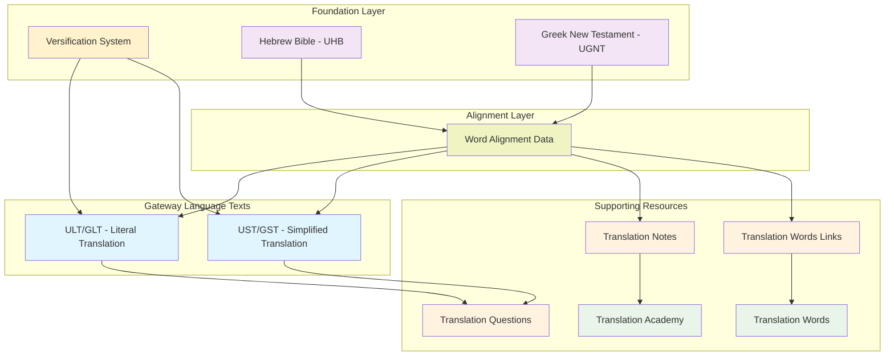
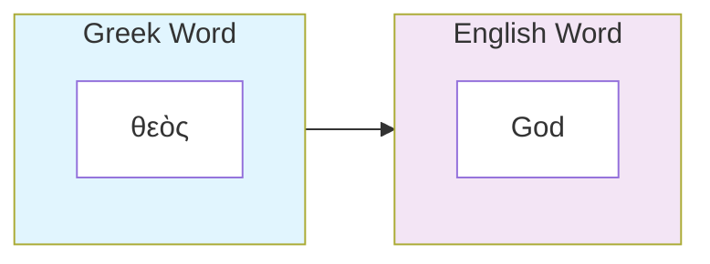
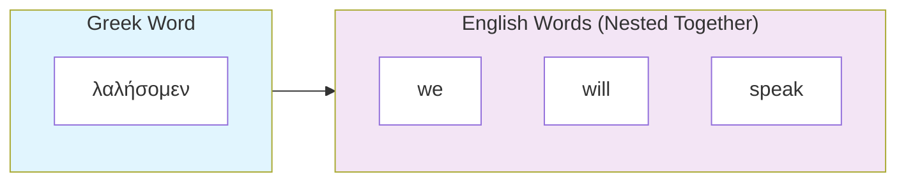
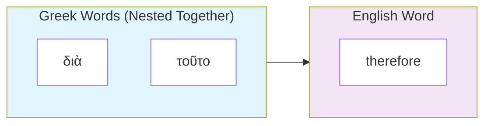
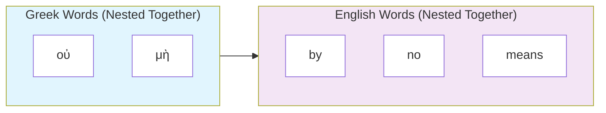
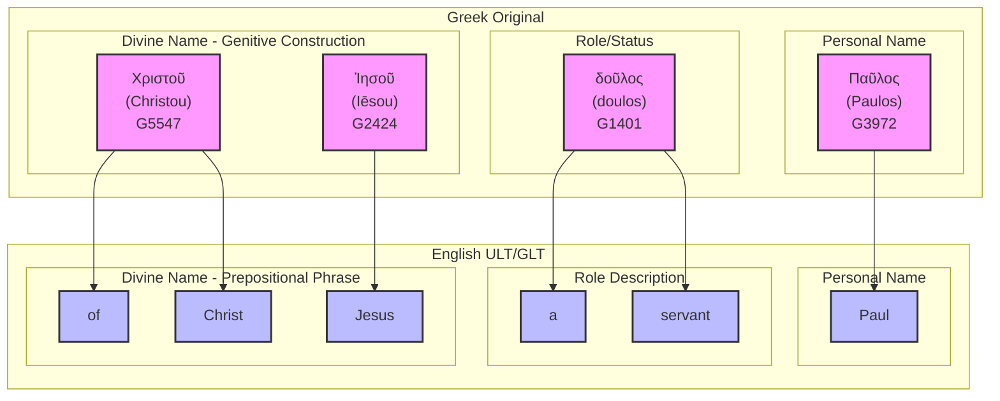

# unfoldingWord Translation Resources: Developer Guide

This document provides comprehensive technical documentation for developers building scripture translation, review, and quality assurance tools that work with unfoldingWord's Bible translation resources. These resources form an interconnected ecosystem designed to support accurate, clear, and natural Bible translation worldwide.

## Table of Contents

1. [Overview](#overview)
2. [Resource Ecosystem Concepts](#resource-ecosystem-concepts)
3. [Resource Relationships and Workflow](#resource-relationships-and-workflow)
4. [Getting Started with Integration](#getting-started-with-integration)
5. [Technical Specifications](#technical-specifications)
6. [Resource Container Architecture](#resource-container-architecture)
7. [Resource Linking System](#resource-linking-system)
8. [Integration Patterns and APIs](#integration-patterns-and-apis)
9. [Implementation Guidelines](#implementation-guidelines)
10. [Advanced Topics and Extensibility](#advanced-topics-and-extensibility)
11. [Further Reading and Resources](#further-reading-and-resources)

## Overview

### Mission and Philosophy

unfoldingWord translation resources are developed under Creative Commons Attribution-ShareAlike 4.0 licenses to provide the global church with high-quality, interconnected Bible translation tools. The ecosystem serves **Mother Tongue Translators (MTTs)** who use **gateway languages** as their bridge to translate Scripture into their **heart languages**.

### Key Definitions

**Gateway Languages**: Strategic languages (such as English, Spanish, French, Portuguese, Hindi) that serve as intermediary bridges between the original biblical languages (Hebrew, Greek, Aramaic) and target heart languages. Gateway languages are major languages that Mother Tongue Translators can understand and use as a foundation for translating Scripture into their native languages.

**Mother Tongue Translators (MTTs)**: Translators who are native speakers of the target language and are working to translate Scripture into their own heart language - the language they know best and speak most naturally.

**Heart Languages**: The native languages that Mother Tongue Translators speak most naturally and are translating Scripture into. These are the target languages for the final Bible translations that will serve local communities.

### Translation Challenges: A Real-World Scenario

To understand why the unfoldingWord resource ecosystem exists, consider this common translation scenario:

**The Challenge**: A team of Mother Tongue Translators in a remote region is working to translate the book of Romans into their heart language. They're using a popular commercial Bible translation in Spanish (their gateway language) as their primary source, along with basic study helps.

**Problem 1 - Hidden Cultural Adaptations**: In Romans 1:1, their Spanish Bible translates Paul's description of himself as "siervo" (servant), which feels natural and appropriate in Spanish. However, they don't realize that the original Greek word "δοῦλος" (doulos) actually means "slave" - a much stronger concept that implies complete ownership and submission. The Spanish translation adapted this for cultural comfort, but in the translators' culture, the concept of slavery might actually communicate Paul's intended meaning more accurately than the softened "servant." Without access to the original language, they miss this opportunity for a more precise translation.

**Problem 2 - Metaphor Translation Barriers**: When they reach Romans 3:25, they encounter the phrase "propitiation through his blood." This theological metaphor combines ancient Jewish sacrificial concepts with legal terminology that has no direct equivalent in their culture. They spend days trying to understand what "propitiation" means and how blood relates to forgiveness in their worldview. Without cultural and linguistic guidance, they struggle to find meaningful expressions in their language.

**Problem 3 - Consultant Dependency**: As these difficult passages accumulate, the translation team must wait weeks or months or years for a visiting consultant to help them understand the meaning and suggest translation approaches. This creates frustrating delays and leaves team members feeling uncertain about their translation decisions. The consultant, while helpful, may not fully understand their cultural context and might suggest solutions that don't work naturally in their language.

**Problem 4 - Inconsistent Terminology**: The team encounters the word "covenant" throughout Romans but translates it differently each time because they don't have a systematic understanding of how this theological concept appears across the entire Bible. Without comprehensive terminology guidance, their translation lacks the conceptual consistency that helps readers understand biblical themes.

**How the unfoldingWord Ecosystem Helps**: These resources work together to address each of these common challenges:

- **Literal Translation (ULT/GLT)** provides a form-centric rendering that preserves the structure and wording of the original text, showing exactly what the Greek says about Paul being a "slave" rather than a softened "servant"
- **Simplified Translation (UST/GST)** demonstrates how to express complex concepts like "propitiation" in clear, natural language that can guide culturally appropriate translation approaches
- **Translation Notes** provide specific guidance for passages like Romans 3:25, explaining the cultural and theological background needed for accurate translation
- **Translation Words** articles give comprehensive definitions of key terms like "covenant" and "propitiation," showing how they're used consistently throughout Scripture
- **Translation Academy** articles teach general principles for translating metaphors, cultural concepts, and theological terminology
- **Translation Questions** help the team verify that their translation effectively communicates the intended meaning to their community

Instead of waiting for consultant visits, the translation team has immediate access to expert guidance precisely targeted to the original language words they're translating. Importantly, they don't need to learn Greek or Hebrew themselves - the combination of Literal Translation (showing original structure), Simplified Translation (demonstrating clear meaning), and Translation Notes (explaining context) gives them access to original language insights through their gateway language. They can make informed decisions about how closely to follow their gateway language source versus returning to the original meaning, and they can translate complex concepts with confidence using proven methodologies.

This scenario illustrates why disconnected resources create translation bottlenecks, while an integrated ecosystem enables Mother Tongue Translators to work efficiently and accurately with expert-level understanding of the original text, all accessible through their gateway language.

### Resource Ecosystem Architecture

The translation resource ecosystem consists of three foundational layers:

1. **Source Texts**: Original language texts (Hebrew, Greek, Aramaic) with modern gateway language translations
2. **Alignment Layer**: Precise word-level connections between original and gateway languages  
3. **Support Resources**: Contextual guidance, definitions, methodology, and quality assurance tools

### Key Design Principles

- **Interconnectedness**: All resources link together through standardized reference systems
- **Precision**: Word-level alignment enables exact targeting of translation guidance
- **Extensibility**: Resource Container specification allows new resource creation
- **Multilingual**: Gateway language organizations can create parallel resource sets
- **Open Access**: Creative Commons licensing ensures global accessibility

## Resource Ecosystem Concepts

This section provides developers with a comprehensive understanding of what each resource contains, why translation teams need them, and how they work together. Understanding these concepts is essential before diving into technical implementation details.

### Foundation Resources

These resources provide the structural framework for all translation work:

#### **Versification**

**What it contains**: The canonical chapter and verse structure for all 66 books of the Protestant Bible canon.

**Purpose**: Establishes a consistent reference system that all other resources use to coordinate with each other. When you look at Genesis 1:1, every resource knows exactly which verse you're referencing.

**Why translators need it**: Enables precise navigation and ensures that notes, word definitions, and questions all align to the correct Scripture passages.

#### **Original Language Texts**

**What they contain**:

- **Hebrew Bible (UHB)**: The complete Old Testament in Hebrew and Aramaic
- **Greek New Testament (UGNT)**: The complete New Testament in Koine Greek

**Purpose**: Provide the authoritative source texts that all translations should ultimately derive from.

**Why translators need them**: These are the "measuring stick" against which all translations are evaluated for accuracy and faithfulness.

### Gateway Language Translation Texts

These are complete Bible translations in gateway languages (like English, Spanish, French) that serve as bridges for mother tongue translators:

#### **Literal Translation (ULT/GLT)**

**What it contains**: A complete Bible translation that follows a form-centric approach, preserving the structures of the original Hebrew and Greek texts while remaining understandable in the gateway language.

**Purpose**: Shows translators exactly what the original text says by retaining original language word order, grammatical forms, idioms, and figures of speech as much as possible.

**Why translators need it**: Provides access to the structural patterns and specific forms used in the original languages, helping translators understand how the biblical authors expressed their thoughts and enabling them to make informed decisions about how to render these forms in their target languages.

#### **Simplified Translation (UST/GST)**

**What it contains**: A complete Bible translation that follows a meaning-based approach, prioritizing clear, natural communication of biblical concepts using contemporary language and cultural expressions.

**Purpose**: Demonstrates how to express the meaning of the original text in natural, understandable language that communicates effectively to modern readers.

**Why translators need it**: Provides a model for meaning-based translation, showing how to communicate biblical concepts clearly and naturally while maintaining the essential meaning of the original text.

#### **Word Alignment Data**

**What it contains**: Precise connections showing exactly which words in the gateway language translate which words in Hebrew/Greek.

**Purpose**: Creates a bridge between the original languages and gateway language translations at the individual word level.

**Why translators need it**: Enables translation tools to show exactly which Hebrew or Greek word a translator is working on, and to highlight relevant notes and definitions for that specific word.

### Supporting Resources

The supporting resources provide contextual guidance, definitions, methodology, and quality assurance tools that work together with the core translation texts. These resources follow standardized formats and linking mechanisms to enable precise integration with translation applications.

#### **Translation Notes (TN)**

**What they contain**: Verse-by-verse explanations for difficult, ambiguous, or culturally complex passages throughout the Bible that require special attention for accurate translation.

**Purpose**: Provide specific guidance for translating challenging passages, including alternative translation options, cultural background, theological clarifications, and explanations of figures of speech or grammatical constructions.

**Why translators need them**: Many passages in Scripture require specialized knowledge about language, culture, or context to translate accurately - these notes provide that expertise in a practical format that can be adapted for different gateway languages.

**Example**: For a metaphor like "God is my rock," a note would explain that this refers to God as a source of protection and stability, not a literal stone.

#### **Translation Words (TW)**

**What they contain**: Comprehensive definitions and explanations of key biblical, theological, and cultural terms that appear throughout Scripture, focusing on how these words are used in the Bible rather than modern dictionary definitions.

**Purpose**: Ensure translators understand important biblical concepts consistently across the entire Bible, providing biblical context for terms that may not be used in everyday life or may have different meanings in modern usage.

**Why translators need them**: Many biblical terms like "covenant," "righteousness," or "Sabbath" carry specific biblical meanings that differ from modern usage and must be translated consistently throughout Scripture to preserve the integrity of biblical concepts.

**Example**: The entry for "covenant" would explain the biblical concept of formal agreements between God and people, with examples from throughout Scripture.

#### **Translation Words Links (TWL)**

**What they contain**: Connections showing exactly which occurrences of original language words should be linked to Translation Words definitions.

**Purpose**: Connect specific word instances in the text to their corresponding definitions and explanations.

**Why translators need them**: When a translator encounters the Hebrew word "hesed" in Psalm 23, this resource points them to the Translation Words entry explaining "steadfast love" or "mercy."

#### **Translation Questions (TQ)**

**What they contain**: Comprehension questions with answers that test whether a translation successfully communicates the intended meaning of the original text.

**Purpose**: Provide a quality assurance tool for conducting community checks of Bible translations, helping verify that the translation is clear, accurate, and understandable to the target audience.

**Why translators need them**: These questions enable translators to conduct systematic checks with community members to ensure their translation communicates the intended biblical message clearly and that readers understand what the original text meant to convey.

**Example**: For the passage "Paul, a servant of Christ Jesus," a question might be "What does Paul call himself?" with the answer "Paul calls himself a servant."

#### **Translation Academy (TA)**

**What they contain**: Comprehensive training materials covering translation theory, methodology, best practices, cultural issues, and quality standards for Bible translation.

**Purpose**: Provide the theoretical foundation and practical guidance needed for high-quality Bible translation work, serving as the educational foundation for translation teams.

**Why translators need them**: Translation is a complex skill requiring knowledge of linguistics, culture, theology, and communication principles - these materials provide structured training in all these areas and establish the methodological foundation that other translation resources reference.

**Example**: An article on "Translating Metaphors" would explain what metaphors are, why they're challenging to translate, and provide specific strategies for handling them effectively.

### How Resources Work Together

These resources form an interconnected ecosystem where each one enhances the others:

- **Word Alignment** connects gateway language translations to original languages
- **Translation Notes** reference specific aligned words to provide targeted guidance
- **Translation Academy** articles are referenced by Translation Notes, they explain the methodology behind translation decisions and provide training in translation theory, methodology, best practices, cultural issues, and quality standards for Bible translation
- **Translation Words Links** point from aligned words to Translation Words articles
- **Translation Words** articles provide comprehensive definitions of key biblical, theological, and cultural terms
- **Translation Questions** verify that the final translation communicates effectively

**Example workflow**: A translator working on Romans 1:1 encounters the word "servant." The alignment data shows this translates Greek "doulos." Translation Words Links points to a comprehensive definition of "doulos" explaining slavery in the ancient world. Translation Notes provide specific guidance on how to translate this concept in different cultural contexts. Translation Academy articles explain general principles for translating cultural terms. Translation Questions help verify that the final translation communicates Paul's intended meaning.

This conceptual foundation enables the precise, interconnected resource ecosystem detailed in the following sections.

## Resource Relationships and Workflow

This section demonstrates how developers can understand the practical connections between resources and how they integrate into translation workflows. These relationship patterns form the foundation for all technical implementation decisions.

### Understanding Resource Dependencies

The unfoldingWord ecosystem is built on a foundation of precise interdependencies that developers must understand to build effective translation tools:

#### Core Dependency Chain



#### Critical Implementation Insights

**Word Alignment as the Central Hub**: The word alignment data serves as the crucial connection point that enables all other resources to reference specific words in context. Without understanding alignment data, developers cannot properly implement:

- Translation Note highlighting
- Translation Words popup functionality  
- Quality assurance validation
- Cross-resource navigation

**Versification as the Coordinate System**: Every resource uses the versification system as its reference framework. Developers must ensure their applications handle versification consistently across all resources to maintain proper coordination.

**Gateway Language Flexibility**: The system supports multiple gateway languages (English, Spanish, French, etc.) with identical structural patterns. Developers should design their applications to work with any gateway language implementation, not just English. For detailed information about gateway language translation processes, see the [Gateway Language Manual](https://gl-manual.readthedocs.io/en/latest/gl_translation.html).

### Practical Integration Workflows

#### Translation Review Workflow

This workflow demonstrates how resources work together to support translation review:

1. **Context Loading**: Application loads ULT/GLT and UST/GST for verse comparison
2. **Note Integration**: Translation Notes provide specific guidance, with Quote/Occurrence data pointing to aligned words
3. **Term Definition**: Translation Words Links connect aligned words to comprehensive definitions
4. **Methodology Reference**: Translation Academy articles explain the principles behind translation decisions
5. **Quality Verification**: Translation Questions enable community checking of translation effectiveness

#### Resource Discovery Workflow  

This workflow shows how developers should approach resource discovery:

1. **Language Detection**: Identify available gateway languages with complete resource sets
2. **Resource Validation**: Verify that all required resources exist for the target language
3. **Version Coordination**: Ensure compatible versions across all resources in the ecosystem
4. **Dependency Mapping**: Build resource dependency graph for proper loading order
5. **Fallback Strategy**: Define alternative resources when primary resources are unavailable

#### Cross-Resource Navigation Workflow

This workflow demonstrates how users move between interconnected resources:

1. **Entry Point**: User encounters difficult term in ULT/GLT or UST/GST text
2. **Alignment Resolution**: System identifies original language word through alignment data  
3. **Resource Linking**: Translation Words Links provide path to definition
4. **Extended Learning**: Translation Academy articles offer deeper methodology training
5. **Context Return**: User returns to original translation context with enhanced understanding

### Data Flow Patterns for Developers

#### Highlighting Implementation Pattern

When implementing Translation Note highlighting:

- Parse TN Quote and Occurrence fields
- Locate matching alignment markers in USFM
- Extract gateway language words within alignment spans
- Apply visual highlighting with clear connection to note content

#### Cross-Reference Resolution Pattern  

When implementing RC link navigation:

- Parse RC URI components (language, resource, type, project, reference)
- Resolve to appropriate Resource Container
- Navigate to specific content location
- Maintain navigation context for user return path

#### Multi-Resource Coordination Pattern

When displaying comprehensive verse analysis:

- Load all relevant resources for target verse concurrently
- Build cross-resource connections using alignment data as foundation
- Present unified interface showing interconnected information
- Enable seamless navigation between related content

### Performance and Architecture Considerations

#### Resource Loading Strategy

- **Dependency-Aware Loading**: Load foundational resources (versification, alignment) before dependent resources
- **Lazy Loading Patterns**: Load supporting resources only when needed for specific features
- **Caching Strategies**: Cache alignment data and resource connections for responsive user interface
- **Concurrent Loading**: Load multiple resources simultaneously when dependencies allow

#### Error Handling Patterns  

- **Graceful Degradation**: Continue operation when some resources are unavailable
- **Fallback Resources**: Substitute alternative resources when primary resources fail
- **Resource Validation**: Verify resource consistency and completeness before integration
- **User Communication**: Provide clear feedback when resources are incomplete or unavailable

This understanding of resource relationships and workflows prepares developers for the technical implementation details covered in the following sections.

## Getting Started with Integration

This section provides developers with practical guidance for beginning integration with the unfoldingWord ecosystem. It covers essential first steps, basic resource access patterns, and common integration approaches without diving into complex technical details.

### Prerequisites for Developers

Before beginning integration, developers should understand these fundamental concepts:

#### Essential Knowledge Requirements

- **Git Repository Structure**: Basic understanding of Git-based content management
- **REST API Concepts**: Experience with RESTful web services and JSON data handling  
- **Text File Formats**: Familiarity with structured text formats (TSV, YAML, Markdown, USFM)
- **Unicode and Text Encoding**: Understanding of UTF-8 and multilingual text handling
- **Resource Linking**: Concept of URI-based resource identification and resolution

#### Translation Domain Awareness

While technical expertise is assumed, developers benefit from understanding:

- **Bible Reference Systems**: Chapter and verse numbering concepts
- **Translation Philosophy**: Difference between literal and meaning-based translation approaches
- **Cross-Language Challenges**: Cultural and linguistic barriers in translation work
- **Quality Assurance**: Community-based checking and validation processes

For comprehensive information about Bible translation methodology and workflow, see [unfoldingWord's Translator Resources](https://unfoldingword.org/for-translators/).

### Resource Discovery Basics

#### Understanding Resource Availability

Before diving into implementation, developers should understand what resources are available and how to access them:

**Key Resource Locations**:

- **Primary Platform**: Door43 Content Service at `https://git.door43.org/`
- **Organization Structure**: Resources organized under various organizations (some language-specific like [`es-419_gl`](https://git.door43.org/es-419_gl/), others multi-language like [`unfoldingWord`](https://git.door43.org/unfoldingWord/))
- **Repository Naming**: Language code + underscore + resource identifier (e.g., [`en_ult`](https://git.door43.org/unfoldingWord/en_ult/), [`es-419_tn`](https://git.door43.org/es-419_gl/es-419_tn/), [`fr_tw`](https://git.door43.org/fr_gl/fr_tw/))
- **Resource Subject Identification**: Resource content types are identified by `subject` and queried by this field by the [Door43 Catalog API](https://git.door43.org/api/swagger). The ecosystem is extensible, allowing new subjects and resource identifiers to be created as needed.

#### Recommended Starting Approach

**Language Selection for First Implementation**:

- **English (`en`)**: Most complete resource set, best for initial development and testing
- **Proven Ecosystem**: All resource types available with high quality levels
- **Reference Implementation**: Serves as the model for other gateway languages

**Simple Access Strategy**:

- Begin with direct repository URLs for well-known resources
- Use basic Git platform APIs for file retrieval  
- Focus on one resource type initially (e.g., ULT/GLT text)
- Validate basic functionality before expanding to other resources

### Basic Integration Patterns

#### Simple Resource Access Pattern

For developers beginning integration, start with read-only access to individual resources:

**Basic Access Strategy**:

1. **Single Resource Focus**: Begin with one resource type (e.g., ULT/GLT)
2. **Direct Repository Access**: Use standard Git platform APIs for file retrieval
3. **Simple Content Parsing**: Focus on basic content extraction without complex linking
4. **Progressive Enhancement**: Add additional resources and features incrementally

**Resource Access Priorities**:

1. **Gateway Language Texts**: ULT/GLT and UST/GST for foundational content
2. **Versification**: Chapter and verse structure for navigation
3. **Supporting Resources**: Add TN, TW, and other resources as features expand
4. **Cross-Resource Linking**: Implement resource connections after basic functionality works

#### Incremental Feature Development

Build translation tool features progressively rather than attempting comprehensive integration immediately:

**Phase 1 - Basic Text Display**:

- Display ULT/GLT and UST/GST side by side
- Implement basic navigation between chapters and verses
- Handle USFM formatting for readable text presentation
- Provide simple search functionality within texts

**Phase 2 - Enhanced Navigation**:

- Add versification-based reference system
- Implement cross-reference navigation within texts
- Enable bookmarking and history functionality
- Provide text comparison features between ULT/GLT and UST/GST

**Phase 3 - Supporting Resource Integration**:

- Display Translation Notes for selected verses
- Show Translation Words definitions for key terms
- Enable Translation Academy article access
- Implement Translation Questions for quality checking

**Phase 4 - Advanced Integration**:

- Enable precise word-level highlighting through alignment data
- Implement cross-resource navigation and linking
- Add multi-language support for different gateway languages
- Provide comprehensive quality assurance features

### Common Integration Approaches

#### Web Application Strategy

For web-based translation tools:

**Technical Approach Considerations**:

- **Client-Side vs. Server-Side**: Determine whether to load resources in browser or server
- **Caching Strategy**: Implement appropriate caching for resource content and API responses
- **Progressive Loading**: Load essential resources first, supporting resources as needed
- **Offline Capability**: Consider service worker strategies for offline resource access

**User Experience Priorities**:

- **Fast Initial Load**: Prioritize showing basic text content quickly
- **Responsive Design**: Ensure functionality across desktop, tablet, and mobile devices
- **Accessibility**: Implement proper semantic markup and keyboard navigation
- **Performance**: Optimize resource loading and text rendering for smooth interaction

#### Desktop Application Strategy  

For native desktop translation tools:

**Architecture Considerations**:

- **Local Resource Storage**: Download and cache resources locally for offline access
- **Update Management**: Implement system for checking and downloading resource updates
- **Cross-Platform Compatibility**: Ensure resource handling works across operating systems
- **Integration APIs**: Provide APIs for other desktop applications to access loaded resources

**Performance Optimization**:

- **Resource Indexing**: Build local indexes for fast search and navigation
- **Memory Management**: Efficiently handle large resource files and multiple open books
- **Concurrent Access**: Support multiple simultaneous resource operations
- **Background Processing**: Load and process resources without blocking user interface

#### Mobile Application Strategy

For mobile translation tools:

**Mobile-Specific Considerations**:

- **Bandwidth Optimization**: Minimize network usage through efficient resource loading
- **Storage Management**: Handle limited device storage for resource caching
- **Touch Interface**: Design resource navigation for touch-based interaction
- **Battery Efficiency**: Optimize resource processing to minimize battery drain

**Connectivity Handling**:

- **Offline Priority**: Ensure core functionality works without network connection
- **Sync Strategy**: Implement efficient synchronization of resource updates
- **Progressive Download**: Allow users to download specific books or resources as needed
- **Connection Quality**: Adapt resource loading to available network conditions

### Integration Testing Strategy

#### Resource Validation Testing

Before deploying integration features, developers should test:

**Content Integrity Testing**:

- **Format Validation**: Verify that USFM, TSV, and other formats parse correctly
- **Character Encoding**: Test handling of Unicode characters and multilingual content
- **Cross-Resource Consistency**: Validate that resource references resolve correctly
- **Version Compatibility**: Ensure resources work together across different versions

**Functionality Testing**:

- **Navigation Accuracy**: Verify that chapter and verse navigation works correctly
- **Search Functionality**: Test search accuracy across different resource types
- **Cross-Reference Resolution**: Validate that links between resources function properly
- **Performance Testing**: Measure resource loading times and application responsiveness

#### User Experience Validation

Test integration from translator perspective:

**Workflow Testing**:

- **Translation Review Process**: Verify that resources support actual translation workflows
- **Learning Curve Assessment**: Evaluate how quickly new users can become productive
- **Error Handling**: Test application behavior when resources are unavailable or incomplete
- **Accessibility Compliance**: Ensure features work with assistive technologies

This getting started foundation prepares developers for the detailed technical specifications and advanced integration patterns covered in the following sections.

## Technical Specifications

This section provides detailed technical specifications for all resource types in the unfoldingWord ecosystem. It covers file formats, data structures, and implementation details that developers need for building robust integration features.

### Core Translation Resources

The core translation resources form the foundation of the unfoldingWord ecosystem, providing source texts and alignment data that enable precise translation work.

### 1. Literal Translation (ULT/GLT)

**unfoldingWord® Literal Text** - A form-centric translation that preserves the structures, word order, grammatical forms, idioms, and figures of speech of the original Hebrew and Greek texts while remaining understandable in the gateway language.

#### Technical Specifications

- **Format**: USFM 3.0 with embedded word alignment data
- **Base**: Derived from 1901 American Standard Version with modern updates
- **Philosophy**: Form-centric, preserving original word order and grammatical structures
- **Alignment**: Every word aligned to Hebrew (UHB) and Greek (UGNT) sources
- **Repository**: [unfoldingWord Literal Text](https://git.door43.org/unfoldingWord/en_ult)
- **License**: Creative Commons Attribution-ShareAlike 4.0

#### File Structure

```
en_ult/
├── manifest.yaml               # Resource Container manifest
├── LICENSE.md                 # CC BY-SA 4.0 license
├── 01-GEN.usfm               # Genesis with alignment data
├── 02-EXO.usfm               # Exodus with alignment data
├── 40-MAT.usfm               # Matthew with alignment data
└── 66-REV.usfm               # Revelation with alignment data
```

#### USFM Structure Elements

Some of the most common USFM structure elements are:

- **Book Headers**: `\id`, `\usfm`, `\ide`, `\h`, `\toc1-3`, `\mt` markers
- **Chapter/Verse**: `\c` and `\v` markers for scripture structure
- **Alignment Data**: `\zaln-s`/`\zaln-e` and `\w` markers for word-level connections
- **Formatting**: `\p`, `\m`, `\q1`, `\q2` for text layout and poetry
- **Cross-References**: `\x` markers for scripture cross-references
- **Footnotes**: `\f` markers for footnotes
- **Translator sections**: `\ts\*` markers for indicating the start or end of a translator sections.

More information about USFM structure elements can be found in the [USFM 3.1 Specification](https://docs.usfm.bible/usfm/3.1/index.html).

#### Purpose and Integration

- **Translation Foundation**: Provides literal rendering for understanding original meaning
- **Structural Reference**: Shows original language grammatical patterns
- **Alignment Anchor**: Serves as gateway language connection to Hebrew/Greek
- **Quality Standard**: Maintains high accuracy to original language texts

### 2. Simplified Translation (UST/GST)

**unfoldingWord® Simplified Text** - A meaning-based translation that prioritizes clear, natural communication of biblical concepts using contemporary language and expressions.

#### Technical Specifications

- **Format**: USFM 3.0 with embedded word alignment data
- **Philosophy**: Meaning-based, prioritizing clarity and natural expression over structural preservation
- **Approach**: Communicates the meaning of the original text using natural, contemporary language
- **Alignment**: Every word aligned to Hebrew (UHB) and Greek (UGNT) sources
- **Repository**: [unfoldingWord Simplified Text](https://git.door43.org/unfoldingWord/en_ust)
- **License**: Creative Commons Attribution-ShareAlike 4.0

#### Purpose and Integration

- **Meaning Clarity**: Provides clear, natural rendering of biblical concepts
- **Cultural Bridge**: Explains ancient concepts in modern, understandable terms
- **Complementary Translation**: Works alongside ULT/GLT for comprehensive understanding

### 3. Word Alignment Data

**USFM 3.0 Embedded Alignment** - Precise word-level connections between gateway language translations and original Hebrew, Greek, and Aramaic texts.

#### Alignment Syntax Structure

```usfm
\zaln-s |x-strong="G35880" x-lemma="ὁ" x-morph="Gr,EA,,,,NMS," x-occurrence="1" x-occurrences="1" x-content="ὁ"\*\w The|x-occurrence="1" x-occurrences="1"\w*\zaln-e\*
```

#### Alignment Attributes

- **x-strong**: Strong's concordance number (G35880, H01234)
- **x-lemma**: Dictionary form of the original word (ὁ, אֱלֹהִים)
- **x-morph**: Morphological parsing (Gr,EA,,,,NMS,)
- **x-occurrence**: Which occurrence in the verse (1, 2, 3...)
- **x-occurrences**: Total occurrences in the verse
- **x-content**: Actual original language text being aligned

#### Alignment Relationship Types

**1. One-to-One**: Single original word ↔ single gateway word

```usfm
\zaln-s |x-strong="G2316" x-lemma="θεός" x-morph="Gr,N,,,,,NMS," x-occurrence="1" x-occurrences="1" x-content="θεὸς"\*\w God|x-occurrence="1" x-occurrences="1"\w*\zaln-e\*
```



**2. One-to-Many**: Single original word ↔ multiple gateway words (nested structure)

```usfm
\zaln-s |x-strong="G2980" x-lemma="λαλέω" x-morph="Gr,V,IFA1,,P," x-occurrence="1" x-occurrences="1" x-content="λαλήσομεν"\*\w we|x-occurrence="1" x-occurrences="1"\w* \w will|x-occurrence="1" x-occurrences="1"\w* \w speak|x-occurrence="1" x-occurrences="1"\w*\zaln-e\*
```

*Here, the single Greek verb "λαλήσομεν" (we will speak) requires three English words to express the same meaning. All three gateway words are contained within one alignment pair because they all translate the single original word.*



**3. Many-to-One**: Multiple original words ↔ single gateway word (overlapping alignments)

```usfm
\zaln-s |x-strong="G1223" x-lemma="διά" x-morph="Gr,P,,,,,G,,," x-occurrence="1" x-occurrences="1" x-content="διὰ"\*\zaln-s |x-strong="G5124" x-lemma="οὗτος" x-morph="Gr,RD,,,,ANS," x-occurrence="1" x-occurrences="1" x-content="τοῦτο"\*\w therefore|x-occurrence="1" x-occurrences="1"\w*\zaln-e\*\zaln-e\*
```

*This example shows two Greek words "διὰ τοῦτο" (literally "through this") being translated as the single English word "therefore". The alignment markers are nested, with both original words wrapping around the single gateway word that captures their combined meaning.*



**4. Many-to-Many**: Multiple original words ↔ multiple gateway words (nested combinations)

```usfm
\zaln-s |x-strong="G3756" x-lemma="οὐ" x-morph="Gr,D,,,,,,,," x-occurrence="1" x-occurrences="1" x-content="οὐ"\*\zaln-s |x-strong="G3361" x-lemma="μή" x-morph="Gr,D,,,,,,,," x-occurrence="1" x-occurrences="1" x-content="μὴ"\*\w by|x-occurrence="1" x-occurrences="1"\w* \w no|x-occurrence="1" x-occurrences="1"\w* \w means|x-occurrence="1" x-occurrences="1"\w*\zaln-e\*\zaln-e\*
```

*This shows a many-to-many relationship: the Greek double negative "οὐ μὴ" (literally "not not") is an emphatic negation construction that cannot be aligned as individual word pairs. You cannot say οὐ = "by" and μὴ = "no means" because neither Greek word individually means those English concepts. Instead, both Greek words together form an emphatic negation that requires the English idiomatic phrase "by no means" as an inseparable unit. The nested alignment markers show that both original words contribute to all three gateway words simultaneously.*



#### Complex Alignment Example: Romans 1:1

**Original Greek Text**:
> Παῦλος δοῦλος Χριστοῦ Ἰησοῦ

**ULT/GLT Translation**:
> Paul, a servant of Christ Jesus

**Alignment Visualization**:



**USFM Alignment Code**:

```usfm
\v 1 \zaln-s |x-strong="G39720" x-lemma="Παῦλος" x-morph="Gr,N,,,,,NMS," x-occurrence="1" x-occurrences="1" x-content="Παῦλος"\*\w Paul|x-occurrence="1" x-occurrences="1"\w*\zaln-e\*, \zaln-s |x-strong="G14010" x-lemma="δοῦλος" x-morph="Gr,N,,,,,NMS," x-occurrence="1" x-occurrences="1" x-content="δοῦλος"\*\w a|x-occurrence="1" x-occurrences="1"\w* \w servant|x-occurrence="1" x-occurrences="1"\w*\zaln-e\* \zaln-s |x-strong="G55470" x-lemma="Χριστός" x-morph="Gr,N,,,,,GMS," x-occurrence="1" x-occurrences="1" x-content="Χριστοῦ"\*\w of|x-occurrence="1" x-occurrences="1"\w* \w Christ|x-occurrence="1" x-occurrences="1"\w*\zaln-e\* \zaln-s |x-strong="G24240" x-lemma="Ἰησοῦς" x-morph="Gr,N,,,,,GMS," x-occurrence="1" x-occurrences="1" x-content="Ἰησοῦ"\*\w Jesus|x-occurrence="1" x-occurrences="1"\w*\zaln-e\*
```

**3. Many-to-One**: Multiple original words ↔ single gateway word

```usfm
\zaln-s |x-strong="G1223" x-content="διὰ"\*\zaln-s |x-strong="G5124" x-content="τοῦτο"\*\w therefore\w*\zaln-e\*\zaln-e\*
```

**4. Many-to-Many**: Multiple original words ↔ multiple gateway words

```usfm
\zaln-s |x-strong="G2570" x-content="καλῶς"\*\zaln-s |x-strong="G4160" x-content="ποιεῖς"\*\w do\w* \w good\w*\zaln-e\*\zaln-e\*
```

### 4. Versification

**Chapter and Verse Structure** - Standardized reference framework defining canonical structure for precise resource coordination.

#### Purpose

- **Reference Framework**: Enables consistent scripture references across all resources
- **Context Loading**: Tools know which resources to load for current verse
- **Navigation**: Uniform reference system for user interface coordination
- **Validation**: Ensures all resource references point to valid scripture locations

#### Technical Implementation

- **Format**: JSON or structured data defining chapter/verse boundaries
- **Scope**: Covers all 66 books of the Protestant canon
- **Standards**: Follows established versification systems (KJV, etc.)
- **Integration**: Referenced by all other resources for coordinate validation

## Supporting Resources

The supporting resources provide contextual guidance, definitions, methodology, and quality assurance tools that work together with the core translation texts.

### 5. Translation Notes (TN)

**unfoldingWord® Translation Notes** - Comprehensive verse-by-verse guidance providing specific help for translating difficult, complex, or ambiguous passages.

#### Technical Specifications

- **Format**: TSV (Tab-Separated Values) files, one per book
- **Structure**: Flat directory structure (files in root directory)
- **Naming**: `tn_[BOOK].tsv` (e.g., `tn_GEN.tsv`, `tn_MAT.tsv`)
- **Repository**: [unfoldingWord Translation Notes](https://git.door43.org/unfoldingWord/en_tn)
- **License**: Creative Commons Attribution-ShareAlike 4.0

#### TSV Column Structure

| Reference | ID   | Tags    | SupportReference                           | Quote      | Occurrence | Note                                    |
|-----------|------|---------|-------------------------------------------|------------|------------|-----------------------------------------|
| 1:3       | abc1 | grammar | rc://en/ta/man/translate/figs-metaphor    | בְּרֵאשִׁית | 1          | The Hebrew word for "beginning"...      |

**Column Definitions**:

- **Reference**: Chapter:verse (e.g., "1:3") or range ("1:3-5") or (1:2, 1:6)
- **ID**: Four-character unique identifier (e.g., "abc1")
- **Tags**: Categorization (grammar, culture, translate, etc.)
- **SupportReference**: Links to Translation Academy (`rc://*/ta/man/translate/...`)
- **Quote**: Original language text the note addresses
- **Occurrence**: Which occurrence (-1=all, 0=none, 1,2,3...=specific)
- **Note**: Markdown-formatted explanation and guidance

#### Note Categories

- **Translation Alternatives**: Different ways to render difficult terms
- **Cultural Context**: Background for understanding ancient customs
- **Grammatical Guidance**: Complex syntactic structure explanations
- **Theological Clarification**: Conceptual explanations
- **Figures of Speech**: Metaphors, idioms, and rhetorical devices

#### Integration Points

- **Quote + Occurrence**: Links to ULT/GLT/UST/GST alignment data for highlighting
- **SupportReference**: Links to Translation Academy methodology
- **Reference**: Coordinates with versification system

### 6. Translation Words (TW)

**unfoldingWord® Translation Words** - Comprehensive definitions of key biblical, theological, and cultural terms throughout Scripture.

#### Technical Specifications

- **Format**: Markdown articles in hierarchical directories
- **Organization**: `/bible/kt/`, `/bible/names/`, `/bible/other/`
- **Repository**: [unfoldingWord Translation Words](https://git.door43.org/unfoldingWord/en_tw)
- **License**: Creative Commons Attribution-ShareAlike 4.0

#### Content Categories

- **Key Terms (`/kt/`)**: Central theological concepts (God, salvation, covenant)
- **Names (`/names/`)**: People, places, and proper nouns
- **Other Terms (`/other/`)**: Cultural, historical, and general concepts

#### Article Structure

```markdown
# Aaron

## Word Data:
* Strongs: H0175
* Part of speech: Proper Noun

## Facts:
Aaron was Moses' older brother. God chose Aaron to be the first high priest...

## Bible References:
* [1 Chronicles 23:12-14](rc://en/tn/help/1ch/23/12)
* [Acts 07:38-40](rc://en/tn/help/act/07/38)

## Examples from Bible Stories:
* [09:15](rc://en/obs/help/obs/09/15) God warned Moses and Aaron...
```

### 7. Translation Words Links (TWL)

**unfoldingWord® Translation Words Links** - Precise mapping connecting specific original language word occurrences to Translation Words definitions.

#### Technical Specifications

- **Format**: TSV files, one per book
- **Naming**: `twl_[BOOK].tsv` (e.g., `twl_GEN.tsv`)
- **Repository**: [unfoldingWord Translation Words Links](https://git.door43.org/unfoldingWord/en_twl)
- **License**: Creative Commons Attribution-ShareAlike 4.0

#### TSV Column Structure

| Reference | ID   | Tags | OrigWords | Occurrence | TWLink                           |
|-----------|------|------|-----------|------------|----------------------------------|
| 1:3       | xyz9 | kt   | אֱלֹהִים    | 1          | rc://en/tw/dict/bible/kt/god     |

**Column Definitions**:

- **Reference**: Chapter:verse where term occurs
- **ID**: Four-character unique identifier
- **Tags**: Term category (kt, names, other)
- **OrigWords**: Original language word(s)
- **Occurrence**: Which occurrence of the original word
- **TWLink**: Link to Translation Words article

### 8. Translation Questions (TQ)

**unfoldingWord® Translation Questions** - Comprehensive questions enabling translators to verify their translation communicates intended meaning clearly.

#### Technical Specifications

- **Format**: TSV files, one per book
- **Naming**: `tq_[BOOK].tsv` (e.g., `tq_GEN.tsv`)
- **Repository**: [unfoldingWord Translation Questions](https://git.door43.org/unfoldingword/en_tq)
- **License**: Creative Commons Attribution-ShareAlike 4.0

#### TSV Column Structure

| Reference | ID   | Tags | Quote  | Occurrence | Question                     | Response                      |
|-----------|------|------|--------|------------|------------------------------|-------------------------------|
| 1:3       | swi9 |      |  |  | What does Paul call himself? | Paul calls himself a servant  |

The quote and occurrence columns are not used in translation questions.

#### Purpose and Usage

- **Translation Verification**: Confirm translated meaning matches original intent
- **Comprehension Testing**: Verify target language speakers understand translation
- **Quality Assurance**: Systematic checking of translation accuracy
- **Training Tool**: Help translators understand key concepts

### 9. Translation Academy (TA)

**unfoldingWord® Translation Academy** - Comprehensive training materials providing theoretical foundation and practical guidance for Bible translation.

#### Technical Specifications

- **Format**: Markdown articles in hierarchical structure
- **Organization**: `/translate/`, `/checking/`, `/process/` categories
- **Repository**: [unfoldingWord Translation Academy](https://git.door43.org/unfoldingWord/en_ta)
- **License**: Creative Commons Attribution-ShareAlike 4.0

#### Content Categories

- **Translation Principles**: Fundamental translation theory concepts
- **Translation Methods**: Specific techniques for different text types
- **Cultural Issues**: Cross-cultural communication guidance
- **Quality Assurance**: Standards and checking processes

#### Article Structure

```markdown
# Translate Unknowns

## Description
This page answers the question: How do I translate words that I don't understand?

## Translation Principles
When translators encounter unknown words...

## Examples
Here are examples of how to handle unknown words...

## Translation Strategies
If the word is not known, here are strategies...
```

## Resource Container Architecture

### Technical Foundation

All unfoldingWord resources follow the [Resource Container (RC) specification](https://resource-container.readthedocs.io/en/latest/), providing standardized structure, metadata, and linking mechanisms.

### RC Directory Structure

```
en_resource_name/
├── .apps/                      # Application metadata
├── LICENSE.md                  # License information
├── manifest.yaml              # RC manifest file
├── media.yaml                 # Media definitions (optional)
└── content/                   # Project content directory
    ├── config.yaml            # Project configuration
    ├── 01-GEN.usfm           # Genesis content
    └── 40-MAT.usfm           # Matthew content
```

### RC Container Types

#### 1. Bundle (`bundle`)

Flat directory structure for USFM collections:

```
en_ult/
├── manifest.yaml
├── 01-GEN.usfm               # Direct file access
└── 40-MAT.usfm
```

#### 2. Help (`help`)

Supplemental content like Translation Notes (flat structure):

```
en_tn/
├── manifest.yaml
├── tn_GEN.tsv
├── tn_EXO.tsv
├── tn_MAT.tsv
└── tn_REV.tsv
```

#### 3. Dictionary (`dict`)

Term definitions like Translation Words:

```
en_tw/
├── manifest.yaml
└── content/
    ├── aaron.md
    ├── god.md
    └── moses.md
```

#### 4. Manual (`man`)

Instructional content like Translation Academy:

```
en_ta/
├── manifest.yaml
└── content/
    ├── translate-unknowns/
    │   └── 01.md
    └── checking-level-one/
        └── 01.md
```

#### 5. Book (`book`)

Chapter/chunk structured content:

```
en_obs/
├── manifest.yaml
└── content/
    ├── 01/                   # Chapter directories
    │   ├── 01.md            # Chunk files
    │   └── 02.md
    └── 02/
        └── 01.md
```

### Manifest File Structure

Every RC includes a `manifest.yaml` following [Dublin Core standards](https://www.dublincore.org/specifications/dublin-core/dcmi-terms/):

```yaml
dublin_core:
  conformsto: 'rc0.2'
  contributor: []
  creator: 'unfoldingWord'
  description: 'Literal translation for Bible translators'
  format: 'text/usfm'
  identifier: 'ult'
  issued: '2024-01-01'
  language:
    identifier: 'en'
    title: 'English'
    direction: 'ltr'
  modified: '2024-01-01T12:00:00-00:00'
  publisher: 'unfoldingWord'
  relation: 
    - 'en/tn'
    - 'en/tw'
    - 'hbo/uhb'
    - 'el-x-koine/ugnt'
  rights: 'CC BY-SA 4.0'
  source:
    - identifier: 'uhb'
      language: 'hbo'
      version: '2.1.30'
  subject: 'Bible'
  title: 'unfoldingWord Literal Text'
  type: 'bundle'
  version: '85'

checking:
  checking_entity: ['unfoldingWord']
  checking_level: '3'

projects:
  - categories: ['bible-ot']
    identifier: 'gen'
    path: './01-GEN.usfm'
    sort: 1
    title: 'Genesis'
    versification: 'kjv'
```

## Resource Linking System

### RC Link Structure

The [RC Linking specification](https://resource-container.readthedocs.io/en/latest/) defines standardized URIs for cross-resource navigation:

```
rc://language/resource/type/project/chapter/chunk
```

### Link Examples by Resource Type

```
# Translation texts
rc://en/ult/book/gen/01/02        # ULT/GLT Genesis 1:2
rc://en/ust/book/mat/05/01        # UST/GST Matthew 5:1

# Translation Notes
rc://en/tn/help/gen/01/02         # Translation Note for Genesis 1:2

# Translation Words
rc://en/tw/dict/bible/kt/god      # Translation Words entry for "god"

# Translation Academy
rc://en/ta/man/translate/translate-unknowns    # TA module
```

### Wildcard Support

```
rc://en/ult/book/*                # Any book in English ULT/GLT
rc://*/ult/book/gen               # Genesis in ULT/GLT in any language (Default)
rc://en/*/book/gen/01/01          # Genesis 1:1 in any English translation
```

Language wildcards in RC links are commonly used for language codes (e.g. `rc://*/ult/book/gen`) because they allow applications to dynamically resolve the appropriate language based on user preferences and settings. Rather than hardcoding specific language codes, using wildcards enables the same RC link structure to work across multiple languages. The application's language selection feature determines which language resources to load when resolving these wildcarded links. This pattern promotes resource reusability and simplifies multilingual support.

### Link Resolution Process

1. **Locate Resource Container**: Find RC directory matching language/resource
2. **Navigate to Project**: Use manifest to locate project content
3. **Resolve Chapter/Chunk**: Navigate to specific content location

### Practical Usage Examples

#### Translation Notes TSV

```tsv
Reference ID SupportReference Quote Note
1:1 tn001 rc://en/ta/man/translate/translate-names Παῦλος Paul is the name of a man
1:1 tn002 rc://en/tw/dict/bible/other/servant δοῦλος Paul calls himself a servant
```

#### Translation Academy Cross-References

```markdown
For more information, see [Translate Names](rc://en/ta/man/translate/translate-names).
```

## Integration Patterns and APIs

This section covers practical API usage, authentication methods, and multi-platform integration strategies that developers need for robust resource access and application deployment across different hosting environments.

### Advanced Resource Discovery

This section provides comprehensive guidance for programmatic resource discovery using the Door43 Catalog API and other discovery methods for production applications.

#### Catalog API Resource Discovery

Door43 Content Service provides a specialized Catalog API that enables sophisticated resource discovery beyond basic repository access:

**Strategic Resource Discovery Process**:

1. **Ecosystem Assessment**: Query catalog API to understand complete resource landscape
2. **Language Availability Analysis**: Identify which gateway languages have complete resource sets  
3. **Quality and Version Evaluation**: Assess resource maturity, checking levels, and update frequency
4. **Dependency Mapping**: Build comprehensive resource dependency graphs
5. **Production Readiness Validation**: Verify resources meet quality standards for deployment

**Multi-Language Discovery Strategy**:

- Query catalog without language filters to discover all available gateway language implementations
- Group resources by language identifier to assess ecosystem completeness
- Use subject filters to identify specific resource types across languages
- Prioritize languages with recent updates and high checking levels
- Plan fallback strategies for incomplete language implementations

**Subject-Based Resource Discovery**:

- Filter by `subject=Bible` to find translation texts across all languages
- Filter by `subject=Translation Notes` to find translation helps
- Filter by `subject=Translation Words` to find terminology resources
- Filter by `subject=Open Bible Stories` to find OBS resources
- Filter by `subject=Translation Academy` to find training materials
- Use multiple subject queries to assess complete resource coverage for specific languages
- Cross-reference subject availability with language codes to map ecosystem completeness
- Query without subject filters to discover all available subjects in the ecosystem
- Monitor for new subjects as organizations extend the ecosystem with specialized resources

**Advanced Filtering and Selection**:

- Use stage filters (`stage=prod`) to focus on production-ready resources
- Apply quality filters (`checking_level=3`) to identify thoroughly reviewed content
- Combine subject and language filters for precise resource discovery
- Sort by release dates to identify most recently updated implementations
- Cross-reference resource relationships through manifest metadata

#### Enterprise Resource Discovery Patterns

**Automated Resource Validation**:

- Implement automated checks for resource completeness across target languages
- Validate resource version compatibility within language ecosystems
- Monitor resource update frequency and quality level changes
- Detect and report resource dependency conflicts or missing links

**Multi-Organization Discovery**:

- Discover resources across different gateway language organizations
- Map organizational patterns and resource naming conventions
- Identify authoritative sources for each gateway language
- Plan integration strategies for multi-organizational deployments

**Performance-Optimized Discovery**:

- Cache catalog responses to minimize API calls during resource discovery
- Implement incremental discovery for large-scale applications
- Use batch requests for efficient multi-resource discovery
- Plan discovery schedules that respect API rate limits

### Hosting Infrastructure: Git-Based Platforms

While the primary hosting is **Door43 Content Service (DCS)**, applications should support multiple hosting platforms:

#### Primary Platform: Door43 Content Service

- **Platform**: `https://git.door43.org/`
- **Organization**: `unfoldingWord` for English resources
- **Technology**: Gitea-based Git platform with Door43 extensions
- **API Access**: REST API for programmatic access
- **Version Control**: Full Git history and branching
- **Catalog API**: Extended endpoints for resource discovery and organization

#### Alternative Hosting Considerations

Applications should be designed to work with:

- **Door43 Clones**: Mirror instances of the main DCS platform
- **Other Gitea Instances**: Self-hosted Gitea platforms with unfoldingWord resources
- **Generic Git Platforms**: GitHub, GitLab, or other Git-based hosting
- **Local Repositories**: Offline or network-isolated environments
- **Custom Servers**: Organization-specific hosting solutions

### API Documentation and Access

#### Door43 API Overview

Door43 extends the standard Gitea API with specialized endpoints for Bible translation resources. The API provides both standard Git repository access and enhanced catalog functionality for resource discovery.

**API Documentation**:

- **Swagger UI**: [https://git.door43.org/api/swagger](https://git.door43.org/api/swagger)
- **OpenAPI Specification**: [https://git.door43.org/swagger.v1.json](https://git.door43.org/swagger.v1.json)
- **Base URL**: `https://git.door43.org/api/v1`
- **Platform Information**: [Door43 About Page](https://git.door43.org/about)

#### Standard Gitea API Endpoints

```javascript
// Repository access
GET /api/v1/repos/{owner}/{repo}                    // Repository metadata
GET /api/v1/repos/{owner}/{repo}/contents/{path}    // File contents
GET /api/v1/repos/{owner}/{repo}/releases           // Release information
GET /api/v1/repos/{owner}/{repo}/tags               // Version tags

// Organization and user endpoints
GET /api/v1/orgs/{org}/repos                        // Organization repositories
GET /api/v1/users/{username}/repos                  // User repositories
```

#### Door43 Catalog API Extensions

The Catalog API provides enhanced resource discovery and organization capabilities, by default the catalog is filtered to only show resources that are in the production stage.

```javascript
// Catalog endpoints for resource discovery
GET /api/v1/catalog/list                            // List all catalog entries
GET /api/v1/catalog/search                          // Search catalog entries
GET /api/v1/catalog/latest                          // Latest released resources

// Resource organization by metadata
GET /api/v1/catalog/list?subject=Bible              // Filter by subject
GET /api/v1/catalog/list?resource=ult               // Filter by resource type
GET /api/v1/catalog/list?lang=en                    // Filter by language
GET /api/v1/catalog/list?stage=prod                 // Filter by release stage
```

#### Catalog Entry Structure

Catalog entries provide rich metadata for resource discovery:

```typescript
interface CatalogEntry {
  id: string;                    // Unique identifier
  url: string;                   // Repository URL
  name: string;                  // Resource name
  owner: string;                 // Owner/organization
  full_name: string;             // Full repository name
  title: string;                 // Human-readable title
  description: string;           // Resource description
  language: {
    identifier: string;          // Language code (e.g., "en")
    title: string;              // Language name (e.g., "English")
    direction: string;          // Text direction ("ltr" or "rtl")
  };
  subject: string;              // Content subject (e.g., "Bible")
  resource: {
    identifier: string;         // Resource type (e.g., "ult", "tn")
    title: string;             // Resource title
  };
  format: string;               // Content format (e.g., "text/usfm")
  stage: string;                // Release stage ("prod", "preprod", "draft")
  checking_level: string;       // Quality level ("1", "2", "3")
  version: string;              // Version number
  released: string;             // Release date (ISO 8601)
  zipball_url: string;          // Download URL for ZIP archive
  tarball_url: string;          // Download URL for TAR archive
  metadata_url: string;         // Direct manifest.yaml URL
  metadata_json_url: string;    // JSON-formatted metadata URL
}
```

#### TypeScript Interface Generation

The OpenAPI specification can be used to generate TypeScript interfaces:

```bash
# Install OpenAPI TypeScript generator
npm install -g @openapitools/openapi-generator-cli

# Generate TypeScript interfaces
openapi-generator-cli generate \
  -i https://git.door43.org/swagger.v1.json \
  -g typescript-fetch \
  -o ./src/api/door43
```

#### Common Integration Patterns

**1. Resource Discovery Process**:
Applications should query the catalog API to find available resources by language and type:

- Filter catalog entries by language (`lang=en`) and resource type (`resource=ult`)
- Include stage filter (`stage=prod`) to get production-ready resources only
- Sort results by release date to identify the most recent version
- Handle cases where no resources are found for a given language/type combination

**2. Resource Download Process**:
Applications can obtain resource content through multiple methods:

- **ZIP Download**: Use the `zipball_url` from catalog entries for complete resource packages
- **Direct File Access**: Access individual files through repository API endpoints
- **Manifest Access**: Retrieve metadata through `metadata_json_url` for resource information
- **Incremental Loading**: Download only needed books or sections rather than entire resources

**3. Multi-Language Resource Discovery**:
To find available languages for a specific resource type:

- Query catalog without language filter to get all available implementations
- Extract unique language identifiers from the results
- Group resources by language to understand completeness
- Identify which languages have full resource ecosystems

**4. Gateway Language Ecosystem Assessment**:
To identify complete gateway language implementations:

- Define core resource requirements (`ult`, `ust`, `tn`, `tw`, `twl`, `ta`)
- Query catalog for all production resources across languages
- Group catalog entries by language identifier
- Filter languages that have all required resource types available
- Prioritize languages with recent updates and high checking levels

#### Authentication and Rate Limiting Considerations

**Authentication Requirements:**

- Most public resources are accessible without authentication
- Private repositories or enhanced API features may require API tokens
- Authentication should use standard `Authorization: token <TOKEN>` headers
- Content-Type should be set to `application/json` for API requests

**Rate Limiting Management:**

- APIs typically include rate limit information in response headers
- Check `X-RateLimit-Remaining` and `X-RateLimit-Reset` headers when available
- Implement backoff strategies when approaching rate limits
- Consider caching responses to minimize API calls
- For high-volume applications, consider local resource mirrors

### Repository Organization

```
https://git.door43.org/unfoldingWord/en_ult     # ULT/GLT
https://git.door43.org/unfoldingWord/en_ust     # UST/GST
https://git.door43.org/unfoldingWord/en_tn      # Translation Notes
https://git.door43.org/unfoldingWord/en_tw      # Translation Words
https://git.door43.org/unfoldingWord/en_twl     # Translation Words Links
https://git.door43.org/unfoldingWord/en_ta      # Translation Academy
```

### Multilingual Gateway Language Ecosystem

#### Gateway Language Strategy

unfoldingWord created English resources for Mother Tongue Translators, serving as the reference implementation. Multiple organizations contribute resources for different gateway languages:

**Organization Types**:

- **Language-Specific Organizations**: Like `es-419_gl` (Latin American Spanish Gateway Language resources)
- **Multi-Language Organizations**: Like `unfoldingWord` (hosting resources for multiple languages)
- **Mixed Organizations**: Some organizations host both gateway language and other language resources

#### Repository Naming Patterns

**Standard Format**: `{language-code}_{resource-identifier}`

**Examples**:

- `en_ult` - English Literal Translation
- `es-419_tn` - Latin American Spanish Translation Notes  
- `fr_tw` - French Translation Words
- `hi_glt` - Hindi Gateway Literal Translation

#### Resource Subject Identification

Resource content types are definitively identified by the `subject` field in each repository's manifest file, not just the repository name. The Door43 Catalog API uses these subjects as searchable parameters. The ecosystem is extensible, allowing new subjects to be created as translation needs evolve.

**Complete List of Current Resource Subjects**:

- Aligned Bible
- Aramaic Grammar  
- Bible
- Greek Grammar
- Greek Lexicon
- Greek New Testament
- Hebrew Grammar
- Hebrew Old Testament
- Hebrew-Aramaic Lexicon
- OBS Study Notes
- OBS Study Questions
- OBS Translation Notes
- OBS Translation Questions
- Open Bible Stories
- Study Notes
- Study Questions
- Training Library
- Translation Academy
- Translation Notes
- Translation Questions
- Translation Words
- TSV Study Notes
- TSV Study Questions
- TSV Translation Notes
- TSV Translation Questions
- TSV Translation Words Links
- TSV OBS Study Notes
- TSV OBS Study Questions
- TSV OBS Translation Notes
- TSV OBS Translation Questions
- TSV OBS Translation Words Links

**Resource Identifier Extensibility**:

The resource identifiers used in repository names (the part after the underscore) are also extensible. These identifiers serve dual purposes:

- **Repository Naming**: Form part of the repository name pattern `{language}_{identifier}`
- **Resource Relations**: Used in manifest `relation` fields to establish connections between resources

**Example Resource Relations in Manifest**:

```yaml
relation:
  - en/tn           # English Translation Notes
  - en/tw           # English Translation Words  
  - hbo/uhb         # Hebrew Bible
  - el-x-koine/ugnt # Greek New Testament
```

Organizations can create new resource identifiers and subjects as needed for specialized resources, following the established patterns while extending the ecosystem capabilities.

The English implementation serves as the model that other gateway language organizations follow, maintaining the same structural patterns and resource types while adapting content for their specific linguistic and cultural contexts. For detailed guidance on gateway language translation and adaptation processes, see the [Gateway Language Manual](https://gl-manual.readthedocs.io/en/latest/gl_translation.html).

#### Consistent Linking Strategy

All gateway language organizations maintain the same internal linking patterns:

```yaml
# Spanish GLT manifest
relation:
  - es-419/tw          # Spanish Translation Words
  - es-419/tn          # Spanish Translation Notes
  - hbo/uhb?v=2.1.30   # Same Hebrew Bible reference
  - el-x-koine/ugnt?v=0.34  # Same Greek New Testament reference
```

### Quality Assurance Integration

#### Alignment-Based Validation

- **Coverage**: Every original word has gateway language alignment
- **Accuracy**: Aligned words appropriately represent original meaning
- **Consistency**: Same original words consistently aligned across contexts

#### Cross-Resource Coherence

- **Note Accuracy**: Translation Notes reference actually aligned words
- **Link Validity**: TWL points to words present in alignments
- **Methodology**: Alignment decisions follow Translation Academy principles

## Advanced Topics and Extensibility

This section covers advanced integration topics including creating custom resources, extending the ecosystem, and implementing specialized features for power users and organizations with unique requirements.

### Creating New Resources

The unfoldingWord ecosystem is designed for extensibility. Gateway language organizations can create additional resources following RC specifications, including new resource types with custom subjects and identifiers.

#### Required Components

1. **RC Directory Structure**: Follow standard layout with manifest
2. **Manifest Compliance**: Use Dublin Core metadata standards
3. **Linking Compatibility**: Support RC link resolution
4. **Format Standards**: Use established file formats (USFM, TSV, Markdown)
5. **Subject Definition**: Choose appropriate subject for resource type (existing or new)
6. **Identifier Selection**: Select unique resource identifier for repository naming and relations

#### Example: New Commentary Resource

**Directory Structure**:

```
en_biblical-commentary/
├── .apps/
├── LICENSE.md
├── manifest.yaml
├── bc_GEN.tsv
├── bc_EXO.tsv
└── bc_MAT.tsv
```

**Manifest**:

```yaml
dublin_core:
  conformsto: 'rc0.2'
  creator: 'Gateway Language Organization'
  description: 'Biblical commentary for translation teams'
  format: 'text/tab-separated-values'
  identifier: 'biblical-commentary'
  language:
    identifier: 'en'
    title: 'English'
  relation:
    - 'en/ult'
    - 'en/ust'
  title: 'Biblical Commentary'
  type: 'help'
  version: '1'

projects:
  - identifier: 'gen'
    path: './bc_GEN.tsv'
    title: 'Genesis'
```

**TSV Content**:

| Reference | ID    | Tags     | Quote      | Occurrence | Note                                        |
|-----------|-------|----------|------------|------------|---------------------------------------------|
| 1:1       | bc001 | creation | בְּרֵאשִׁית | 1          | The Hebrew word for "beginning" implies... |
| 1:2       | bc002 | spirit   | רוּחַ       | 1          | The Spirit of God hovering suggests...     |

### Integration Requirements

#### For Translation Tools

1. **Resource Discovery**: Scan for RC manifest files
2. **Type Recognition**: Handle all RC container types
3. **Format Processing**: Parse USFM, TSV, and Markdown content
4. **Link Resolution**: Support RC link navigation

#### For Resource Creators

1. **Reference Format**: Use standard chapter:verse format
2. **Quote Matching**: Include exact original language text for alignment
3. **Occurrence Tracking**: Number multiple instances correctly
4. **Cross-References**: Use RC link format for references

## Implementation Guidelines

### Usage Examples: Linking Resources for Practical Features

This section demonstrates how applications can combine multiple resources to create powerful translation review features.

#### 1. Translation Note Highlighting

**Scenario**: Highlight gateway language text that corresponds to Translation Notes

**Resources Used**: Translation Notes (TN) + Word Alignment Data + ULT/GLT/UST/GST

**Example: Romans 1:1 Translation Note**

| Reference | ID   | Quote  | Occurrence | Note                                           |
|-----------|------|--------|------------|------------------------------------------------|
| 1:1       | abc1 | δοῦλος | 1          | Paul calls himself a servant of Jesus Christ... |

**Alignment Data in ULT/GLT**:

```usfm
\zaln-s |x-strong="G14010" x-lemma="δοῦλος" x-occurrence="1" x-content="δοῦλος"\*\w a servant\w*\zaln-e\*
```

**Implementation Process**:

1. Parse Translation Note: Quote = "δοῦλος", Occurrence = 1
2. Search alignment for `x-content="δοῦλος"` with `x-occurrence="1"`
3. Extract gateway text: "a servant"
4. Highlight "a servant" in displayed ULT/GLT text

**Visual Result**:

```
ULT/GLT Romans 1:1: Paul **[a servant]** of Jesus Christ...
                              ↑ highlighted because it aligns to δοῦλος
```

**Implementation Requirements**:

1. Parse Translation Note Quote and Occurrence fields from TSV data
2. Search alignment data for matching `x-content` attribute with specified occurrence
3. Extract the gateway language words contained within the matching alignment markers
4. Apply visual highlighting to those specific words in the displayed text
5. Handle cases where no matching alignment is found

#### 2. Translation Words Popup

**Scenario**: Show Translation Words definitions when users click on linked terms

**Resources Used**: Translation Words Links (TWL) + Translation Words (TW) + Word Alignment Data

**Example: Genesis 1:1 "God" Reference**

| Reference | ID   | Tags | OrigWords | Occurrence | TWLink                           |
|-----------|------|------|-----------|------------|----------------------------------|
| 1:1       | xyz9 | kt   | אֱלֹהִים    | 1          | rc://en/tw/dict/bible/kt/god     |

**Implementation Process**:

1. User clicks on "God" in ULT/GLT text
2. Find alignment data for clicked word
3. Match original word (אֱלֹהִים) with TWL entry
4. Load Translation Words article from `rc://en/tw/dict/bible/kt/god`
5. Display popup with definition and examples

**Implementation Requirements**:

1. Identify which gateway language word was clicked in the displayed text
2. Locate the corresponding alignment data for that word position
3. Extract the original language word from the alignment `x-content` attribute
4. Search TWL data for entries matching the verse reference and original word
5. Resolve the RC link from TWL to load the corresponding Translation Words article
6. Display the article content in an appropriate user interface element

#### 3. Cross-Reference Navigation

**Scenario**: Enable seamless navigation between interconnected resources

**Resources Used**: Translation Academy (TA) + Translation Notes (TN) + RC Links

**Example: Translation Note with TA Reference**

| Reference | ID    | SupportReference                              | Quote  | Note                        |
|-----------|-------|-----------------------------------------------|--------|-----------------------------|
| 1:1       | tn001 | rc://en/ta/man/translate/translate-names     | Παῦλος | Paul is the name of a man  |

**Implementation Process**:

1. Display Translation Note with clickable TA link
2. Parse RC link: `rc://en/ta/man/translate/translate-names`
3. Load Translation Academy article
4. Provide breadcrumb navigation back to original context

**Implementation Requirements**:

1. Parse RC link from Translation Note SupportReference field
2. Resolve the RC link to locate the appropriate Translation Academy article
3. Load the article content from the Translation Academy resource
4. Maintain navigation context to enable returning to the original Translation Note
5. Provide user interface for seamless navigation between interconnected resources

#### 4. Comprehensive Verse Analysis

**Scenario**: Show all available resources for a specific verse in one interface

**Resources Used**: ULT/GLT + UST/GST + TN + TW + TWL + TQ + Alignment Data

**Implementation Process**:

1. Load all resources for target verse
2. Build cross-resource connections
3. Create unified interface showing:
   - Side-by-side ULT/GLT/UST/GST comparison
   - Translation Notes with highlighting
   - Translation Words definitions
   - Translation Questions for verification
   - Original language alignment data

**Implementation Requirements**:

1. Load all relevant resources for the target verse concurrently for optimal performance
2. Extract verse-specific content from each resource type (ULT/GLT, UST/GST, TN, TW, TWL, TQ)
3. Build cross-resource connections using alignment data as the linking foundation
4. Connect Translation Notes to highlighted text through Quote/Occurrence matching
5. Link Translation Words definitions to specific words through TWL mappings
6. Present unified interface showing all interconnected information for comprehensive analysis

#### 5. Quality Assurance Dashboard

**Scenario**: Validate resource consistency and completeness

**Resources Used**: All resources with cross-validation

**Implementation Process**:

1. Check alignment coverage (every original word aligned)
2. Validate Translation Note quotes exist in alignment
3. Verify TWL links point to existing TW articles
4. Confirm RC links resolve correctly
5. Report inconsistencies for correction

**Quality Validation Requirements**:

1. **Alignment Coverage**: Verify every original language word has corresponding gateway language alignment
2. **Translation Note Accuracy**: Confirm all TN Quote fields reference words that exist in alignment data
3. **TWL Link Validity**: Ensure all Translation Words Links point to existing Translation Words articles
4. **RC Link Resolution**: Validate that all RC links resolve to accessible resources
5. **Cross-Resource Consistency**: Check that references between resources are accurate and up-to-date
6. **Issue Reporting**: Provide clear categorization and description of any consistency problems found

### Resource Loading Strategy

#### Configurable Resource Sources

Applications should support configurable resource sources rather than hardcoding specific URLs:

**Configuration Requirements:**

- **Base URL**: Configurable base URL for resource hosting platform (default: Door43)
- **Organization**: Configurable organization/user for resource repositories (default: unfoldingWord)
- **API Endpoint**: Configurable API path for programmatic access (default: /api/v1)
- **Authentication**: Optional authentication tokens for private or enhanced access
- **API Preference**: Configurable preference for using catalog API vs. direct repository access

**Resource Loading Strategy:**

1. **Primary Method**: Attempt catalog API access when available for enhanced discovery
2. **Fallback Method**: Use standard Git platform API for direct repository access
3. **Final Fallback**: Direct Git protocol access for maximum compatibility
4. **Error Handling**: Graceful degradation between access methods with appropriate logging

**Access Method Selection:**

- Catalog API provides enhanced metadata and filtering capabilities
- Standard Git APIs offer broad platform compatibility
- Direct Git access ensures availability even when web APIs are unavailable
- Local caching reduces repeated network requests

#### Platform Detection and Adaptation

**Platform Adaptation Strategy:**

- Detect platform type from base URL patterns (Door43, GitHub, GitLab, generic Git)
- Adapt API calls and authentication methods based on detected platform
- Use platform-specific optimizations when available
- Maintain compatibility across different hosting platforms

#### Dependency Resolution Strategy

**Automated Resource Loading Using Manifest Relations**

Applications can leverage the `relation` field in Resource Container manifests to automatically discover and load related resources, creating a comprehensive resource environment with minimal configuration.

**Manifest-Driven Dependency Chain Example**:

Starting with `en_glt` (English Literal Translation):

```yaml
# en_glt/manifest.yaml
relation:
  - en/tn           # Translation Notes
  - en/twl          # Translation Words Links
  - en/tq          # Translation Questions
  - hbo/uhb         # Hebrew Bible (source)
```

Loading `en_tn` reveals additional dependencies:

```yaml
# en_tn/manifest.yaml  
relation:
  - en/glt          # Back reference to ULT/GLT
  - en/gst          # Back reference to UST/GST
  - en/ta           # Translation Academy methodology
```

Loading `en_twl` shows further connections:

```yaml
# en_tw/manifest.yaml
relation:
  - en/tw           # Translation Words
  - en/glt          # Literal translation reference
  - en/gst          # Simplified translation reference
```

**Selective Dependency Loading Algorithm**:

Applications may only require specific resource types rather than complete dependency chains. The loading strategy should support selective resource filtering based on application requirements.

**Filtered Loading Process**:

```
1. Load initial resource (e.g., en_glt)
2. Parse manifest relations array
3. Apply resource type filters based on application needs
4. For each filtered relation identifier:
   a. Convert to repository URL/path
   b. Check if already loaded (deduplication)
   c. If not loaded, add to loading queue
   d. Load resource and parse its manifest
   e. Apply filters to its relations before adding to queue
5. Continue until all required dependencies resolved
6. Build dependency graph for proper initialization order
```

**Application-Specific Resource Filtering Examples**:

**Translation Review App** (only needs GLT, TN, TA):

- Load en_glt as primary resource
- Filter relations to include only Translation Notes and Translation Academy subjects
- Skip Translation Words Links, Translation Questions, and other resource subjects
- Maintain focused resource set for specific workflow

**Terminology Study App** (only needs TW, TWL, GLT):

- Load en_tw as primary resource
- Filter relations to include only Translation Words Links and source text subjects
- Skip Translation Notes and methodology resource subjects
- Focus on word-level analysis workflow

**Community Checking App** (only needs GLT, GST, TQ):

- Load translation texts for comparison
- Include only Translation Questions subject for verification workflow
- Skip detailed notes and terminology resource subjects
- Streamline interface for community validators

**Deduplication Strategy**:

**Resource Tracking Requirements**:

- Maintain a registry of already loaded resources using resource identifiers
- Track loading state for each resource (not_loaded, loading, loaded) to prevent race conditions
- Use resource identifiers from manifest relations as unique keys for deduplication
- Implement efficient lookup mechanisms for checking resource loading status

**Loading Queue Management**:

- Maintain a queue of resources discovered through manifest relations but not yet loaded
- Process the queue systematically, checking each resource against the loaded registry
- Add newly discovered relations to the queue during processing
- Continue processing until all discovered dependencies are resolved

**Cache Integration**:

- Check local cache before initiating network requests for resources
- Return cached resources immediately when available and current
- Update cache with newly loaded resources for future deduplication
- Implement cache invalidation strategies for resource updates

**RC Link Integration with Relations**:

Combine manifest relations with RC link resolution for comprehensive resource loading:

**Cross-Reference Resolution Pattern**:

```
User clicks RC link: rc://en/ta/man/translate/figs-metaphor

1. Parse RC link components
2. Check if en/ta already loaded via relations
3. If not loaded, trigger dependency loading for en/ta
4. Load en/ta and its dependencies via manifest relations
5. Navigate to specific article within loaded resource
6. Update dependency graph with newly discovered relations
```

**Practical Implementation Considerations**:

**Circular Dependency Handling**:

- ULT/GLT references TN, TN references ULT/GLT
- Track loading state (not_loaded, loading, loaded) to prevent cycles
- Use dependency graph to detect and handle circular references

**Version Compatibility**:

- Relations may specify version constraints (`en/tn?v=85`)
- Validate version compatibility across dependency chain
- Handle version conflicts with user notification or fallback strategies

**Resource Filtering Strategies**:

**Subject-Based Filtering**:

- Use resource manifest `subject` field to identify resource types
- Create inclusion/exclusion lists based on application requirements
- Filter by subject categories (e.g., only "Translation Notes" and "Translation Academy")
- Allow users to configure resource type preferences

**Identifier-Based Filtering**:

- Filter relations by resource identifier patterns (tn, tw, ta, tq, etc.)
- Support wildcard patterns for flexible filtering (e.g., "t*" for translation helps)
- Enable application-specific resource selection profiles
- Maintain filtering rules across application sessions

**Dependency Scope Control**:

- **Minimal Scope**: Load only explicitly required resources
- **Extended Scope**: Include first-level dependencies only
- **Full Scope**: Load complete dependency chains (traditional approach)
- **Custom Scope**: User-defined resource type combinations

**Performance Optimization**:

- Load filtered relations in parallel when possible
- Prioritize critical path resources (alignment data before notes)
- Implement lazy loading for large dependency trees
- Cache dependency graphs to avoid repeated resolution
- Skip unnecessary network requests through effective filtering

**Organization-Aware Loading**:

```yaml
# Handle cross-organization dependencies
relation:
  - unfoldingWord/en/tn      # Explicit organization reference
  - es-419_gl/es-419/glt     # Different organization
  - en/tw                    # Same organization (implicit)
```

**Error Handling in Dependency Chains**:

- **Missing Dependencies**: Graceful degradation when relations cannot be resolved
- **Partial Loading**: Continue loading available resources when some dependencies fail
- **Fallback Strategies**: Use alternative resources when primary dependencies unavailable
- **User Notification**: Inform users about incomplete resource sets

**Resource Loading Hierarchy with Relations**:

1. **Parse Initial Resource**: Load target resource and extract relations
2. **Resolve Dependencies**: Use relations to discover required resources  
3. **Build Dependency Graph**: Map relationships and detect cycles
4. **Load in Dependency Order**: Load foundational resources before dependent ones
5. **Cross-Link Resources**: Connect resources using alignment data and RC links
6. **Validate Completeness**: Verify all relations are resolvable and functional

This approach enables applications to provide comprehensive translation environments by starting with a single resource identifier and automatically discovering and loading the complete ecosystem of related materials.

#### RC Link Resolution Process

**Link Parsing Requirements:**

1. Parse RC link components (language, resource, type, project, chapter, chunk)
2. Locate appropriate Resource Container based on language and resource type
3. Navigate to specific project within the Resource Container
4. Resolve to final content location using chapter and chunk identifiers
5. Handle wildcards and default values appropriately

### User Interface Integration

#### Unified Navigation

- **Context Preservation**: Maintain reference when switching resources
- **Visual Connections**: Highlight relationships between aligned words and notes
- **Seamless Movement**: Enable jumping between interconnected resources

#### Translation Note Highlighting Strategy

**Highlighting Process:**

1. Extract Quote and Occurrence data from Translation Note entries
2. Locate corresponding alignment markers in the USFM text
3. Identify gateway language words within the alignment spans
4. Apply visual highlighting to the identified words in the user interface
5. Provide clear visual connection between notes and referenced text

### Quality Checking Features

#### Automated Validation

- **Link Validation**: Check RC links resolve correctly
- **Reference Validation**: Verify scripture references are valid
- **Alignment Completeness**: Ensure all original words are aligned
- **Cross-Resource Consistency**: Validate resource interconnections

#### Error Handling Strategy

**Resource Fallback Approach:**

- Define alternative resource types for fallback (ULT/GLT, UST/GST, etc.)
- Attempt to substitute missing resources with available alternatives
- Provide clear indication when fallback resources are being used
- Gracefully handle cases where no alternatives are available
- Log resource access issues for troubleshooting and improvement

### Performance Optimization

#### Caching Strategy

- **Resource Caching**: Cache parsed RC manifests and content
- **Link Resolution**: Cache resolved RC links
- **Alignment Data**: Pre-process alignment for fast highlighting

#### Lazy Loading

- **On-Demand**: Load resources only when needed
- **Progressive**: Load core resources first, then supporting materials
- **Background**: Pre-load likely-needed resources

#### Offline and Local Resource Support

Applications should support offline usage and local resource storage:

**Multi-Source Loading Strategy:**

- **Local Files**: Check for locally stored resource files first
- **Cache Storage**: Use cached versions of previously downloaded resources
- **Remote Access**: Fetch from remote Git repositories when needed
- **Fallback URLs**: Support multiple remote sources for redundancy

**Offline Support Requirements:**

1. **Cache Management**: Store successful downloads for offline use
2. **Source Prioritization**: Prefer local/cached over remote sources
3. **Graceful Degradation**: Continue operation when some sources are unavailable
4. **Update Management**: Check for newer versions when online connectivity is restored

#### Resource Discovery and Validation

**Resource Source Validation:**

- **Manifest Verification**: Check for valid manifest.yaml files with proper Dublin Core metadata
- **RC Compliance**: Verify conformance to Resource Container specification
- **Platform Compatibility**: Ensure resource structure works with different hosting platforms
- **Version Tracking**: Identify RC specification version and compatibility requirements

**Validation Process:**

1. **Access Test**: Verify that resource repositories are accessible
2. **Format Validation**: Confirm that resources follow expected file structures
3. **Metadata Parsing**: Extract and validate Dublin Core metadata from manifests
4. **Cross-Reference Check**: Ensure referenced resources are available and accessible

## Conclusion

The unfoldingWord translation resource ecosystem provides a comprehensive, interconnected foundation for building sophisticated Bible translation tools. By following the Resource Container specification and implementing proper linking mechanisms, developers can create applications that leverage the full power of this integrated resource system.

### Key Success Factors

1. **Understand the Ecosystem**: Grasp how resources interconnect and depend on each other
2. **Follow Standards**: Implement RC specifications and linking protocols correctly
3. **Leverage Alignment**: Use word-level alignment for precise resource targeting
4. **Plan for Extensibility**: Design systems that can accommodate new resources
5. **Optimize Performance**: Implement efficient loading and caching strategies

### Benefits for Translation Teams

- **Precision**: Word-level alignment enables exact targeting of translation guidance
- **Comprehensiveness**: Complete ecosystem covers all aspects of translation work
- **Quality Assurance**: Multiple validation layers ensure translation accuracy
- **Efficiency**: Interconnected resources reduce lookup time and improve workflow
- **Extensibility**: Framework supports creation of specialized resources

### Benefits for Developers

- **Standards-Based**: RC specification provides clear implementation guidelines
- **Well-Documented**: Complete technical specifications with conceptual guidance
- **Proven Architecture**: Battle-tested by multiple translation organizations
- **Open Source**: Creative Commons licensing enables broad adoption
- **Community Support**: Active developer community and ongoing maintenance

This documentation provides the foundation for building translation tools that serve the global church's mission of making Scripture accessible in every language. The unfoldingWord ecosystem represents years of collaborative development by translation experts, linguists, and software developers working together to create the most comprehensive Bible translation resource system available today.

## Further Reading and Resources

### Technical Specifications and Standards

- **[USFM 3.1 Specification](https://docs.usfm.bible/usfm/3.1/index.html)** - Complete technical specification for Unified Standard Format Markers used in scripture texts
- **[Resource Container Specification](https://resource-container.readthedocs.io/en/latest/)** - Official documentation for the Resource Container standard including structure, manifest format, and linking mechanisms
- **[Dublin Core Metadata Terms](https://www.dublincore.org/specifications/dublin-core/dcmi-terms/)** - Metadata standards used in Resource Container manifests

### Translation Methodology and Workflow

- **[Gateway Language Manual](https://gl-manual.readthedocs.io/en/latest/gl_translation.html)** - Comprehensive guide for translating and adapting unfoldingWord resources into gateway languages
- **[unfoldingWord Translator Resources](https://unfoldingword.org/for-translators/)** - Complete collection of tools, training materials, and resources for Bible translation teams

### Platform and API Documentation

- **[Door43 Content Service](https://git.door43.org/about)** - Information about the primary hosting platform for unfoldingWord resources
- **[Door43 API Documentation](https://git.door43.org/api/swagger)** - Interactive API documentation and testing interface for programmatic access to resources

These resources provide essential background knowledge for developers working with the unfoldingWord ecosystem and offer detailed technical specifications that complement the implementation guidance provided in this document.
