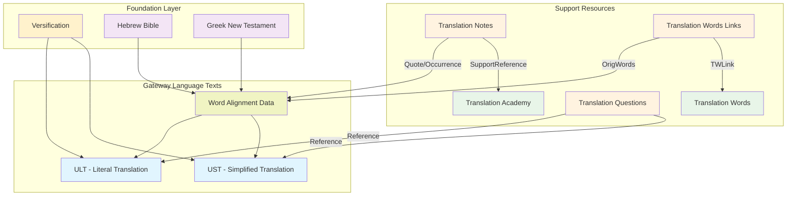
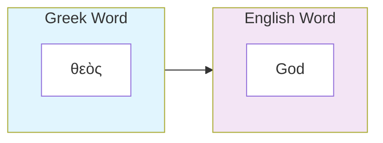
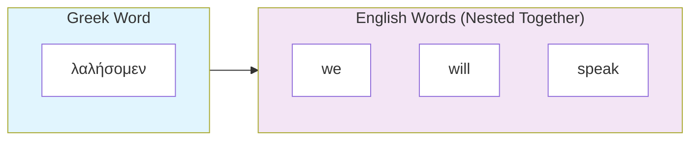
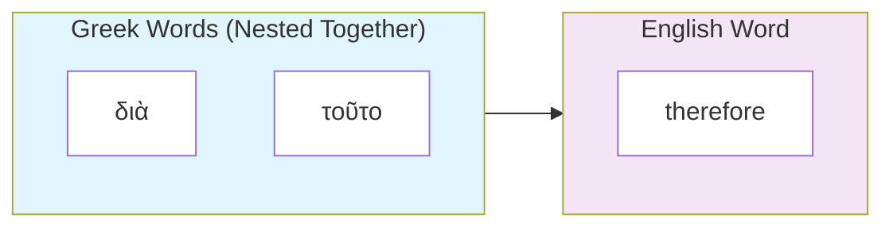
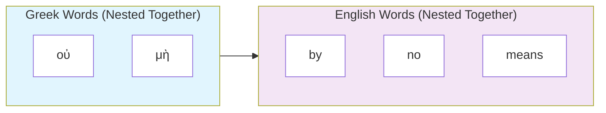
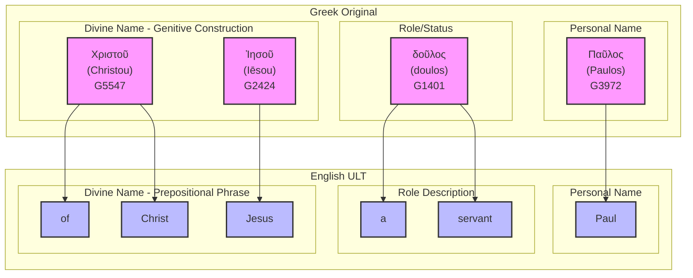

# unfoldingWord Translation Resources: Developer Guide

This document provides comprehensive technical documentation for developers building scripture translation, review, and quality assurance tools that work with unfoldingWord's Bible translation resources. These resources form an interconnected ecosystem designed to support accurate, clear, and natural Bible translation worldwide.

## Table of Contents

1. [Overview](#overview)
2. [Resource Types and Purposes](#resource-types-and-purposes)
3. [Resource Infrastructure and Organization](#resource-infrastructure-and-organization)
4. [Core Translation Resources](#core-translation-resources)
5. [Supporting Resources](#supporting-resources)
6. [Resource Container Architecture](#resource-container-architecture)
7. [Resource Linking System](#resource-linking-system)
8. [Integration Patterns](#integration-patterns)
9. [Extensibility Framework](#extensibility-framework)
10. [Implementation Guidelines](#implementation-guidelines)

## Overview

### Mission and Philosophy

unfoldingWord translation resources are developed under Creative Commons Attribution-ShareAlike 4.0 licenses to provide the global church with high-quality, interconnected Bible translation tools. The ecosystem serves **Mother Tongue Translators (MTTs)** who use gateway languages as their bridge to translate Scripture into their heart languages.

### Resource Ecosystem Architecture

The translation resource ecosystem consists of three foundational layers:

1. **Source Texts**: Original language texts (Hebrew, Greek, Aramaic) with modern gateway language translations
2. **Alignment Layer**: Precise word-level connections between original and gateway languages  
3. **Support Resources**: Contextual guidance, definitions, methodology, and quality assurance tools

### Key Design Principles

- **Interconnectedness**: All resources link together through standardized reference systems
- **Precision**: Word-level alignment enables exact targeting of translation guidance
- **Extensibility**: Resource Container specification allows new resource creation
- **Multilingual**: Gateway language organizations can create parallel resource sets
- **Open Access**: Creative Commons licensing ensures global accessibility

### Resource Relationship Overview



## Resource Types and Purposes

### Foundation Resources

These resources provide the structural framework for all translation work:

#### **Versification**
**What it contains**: The canonical chapter and verse structure for all 66 books of the Protestant Bible canon.

**Purpose**: Establishes a consistent reference system that all other resources use to coordinate with each other. When you look at Genesis 1:1, every resource knows exactly which verse you're referencing.

**Why translators need it**: Enables precise navigation and ensures that notes, word definitions, and questions all align to the correct Scripture passages.

#### **Original Language Texts**
**What they contain**: 
- **Hebrew Bible (UHB)**: The complete Old Testament in Hebrew and Aramaic
- **Greek New Testament (UGNT)**: The complete New Testament in Koine Greek

**Purpose**: Provide the authoritative source texts that all translations should ultimately derive from.

**Why translators need them**: These are the "measuring stick" against which all translations are evaluated for accuracy and faithfulness.

### Gateway Language Translation Texts

These are complete Bible translations in gateway languages (like English, Spanish, French) that serve as bridges for mother tongue translators:

#### **Literal Translation (ULT)**
**What it contains**: A complete Bible translation that stays as close as possible to the original language word order, grammar, and structure while remaining understandable.

**Purpose**: Shows translators exactly what the original text says, preserving Hebrew and Greek grammatical patterns.

**Why translators need it**: Helps translators understand the precise meaning and structure of the original, especially for complex passages where word order or grammar affects meaning.

#### **Simplified Translation (UST)**
**What it contains**: A complete Bible translation that prioritizes clear, natural communication of the original meaning using everyday language and cultural adaptations.

**Purpose**: Demonstrates how to express biblical concepts in clear, contemporary language that ordinary people can understand.

**Why translators need it**: Provides a model for dynamic equivalence translation, showing how to make ancient concepts accessible to modern readers.

#### **Word Alignment Data**
**What it contains**: Precise connections showing exactly which words in the gateway language translate which words in Hebrew/Greek.

**Purpose**: Creates a bridge between the original languages and gateway language translations at the individual word level.

**Why translators need it**: Enables translation tools to show exactly which Hebrew or Greek word a translator is working on, and to highlight relevant notes and definitions for that specific word.

### Supporting Guidance Resources

These resources provide contextual help and training for translators:

#### **Translation Notes (TN)**
**What they contain**: Verse-by-verse explanations for difficult, ambiguous, or culturally complex passages throughout the Bible.

**Purpose**: Provide specific guidance for translating challenging passages, including alternative translation options, cultural background, and theological clarifications.

**Why translators need them**: Many passages in Scripture require specialized knowledge to translate accurately - these notes provide that expertise in a targeted, practical format.

**Example**: For a metaphor like "God is my rock," a note would explain that this refers to God as a source of protection and stability, not a literal stone.

#### **Translation Words (TW)**
**What they contain**: Comprehensive definitions and explanations of key biblical, theological, and cultural terms that appear throughout Scripture.

**Purpose**: Ensure translators understand important concepts consistently across the entire Bible.

**Why translators need them**: Terms like "covenant," "righteousness," or "Sabbath" carry specific meanings that must be translated consistently throughout Scripture.

**Example**: The entry for "covenant" would explain the biblical concept of formal agreements between God and people, with examples from throughout Scripture.

#### **Translation Words Links (TWL)**
**What they contain**: Connections showing exactly which occurrences of original language words should be linked to Translation Words definitions.

**Purpose**: Connect specific word instances in the text to their corresponding definitions and explanations.

**Why translators need them**: When a translator encounters the Hebrew word "hesed" in Psalm 23, this resource points them to the Translation Words entry explaining "steadfast love" or "mercy."

#### **Translation Questions (TQ)**
**What they contain**: Comprehension questions with answers that test whether a translation successfully communicates the intended meaning.

**Purpose**: Provide a quality assurance method for translators to verify their translation is clear and accurate.

**Why translators need them**: After translating a passage, translators can use these questions to test whether their target audience would understand the intended meaning.

**Example**: For the passage "Paul, a servant of Christ Jesus," a question might be "What does Paul call himself?" with the answer "Paul calls himself a servant."

#### **Translation Academy (TA)**
**What they contain**: Comprehensive training materials covering translation theory, methodology, cultural issues, and quality standards.

**Purpose**: Provide the theoretical foundation and practical guidance needed for high-quality Bible translation work.

**Why translators need them**: Translation is a complex skill requiring knowledge of linguistics, culture, theology, and communication - these materials provide structured training in all these areas.

**Example**: An article on "Translating Metaphors" would explain what metaphors are, why they're challenging to translate, and provide specific strategies for handling them effectively.

### How Resources Work Together

These resources form an interconnected ecosystem where each one enhances the others:

- **Word Alignment** connects gateway language translations to original languages
- **Translation Notes** reference specific aligned words to provide targeted guidance
- **Translation Academy** articles are referenced by Translation Notes to explain the methodology behind translation decisions
- **Translation Words Links** point from aligned words to Translation Words articles
- **Translation Words** articles provide comprehensive definitions of key biblical, theological, and cultural terms
- **Translation Questions** verify that the final translation communicates effectively

**Example workflow**: A translator working on Romans 1:1 encounters the word "servant." The alignment data shows this translates Greek "doulos." Translation Words Links points to a comprehensive definition of "doulos" explaining slavery in the ancient world. Translation Notes provide specific guidance on how to translate this concept in different cultural contexts. Translation Academy articles explain general principles for translating cultural terms. Translation Questions help verify that the final translation communicates Paul's intended meaning.

This conceptual foundation enables the precise, interconnected resource ecosystem detailed in the following sections.

## Resource Infrastructure and Organization

### Where Resources are Hosted

All unfoldingWord translation resources are hosted on **Door43 Content Service (DCS)**, a specialized Git-based platform designed specifically for Bible translation content management.

#### Primary Hosting Platform: Door43 Content Service
- **Platform URL**: `https://git.door43.org/`
- **Technology**: Gitea-based Git platform with Door43-specific extensions
- **Organization**: Resources are organized under the `unfoldingWord` organization
- **Access Methods**: Web interface, Git protocols, and REST API
- **Version Control**: Full Git history tracking for all resource changes
- **Collaboration**: Multi-user editing with branch/merge workflows

#### Repository Organization Pattern
```
https://git.door43.org/unfoldingWord/
├── en_ult/          # English Literal Translation
├── en_ust/          # English Simplified Translation  
├── en_tn/           # English Translation Notes
├── en_tw/           # English Translation Words
├── en_twl/          # English Translation Words Links
├── en_ta/           # English Translation Academy
├── hbo_uhb/         # Hebrew Bible (original language)
├── el-x-koine_ugnt/ # Greek New Testament (original language)
└── [other languages and resources...]
```

### Why These Specific Structures?

#### Resource Container (RC) Specification Compliance

All unfoldingWord resources follow the **Resource Container (RC) specification**, an open standard designed specifically for Bible translation content. This ensures:

1. **Standardized Metadata**: Every resource includes Dublin Core-compliant metadata in `manifest.yaml`
2. **Consistent Structure**: Predictable file organization across all resource types
3. **Interoperability**: Resources from different organizations can work together
4. **Linking Capability**: Standardized URI format for cross-resource references
5. **Tool Compatibility**: Translation software can easily parse and integrate resources

#### Benefits of Git-Based Hosting

**Version Control**: Complete history of every change to translation resources
```bash
# Example: View the history of Genesis translation changes
git log --oneline 01-GEN.usfm
```

**Branching and Collaboration**: Multiple teams can work on resources simultaneously
```bash
# Example: Create feature branch for translation improvements
git checkout -b improve-genesis-notes
```

**Distributed Access**: Resources can be cloned, mirrored, and used offline
```bash
# Example: Clone entire ULT repository locally
git clone https://git.door43.org/unfoldingWord/en_ult.git
```

**Quality Control**: Pull requests and review workflows ensure resource accuracy

### Multi-Platform Support Strategy

While Door43 is the primary platform, the Resource Container specification enables hosting on multiple platforms:

#### Supported Hosting Options
- **Door43 Instances**: Primary and mirror Door43 servers
- **Generic Git Platforms**: GitHub, GitLab, Bitbucket
- **Self-Hosted Solutions**: Private Gitea, GitLab, or other Git servers  
- **Local Repositories**: Offline or network-isolated environments
- **Content Delivery Networks**: Cached distribution for performance

#### Platform Detection and Adaptation
Translation tools should detect the hosting platform and adapt accordingly:

```javascript
function detectPlatformType(repositoryUrl) {
  if (repositoryUrl.includes('git.door43.org')) return 'door43';
  if (repositoryUrl.includes('github.com')) return 'github';
  if (repositoryUrl.includes('gitlab.com')) return 'gitlab';
  return 'generic-git';
}
```

### Resource Discovery and Access

#### Door43 Catalog API
Door43 provides enhanced resource discovery through a specialized catalog API:

```javascript
// Discover all available English resources
GET https://git.door43.org/api/v1/catalog/list?lang=en&stage=prod

// Find specific resource type across languages  
GET https://git.door43.org/api/v1/catalog/list?resource=ult
```

#### Standard Git Access Patterns
```javascript
// Direct repository access
GET https://git.door43.org/api/v1/repos/unfoldingWord/en_ult

// File content access
GET https://git.door43.org/api/v1/repos/unfoldingWord/en_ult/contents/01-GEN.usfm

// Release information
GET https://git.door43.org/api/v1/repos/unfoldingWord/en_ult/releases/latest
```

### Quality Assurance and Release Management

#### Three-Stage Quality Process
1. **Draft Stage**: Initial development and testing
2. **Pre-Production**: Review and validation by subject matter experts  
3. **Production**: Approved resources ready for translation teams

#### Release Versioning
Resources use semantic versioning aligned with content updates:
```yaml
# Example from manifest.yaml
dublin_core:
  version: '85'  # Incremented with each content release
  issued: '2024-01-15'
  modified: '2024-01-15T14:30:00Z'
```

#### Checking Levels
Resources include quality indicators:
- **Level 1**: Community reviewed
- **Level 2**: Expert reviewed  
- **Level 3**: Thoroughly checked by unfoldingWord team

### Gateway Language Ecosystem Strategy

#### English as Primary Gateway Language
unfoldingWord provides the reference implementation in English, serving as the model for other gateway language organizations.

#### Parallel Gateway Language Implementations
Other organizations create complete resource sets in strategic languages:
- **Spanish**: `es-419_gl` organization 
- **French**: `fr_gl` organization
- **Portuguese**: `pt-br_gl` organization
- **Hindi**: `hi_gl` organization

Each maintains the same structural patterns while adapting content for their linguistic and cultural context.

This infrastructure foundation enables the precise, interconnected resource ecosystem detailed in the following sections.

## Core Translation Resources

The core translation resources form the foundation of the unfoldingWord ecosystem, providing source texts and alignment data that enable precise translation work.

### 1. Literal Translation (ULT)

**unfoldingWord® Literal Text** - A form-centric translation that maintains close adherence to original language structures while remaining understandable in the gateway language.

#### Technical Specifications
- **Format**: USFM 3.0 with embedded word alignment data
- **Base**: Derived from 1901 American Standard Version with modern updates
- **Philosophy**: Form-centric, preserving original word order and grammatical structures
- **Alignment**: Every word aligned to Hebrew (UHB) and Greek (UGNT) sources
- **Repository**: [unfoldingWord Literal Text](https://git.door43.org/unfoldingWord/en_ult)
- **License**: Creative Commons Attribution-ShareAlike 4.0

#### File Structure
```
en_ult/
├── manifest.yaml               # Resource Container manifest
├── LICENSE.md                 # CC BY-SA 4.0 license
├── 01-GEN.usfm               # Genesis with alignment data
├── 02-EXO.usfm               # Exodus with alignment data
├── 40-MAT.usfm               # Matthew with alignment data
└── 66-REV.usfm               # Revelation with alignment data
```

#### USFM Structure Elements

Some of the most common USFM structure elements are:

- **Book Headers**: `\id`, `\usfm`, `\ide`, `\h`, `\toc1-3`, `\mt` markers
- **Chapter/Verse**: `\c` and `\v` markers for scripture structure
- **Alignment Data**: `\zaln-s`/`\zaln-e` and `\w` markers for word-level connections
- **Formatting**: `\p`, `\m`, `\q1`, `\q2` for text layout and poetry
- **Cross-References**: `\x` markers for scripture cross-references
- **Footnotes**: `\f` markers for footnotes
- **Translator sections**: `\ts\*` markers for indicating the start or end of a translator sections.

More information about USFM structure elements can be found in the [USFM Specification](https://docs.usfm.bible/usfm/latest).

#### Purpose and Integration
- **Translation Foundation**: Provides literal rendering for understanding original meaning
- **Structural Reference**: Shows original language grammatical patterns
- **Alignment Anchor**: Serves as gateway language connection to Hebrew/Greek
- **Quality Standard**: Maintains high accuracy to original language texts

### 2. Simplified Translation (UST)

**unfoldingWord® Simplified Text** - A meaning-focused translation that prioritizes clear communication of biblical concepts.

#### Technical Specifications
- **Format**: USFM 3.0 with embedded word alignment data
- **Philosophy**: Meaning-focused, prioritizing clarity and natural expression
- **Approach**: Dynamic equivalence rendering thoughts and concepts
- **Alignment**: Every word aligned to Hebrew (UHB) and Greek (UGNT) sources
- **Repository**: [unfoldingWord Simplified Text](https://git.door43.org/unfoldingWord/en_ust)
- **License**: Creative Commons Attribution-ShareAlike 4.0

#### Purpose and Integration
- **Meaning Clarity**: Provides clear, natural rendering of biblical concepts
- **Cultural Bridge**: Explains ancient concepts in modern, understandable terms
- **Complementary Translation**: Works alongside ULT for comprehensive understanding


### 3. Word Alignment Data

**USFM 3.0 Embedded Alignment** - Precise word-level connections between gateway language translations and original Hebrew, Greek, and Aramaic texts.

#### Alignment Syntax Structure
```usfm
\zaln-s |x-strong="G35880" x-lemma="ὁ" x-morph="Gr,EA,,,,NMS," x-occurrence="1" x-occurrences="1" x-content="ὁ"\*\w The|x-occurrence="1" x-occurrences="1"\w*\zaln-e\*
```

#### Alignment Attributes
- **x-strong**: Strong's concordance number (G35880, H01234)
- **x-lemma**: Dictionary form of the original word (ὁ, אֱלֹהִים)
- **x-morph**: Morphological parsing (Gr,EA,,,,NMS,)
- **x-occurrence**: Which occurrence in the verse (1, 2, 3...)
- **x-occurrences**: Total occurrences in the verse
- **x-content**: Actual original language text being aligned

#### Alignment Relationship Types

**1. One-to-One**: Single original word ↔ single gateway word
```usfm
\zaln-s |x-strong="G2316" x-lemma="θεός" x-morph="Gr,N,,,,,NMS," x-occurrence="1" x-occurrences="1" x-content="θεὸς"\*\w God|x-occurrence="1" x-occurrences="1"\w*\zaln-e\*
```



**2. One-to-Many**: Single original word ↔ multiple gateway words (nested structure)
```usfm
\zaln-s |x-strong="G2980" x-lemma="λαλέω" x-morph="Gr,V,IFA1,,P," x-occurrence="1" x-occurrences="1" x-content="λαλήσομεν"\*\w we|x-occurrence="1" x-occurrences="1"\w* \w will|x-occurrence="1" x-occurrences="1"\w* \w speak|x-occurrence="1" x-occurrences="1"\w*\zaln-e\*
```

*Here, the single Greek verb "λαλήσομεν" (we will speak) requires three English words to express the same meaning. All three gateway words are contained within one alignment pair because they all translate the single original word.*



**3. Many-to-One**: Multiple original words ↔ single gateway word (overlapping alignments)
```usfm
\zaln-s |x-strong="G1223" x-lemma="διά" x-morph="Gr,P,,,,,G,,," x-occurrence="1" x-occurrences="1" x-content="διὰ"\*\zaln-s |x-strong="G5124" x-lemma="οὗτος" x-morph="Gr,RD,,,,ANS," x-occurrence="1" x-occurrences="1" x-content="τοῦτο"\*\w therefore|x-occurrence="1" x-occurrences="1"\w*\zaln-e\*\zaln-e\*
```

*This example shows two Greek words "διὰ τοῦτο" (literally "through this") being translated as the single English word "therefore". The alignment markers are nested, with both original words wrapping around the single gateway word that captures their combined meaning.*



**4. Many-to-Many**: Multiple original words ↔ multiple gateway words (nested combinations)
```usfm
\zaln-s |x-strong="G3756" x-lemma="οὐ" x-morph="Gr,D,,,,,,,," x-occurrence="1" x-occurrences="1" x-content="οὐ"\*\zaln-s |x-strong="G3361" x-lemma="μή" x-morph="Gr,D,,,,,,,," x-occurrence="1" x-occurrences="1" x-content="μὴ"\*\w by|x-occurrence="1" x-occurrences="1"\w* \w no|x-occurrence="1" x-occurrences="1"\w* \w means|x-occurrence="1" x-occurrences="1"\w*\zaln-e\*\zaln-e\*
```

*This shows a many-to-many relationship: the Greek double negative "οὐ μὴ" (literally "not not") is an emphatic negation construction that cannot be aligned as individual word pairs. You cannot say οὐ = "by" and μὴ = "no means" because neither Greek word individually means those English concepts. Instead, both Greek words together form an emphatic negation that requires the English idiomatic phrase "by no means" as an inseparable unit. The nested alignment markers show that both original words contribute to all three gateway words simultaneously.*



#### Complex Alignment Example: Romans 1:1

**Original Greek Text**:
> Παῦλος δοῦλος Χριστοῦ Ἰησοῦ

**ULT Translation**:
> Paul, a servant of Christ Jesus

**Alignment Visualization**:


**USFM Alignment Code**:
```usfm
\v 1 \zaln-s |x-strong="G39720" x-lemma="Παῦλος" x-morph="Gr,N,,,,,NMS," x-occurrence="1" x-occurrences="1" x-content="Παῦλος"\*\w Paul|x-occurrence="1" x-occurrences="1"\w*\zaln-e\*, \zaln-s |x-strong="G14010" x-lemma="δοῦλος" x-morph="Gr,N,,,,,NMS," x-occurrence="1" x-occurrences="1" x-content="δοῦλος"\*\w a|x-occurrence="1" x-occurrences="1"\w* \w servant|x-occurrence="1" x-occurrences="1"\w*\zaln-e\* \zaln-s |x-strong="G55470" x-lemma="Χριστός" x-morph="Gr,N,,,,,GMS," x-occurrence="1" x-occurrences="1" x-content="Χριστοῦ"\*\w of|x-occurrence="1" x-occurrences="1"\w* \w Christ|x-occurrence="1" x-occurrences="1"\w*\zaln-e\* \zaln-s |x-strong="G24240" x-lemma="Ἰησοῦς" x-morph="Gr,N,,,,,GMS," x-occurrence="1" x-occurrences="1" x-content="Ἰησοῦ"\*\w Jesus|x-occurrence="1" x-occurrences="1"\w*\zaln-e\*
```

**3. Many-to-One**: Multiple original words ↔ single gateway word
```usfm
\zaln-s |x-strong="G1223" x-content="διὰ"\*\zaln-s |x-strong="G5124" x-content="τοῦτο"\*\w therefore\w*\zaln-e\*\zaln-e\*
```

**4. Many-to-Many**: Multiple original words ↔ multiple gateway words
```usfm
\zaln-s |x-strong="G2570" x-content="καλῶς"\*\zaln-s |x-strong="G4160" x-content="ποιεῖς"\*\w do\w* \w good\w*\zaln-e\*\zaln-e\*
```


### 4. Versification

**Chapter and Verse Structure** - Standardized reference framework defining canonical structure for precise resource coordination.

#### Purpose
- **Reference Framework**: Enables consistent scripture references across all resources
- **Context Loading**: Tools know which resources to load for current verse
- **Navigation**: Uniform reference system for user interface coordination
- **Validation**: Ensures all resource references point to valid scripture locations

#### Technical Implementation
- **Format**: JSON or structured data defining chapter/verse boundaries
- **Scope**: Covers all 66 books of the Protestant canon
- **Standards**: Follows established versification systems (KJV, etc.)
- **Integration**: Referenced by all other resources for coordinate validation

## Supporting Resources

The supporting resources provide contextual guidance, definitions, methodology, and quality assurance tools that work together with the core translation texts.

### 5. Translation Notes (TN)

**unfoldingWord® Translation Notes** - Comprehensive verse-by-verse guidance providing specific help for translating difficult, complex, or ambiguous passages.

#### Technical Specifications
- **Format**: TSV (Tab-Separated Values) files, one per book
- **Structure**: Flat directory structure (files in root directory)
- **Naming**: `tn_[BOOK].tsv` (e.g., `tn_GEN.tsv`, `tn_MAT.tsv`)
- **Repository**: [unfoldingWord Translation Notes](https://git.door43.org/unfoldingWord/en_tn)
- **License**: Creative Commons Attribution-ShareAlike 4.0

#### TSV Column Structure

| Reference | ID   | Tags    | SupportReference                           | Quote      | Occurrence | Note                                    |
|-----------|------|---------|-------------------------------------------|------------|------------|-----------------------------------------|
| 1:3       | abc1 | grammar | rc://en/ta/man/translate/figs-metaphor    | בְּרֵאשִׁית | 1          | The Hebrew word for "beginning"...      |

**Column Definitions**:
- **Reference**: Chapter:verse (e.g., "1:3") or range ("1:3-5") or (1:2, 1:6)
- **ID**: Four-character unique identifier (e.g., "abc1")
- **Tags**: Categorization (grammar, culture, translate, etc.)
- **SupportReference**: Links to Translation Academy (`rc://*/ta/man/translate/...`)
- **Quote**: Original language text the note addresses
- **Occurrence**: Which occurrence (-1=all, 0=none, 1,2,3...=specific)
- **Note**: Markdown-formatted explanation and guidance

#### Note Categories
- **Translation Alternatives**: Different ways to render difficult terms
- **Cultural Context**: Background for understanding ancient customs
- **Grammatical Guidance**: Complex syntactic structure explanations
- **Theological Clarification**: Conceptual explanations
- **Figures of Speech**: Metaphors, idioms, and rhetorical devices

#### Integration Points
- **Quote + Occurrence**: Links to ULT/UST alignment data for highlighting
- **SupportReference**: Links to Translation Academy methodology
- **Reference**: Coordinates with versification system

### 6. Translation Words (TW)

**unfoldingWord® Translation Words** - Comprehensive definitions of key biblical, theological, and cultural terms throughout Scripture.

#### Technical Specifications
- **Format**: Markdown articles in hierarchical directories
- **Organization**: `/bible/kt/`, `/bible/names/`, `/bible/other/`
- **Repository**: [unfoldingWord Translation Words](https://git.door43.org/unfoldingWord/en_tw)
- **License**: Creative Commons Attribution-ShareAlike 4.0

#### Content Categories
- **Key Terms (`/kt/`)**: Central theological concepts (God, salvation, covenant)
- **Names (`/names/`)**: People, places, and proper nouns
- **Other Terms (`/other/`)**: Cultural, historical, and general concepts

#### Article Structure
```markdown
# Aaron

## Word Data:
* Strongs: H0175
* Part of speech: Proper Noun

## Facts:
Aaron was Moses' older brother. God chose Aaron to be the first high priest...

## Bible References:
* [1 Chronicles 23:12-14](rc://en/tn/help/1ch/23/12)
* [Acts 07:38-40](rc://en/tn/help/act/07/38)

## Examples from Bible Stories:
* [09:15](rc://en/obs/help/obs/09/15) God warned Moses and Aaron...
```

### 7. Translation Words Links (TWL)

**unfoldingWord® Translation Words Links** - Precise mapping connecting specific original language word occurrences to Translation Words definitions.

#### Technical Specifications
- **Format**: TSV files, one per book
- **Naming**: `twl_[BOOK].tsv` (e.g., `twl_GEN.tsv`)
- **Repository**: [unfoldingWord Translation Words Links](https://git.door43.org/unfoldingWord/en_twl)
- **License**: Creative Commons Attribution-ShareAlike 4.0

#### TSV Column Structure

| Reference | ID   | Tags | OrigWords | Occurrence | TWLink                           |
|-----------|------|------|-----------|------------|----------------------------------|
| 1:3       | xyz9 | kt   | אֱלֹהִים    | 1          | rc://en/tw/dict/bible/kt/god     |

**Column Definitions**:
- **Reference**: Chapter:verse where term occurs
- **ID**: Four-character unique identifier
- **Tags**: Term category (kt, names, other)
- **OrigWords**: Original language word(s)
- **Occurrence**: Which occurrence of the original word
- **TWLink**: Link to Translation Words article

### 8. Translation Questions (TQ)

**unfoldingWord® Translation Questions** - Comprehensive questions enabling translators to verify their translation communicates intended meaning clearly.

#### Technical Specifications
- **Format**: TSV files, one per book
- **Naming**: `tq_[BOOK].tsv` (e.g., `tq_GEN.tsv`)
- **Repository**: [unfoldingWord Translation Questions](https://git.door43.org/unfoldingword/en_tq)
- **License**: Creative Commons Attribution-ShareAlike 4.0

#### TSV Column Structure

| Reference | ID   | Tags | Quote  | Occurrence | Question                     | Response                      |
|-----------|------|------|--------|------------|------------------------------|-------------------------------|
| 1:3       | swi9 |      |  |  | What does Paul call himself? | Paul calls himself a servant  |

The quote and occurrence columns are not used in translation questions.

#### Purpose and Usage
- **Translation Verification**: Confirm translated meaning matches original intent
- **Comprehension Testing**: Verify target language speakers understand translation
- **Quality Assurance**: Systematic checking of translation accuracy
- **Training Tool**: Help translators understand key concepts

### 9. Translation Academy (TA)

**unfoldingWord® Translation Academy** - Comprehensive training materials providing theoretical foundation and practical guidance for Bible translation.

#### Technical Specifications
- **Format**: Markdown articles in hierarchical structure
- **Organization**: `/translate/`, `/checking/`, `/process/` categories
- **Repository**: [unfoldingWord Translation Academy](https://git.door43.org/unfoldingWord/en_ta)
- **License**: Creative Commons Attribution-ShareAlike 4.0

#### Content Categories
- **Translation Principles**: Fundamental translation theory concepts
- **Translation Methods**: Specific techniques for different text types
- **Cultural Issues**: Cross-cultural communication guidance
- **Quality Assurance**: Standards and checking processes

#### Article Structure
```markdown
# Translate Unknowns

## Description
This page answers the question: How do I translate words that I don't understand?

## Translation Principles
When translators encounter unknown words...

## Examples
Here are examples of how to handle unknown words...

## Translation Strategies
If the word is not known, here are strategies...
```

## Resource Container Architecture

### Technical Foundation

All unfoldingWord resources follow the [Resource Container (RC) specification](https://resource-container.readthedocs.io/en/latest/index.html), providing standardized structure, metadata, and linking mechanisms.

### RC Directory Structure
```
en_resource_name/
├── .apps/                      # Application metadata
├── LICENSE.md                  # License information
├── manifest.yaml              # RC manifest file
├── media.yaml                 # Media definitions (optional)
└── content/                   # Project content directory
    ├── config.yaml            # Project configuration
    ├── 01-GEN.usfm           # Genesis content
    └── 40-MAT.usfm           # Matthew content
```

### RC Container Types

#### 1. Bundle (`bundle`)
Flat directory structure for USFM collections:
```
en_ult/
├── manifest.yaml
├── 01-GEN.usfm               # Direct file access
└── 40-MAT.usfm
```

#### 2. Help (`help`)
Supplemental content like Translation Notes (flat structure):
```
en_tn/
├── manifest.yaml
├── tn_GEN.tsv
├── tn_EXO.tsv
├── tn_MAT.tsv
└── tn_REV.tsv
```

#### 3. Dictionary (`dict`)
Term definitions like Translation Words:
```
en_tw/
├── manifest.yaml
└── content/
    ├── aaron.md
    ├── god.md
    └── moses.md
```

#### 4. Manual (`man`)
Instructional content like Translation Academy:
```
en_ta/
├── manifest.yaml
└── content/
    ├── translate-unknowns/
    │   └── 01.md
    └── checking-level-one/
        └── 01.md
```

#### 5. Book (`book`)
Chapter/chunk structured content:
```
en_obs/
├── manifest.yaml
└── content/
    ├── 01/                   # Chapter directories
    │   ├── 01.md            # Chunk files
    │   └── 02.md
    └── 02/
        └── 01.md
```

### Manifest File Structure

Every RC includes a `manifest.yaml` following [Dublin Core standards](https://www.dublincore.org/specifications/dublin-core/dcmi-terms/):

```yaml
dublin_core:
  conformsto: 'rc0.2'
  contributor: []
  creator: 'unfoldingWord'
  description: 'Literal translation for Bible translators'
  format: 'text/usfm'
  identifier: 'ult'
  issued: '2024-01-01'
  language:
    identifier: 'en'
    title: 'English'
    direction: 'ltr'
  modified: '2024-01-01T12:00:00-00:00'
  publisher: 'unfoldingWord'
  relation: 
    - 'en/tn'
    - 'en/tw'
    - 'hbo/uhb'
    - 'el-x-koine/ugnt'
  rights: 'CC BY-SA 4.0'
  source:
    - identifier: 'uhb'
      language: 'hbo'
      version: '2.1.30'
  subject: 'Bible'
  title: 'unfoldingWord Literal Text'
  type: 'bundle'
  version: '85'

checking:
  checking_entity: ['unfoldingWord']
  checking_level: '3'

projects:
  - categories: ['bible-ot']
    identifier: 'gen'
    path: './01-GEN.usfm'
    sort: 1
    title: 'Genesis'
    versification: 'kjv'
```

## Resource Linking System

### RC Link Structure

The [RC Linking specification](https://resource-container.readthedocs.io/en/latest/linking.html) defines standardized URIs for cross-resource navigation:

```
rc://language/resource/type/project/chapter/chunk
```

### Link Examples by Resource Type

```
# Translation texts
rc://en/ult/book/gen/01/02        # ULT Genesis 1:2
rc://en/ust/book/mat/05/01        # UST Matthew 5:1

# Translation Notes
rc://en/tn/help/gen/01/02         # Translation Note for Genesis 1:2

# Translation Words
rc://en/tw/dict/bible/kt/god      # Translation Words entry for "god"

# Translation Academy
rc://en/ta/man/translate/translate-unknowns    # TA module
```

### Wildcard Support
```
rc://en/ult/book/*                # Any book in English ULT
rc://*/ult/book/gen               # Genesis in ULT in any language (Default)
rc://en/*/book/gen/01/01          # Genesis 1:1 in any English translation
```

Language wildcards in RC links are commonly used for language codes (e.g. `rc://*/ult/book/gen`) because they allow applications to dynamically resolve the appropriate language based on user preferences and settings. Rather than hardcoding specific language codes, using wildcards enables the same RC link structure to work across multiple languages. The application's language selection feature determines which language resources to load when resolving these wildcarded links. This pattern promotes resource reusability and simplifies multilingual support.

### Link Resolution Process

1. **Locate Resource Container**: Find RC directory matching language/resource
2. **Navigate to Project**: Use manifest to locate project content
3. **Resolve Chapter/Chunk**: Navigate to specific content location

### Practical Usage Examples

#### Translation Notes TSV
```tsv
Reference	ID	SupportReference	Quote	Note
1:1	tn001	rc://en/ta/man/translate/translate-names	Παῦλος	Paul is the name of a man
1:1	tn002	rc://en/tw/dict/bible/other/servant	δοῦλος	Paul calls himself a servant
```

#### Translation Academy Cross-References
```markdown
For more information, see [Translate Names](rc://en/ta/man/translate/translate-names).
```

## Integration Patterns

### Hosting Infrastructure: Git-Based Platforms

While the primary hosting is **Door43 Content Service (DCS)**, applications should support multiple hosting platforms:

#### Primary Platform: Door43 Content Service
- **Platform**: `https://git.door43.org/`
- **Organization**: `unfoldingWord` for English resources
- **Technology**: Gitea-based Git platform with Door43 extensions
- **API Access**: REST API for programmatic access
- **Version Control**: Full Git history and branching
- **Catalog API**: Extended endpoints for resource discovery and organization

#### Alternative Hosting Considerations
Applications should be designed to work with:
- **Door43 Clones**: Mirror instances of the main DCS platform
- **Other Gitea Instances**: Self-hosted Gitea platforms with unfoldingWord resources
- **Generic Git Platforms**: GitHub, GitLab, or other Git-based hosting
- **Local Repositories**: Offline or network-isolated environments
- **Custom Servers**: Organization-specific hosting solutions

### API Documentation and Access

#### Door43 API Overview

Door43 extends the standard Gitea API with specialized endpoints for Bible translation resources. The API provides both standard Git repository access and enhanced catalog functionality for resource discovery.

**API Documentation**:
- **Swagger UI**: [https://git.door43.org/api/swagger](https://git.door43.org/api/swagger)
- **OpenAPI Specification**: [https://git.door43.org/swagger.v1.json](https://git.door43.org/swagger.v1.json)
- **Base URL**: `https://git.door43.org/api/v1`

#### Standard Gitea API Endpoints

```javascript
// Repository access
GET /api/v1/repos/{owner}/{repo}                    // Repository metadata
GET /api/v1/repos/{owner}/{repo}/contents/{path}    // File contents
GET /api/v1/repos/{owner}/{repo}/releases           // Release information
GET /api/v1/repos/{owner}/{repo}/tags               // Version tags

// Organization and user endpoints
GET /api/v1/orgs/{org}/repos                        // Organization repositories
GET /api/v1/users/{username}/repos                  // User repositories
```

#### Door43 Catalog API Extensions

The Catalog API provides enhanced resource discovery and organization capabilities, by default the catalog is filtered to only show resources that are in the production stage.

```javascript
// Catalog endpoints for resource discovery
GET /api/v1/catalog/list                            // List all catalog entries
GET /api/v1/catalog/search                          // Search catalog entries
GET /api/v1/catalog/latest                          // Latest released resources

// Resource organization by metadata
GET /api/v1/catalog/list?subject=Bible              // Filter by subject
GET /api/v1/catalog/list?resource=ult               // Filter by resource type
GET /api/v1/catalog/list?lang=en                    // Filter by language
GET /api/v1/catalog/list?stage=prod                 // Filter by release stage
```

#### Catalog Entry Structure

Catalog entries provide rich metadata for resource discovery:

```typescript
interface CatalogEntry {
  id: string;                    // Unique identifier
  url: string;                   // Repository URL
  name: string;                  // Resource name
  owner: string;                 // Owner/organization
  full_name: string;             // Full repository name
  title: string;                 // Human-readable title
  description: string;           // Resource description
  language: {
    identifier: string;          // Language code (e.g., "en")
    title: string;              // Language name (e.g., "English")
    direction: string;          // Text direction ("ltr" or "rtl")
  };
  subject: string;              // Content subject (e.g., "Bible")
  resource: {
    identifier: string;         // Resource type (e.g., "ult", "tn")
    title: string;             // Resource title
  };
  format: string;               // Content format (e.g., "text/usfm")
  stage: string;                // Release stage ("prod", "preprod", "draft")
  checking_level: string;       // Quality level ("1", "2", "3")
  version: string;              // Version number
  released: string;             // Release date (ISO 8601)
  zipball_url: string;          // Download URL for ZIP archive
  tarball_url: string;          // Download URL for TAR archive
  metadata_url: string;         // Direct manifest.yaml URL
  metadata_json_url: string;    // JSON-formatted metadata URL
}
```

#### TypeScript Interface Generation

The OpenAPI specification can be used to generate TypeScript interfaces:

```bash
# Install OpenAPI TypeScript generator
npm install -g @openapitools/openapi-generator-cli

# Generate TypeScript interfaces
openapi-generator-cli generate \
  -i https://git.door43.org/swagger.v1.json \
  -g typescript-fetch \
  -o ./src/api/door43
```

#### Practical API Usage Examples

**1. Resource Discovery**:
```javascript
// Find all English ULT resources
const response = await fetch(
  'https://git.door43.org/api/v1/catalog/list?lang=en&resource=ult&stage=prod'
);
const ultResources = await response.json();

// Get latest version
const latest = ultResources.sort((a, b) => 
  new Date(b.released) - new Date(a.released)
)[0];
```

**2. Resource Download**:
```javascript
// Download resource as ZIP
async function downloadResource(catalogEntry) {
  const response = await fetch(catalogEntry.zipball_url);
  const blob = await response.blob();
  return blob;
}

// Get manifest data
async function getResourceManifest(catalogEntry) {
  const response = await fetch(catalogEntry.metadata_json_url);
  const manifest = await response.json();
  return manifest;
}
```

**3. Multi-Language Resource Discovery**:
```javascript
// Find all available languages for ULT
const allUlt = await fetch(
  'https://git.door43.org/api/v1/catalog/list?resource=ult&stage=prod'
).then(r => r.json());

const languages = [...new Set(allUlt.map(entry => entry.language.identifier))];
console.log('Available ULT languages:', languages);
```

**4. Gateway Language Ecosystem Discovery**:
```javascript
// Find complete resource sets for gateway languages
async function findCompleteGatewayLanguages() {
  const requiredResources = ['ult', 'ust', 'tn', 'tw', 'twl', 'ta'];
  const catalog = await fetch(
    'https://git.door43.org/api/v1/catalog/list?stage=prod'
  ).then(r => r.json());
  
  // Group by language
  const byLanguage = catalog.reduce((acc, entry) => {
    const lang = entry.language.identifier;
    if (!acc[lang]) acc[lang] = [];
    acc[lang].push(entry.resource.identifier);
    return acc;
  }, {});
  
  // Find languages with all required resources
  const completeLanguages = Object.entries(byLanguage)
    .filter(([lang, resources]) => 
      requiredResources.every(req => resources.includes(req))
    )
    .map(([lang]) => lang);
    
  return completeLanguages;
}
```

#### Authentication and Rate Limiting

```javascript
// API authentication (when required)
const headers = {
  'Authorization': 'token YOUR_API_TOKEN',
  'Content-Type': 'application/json'
};

// Rate limiting considerations
const apiClient = {
  async request(url, options = {}) {
    const response = await fetch(url, {
      ...options,
      headers: { ...headers, ...options.headers }
    });
    
    // Check rate limit headers
    const remaining = response.headers.get('X-RateLimit-Remaining');
    const reset = response.headers.get('X-RateLimit-Reset');
    
    if (remaining && parseInt(remaining) < 10) {
      console.warn(`API rate limit low: ${remaining} requests remaining`);
    }
    
    return response;
  }
};
```

### Repository Organization
```
https://git.door43.org/unfoldingWord/en_ult     # ULT
https://git.door43.org/unfoldingWord/en_ust     # UST
https://git.door43.org/unfoldingWord/en_tn      # Translation Notes
https://git.door43.org/unfoldingWord/en_tw      # Translation Words
https://git.door43.org/unfoldingWord/en_twl     # Translation Words Links
https://git.door43.org/unfoldingWord/en_ta      # Translation Academy
```

### Multilingual Gateway Language Ecosystem

#### Gateway Language Strategy
unfoldingWord created English resources for Mother Tongue Translators. Other organizations have created parallel ecosystems for different strategic languages:

- **Spanish**: `https://git.door43.org/es-419_gl/`
- **French**: `https://git.door43.org/fr_gl/`
- **Hindi**: `https://git.door43.org/hi_gl/`
- **Portuguese**: `https://git.door43.org/pt-br_gl/`

#### Naming Conventions
- **unfoldingWord (English)**: Uses ULT/UST codes
- **Other Gateway Languages**: Use GLT/GST codes (Gateway Language Literal/Simplified Text)

#### Consistent Linking Strategy
All gateway language organizations maintain the same internal linking patterns:

```yaml
# Spanish GLT manifest
relation:
  - es-419/tw          # Spanish Translation Words
  - es-419/tn          # Spanish Translation Notes
  - hbo/uhb?v=2.1.30   # Same Hebrew Bible reference
  - el-x-koine/ugnt?v=0.34  # Same Greek New Testament reference
```

### Quality Assurance Integration

#### Alignment-Based Validation
- **Coverage**: Every original word has gateway language alignment
- **Accuracy**: Aligned words appropriately represent original meaning
- **Consistency**: Same original words consistently aligned across contexts

#### Cross-Resource Coherence
- **Note Accuracy**: Translation Notes reference actually aligned words
- **Link Validity**: TWL points to words present in alignments
- **Methodology**: Alignment decisions follow Translation Academy principles

## Extensibility Framework

### Creating New Resources

Gateway language organizations can create additional resources following RC specifications:

#### Required Components
1. **RC Directory Structure**: Follow standard layout with manifest
2. **Manifest Compliance**: Use Dublin Core metadata standards
3. **Linking Compatibility**: Support RC link resolution
4. **Format Standards**: Use established file formats (USFM, TSV, Markdown)

#### Example: New Commentary Resource

**Directory Structure**:
```
en_biblical-commentary/
├── .apps/
├── LICENSE.md
├── manifest.yaml
├── bc_GEN.tsv
├── bc_EXO.tsv
└── bc_MAT.tsv
```

**Manifest**:
```yaml
dublin_core:
  conformsto: 'rc0.2'
  creator: 'Gateway Language Organization'
  description: 'Biblical commentary for translation teams'
  format: 'text/tab-separated-values'
  identifier: 'biblical-commentary'
  language:
    identifier: 'en'
    title: 'English'
  relation:
    - 'en/ult'
    - 'en/ust'
  title: 'Biblical Commentary'
  type: 'help'
  version: '1'

projects:
  - identifier: 'gen'
    path: './bc_GEN.tsv'
    title: 'Genesis'
```

**TSV Content**:

| Reference | ID    | Tags     | Quote      | Occurrence | Note                                        |
|-----------|-------|----------|------------|------------|---------------------------------------------|
| 1:1       | bc001 | creation | בְּרֵאשִׁית | 1          | The Hebrew word for "beginning" implies... |
| 1:2       | bc002 | spirit   | רוּחַ       | 1          | The Spirit of God hovering suggests...     |

### Integration Requirements

#### For Translation Tools
1. **Resource Discovery**: Scan for RC manifest files
2. **Type Recognition**: Handle all RC container types
3. **Format Processing**: Parse USFM, TSV, and Markdown content
4. **Link Resolution**: Support RC link navigation

#### For Resource Creators
1. **Reference Format**: Use standard chapter:verse format
2. **Quote Matching**: Include exact original language text for alignment
3. **Occurrence Tracking**: Number multiple instances correctly
4. **Cross-References**: Use RC link format for references

## Implementation Guidelines

### Usage Examples: Linking Resources for Practical Features

This section demonstrates how applications can combine multiple resources to create powerful translation review features.

#### 1. Translation Note Highlighting

**Scenario**: Highlight gateway language text that corresponds to Translation Notes

**Resources Used**: Translation Notes (TN) + Word Alignment Data + ULT/UST

**Example: Romans 1:1 Translation Note**

| Reference | ID   | Quote  | Occurrence | Note                                           |
|-----------|------|--------|------------|------------------------------------------------|
| 1:1       | abc1 | δοῦλος | 1          | Paul calls himself a servant of Jesus Christ... |

**Alignment Data in ULT**:
```usfm
\zaln-s |x-strong="G14010" x-lemma="δοῦλος" x-occurrence="1" x-content="δοῦλος"\*\w a servant\w*\zaln-e\*
```

**Implementation Process**:
1. Parse Translation Note: Quote = "δοῦλος", Occurrence = 1
2. Search alignment for `x-content="δοῦλος"` with `x-occurrence="1"`
3. Extract gateway text: "a servant"
4. Highlight "a servant" in displayed ULT text

**Visual Result**:
```
ULT Romans 1:1: Paul **[a servant]** of Jesus Christ...
                      ↑ highlighted because it aligns to δοῦλος
```

**Code Implementation**:
```javascript
function highlightTranslationNote(note, alignmentData) {
  const quote = note.Quote;
  const occurrence = note.Occurrence;
  
  // Find alignment for the quote
  const alignment = findAlignment(alignmentData, quote, occurrence);
  if (alignment) {
    const gatewayWords = extractGatewayWords(alignment);
    return highlightInText(gatewayWords);
  }
  return null;
}
```

#### 2. Translation Words Popup

**Scenario**: Show Translation Words definitions when users click on linked terms

**Resources Used**: Translation Words Links (TWL) + Translation Words (TW) + Word Alignment Data

**Example: Genesis 1:1 "God" Reference**

| Reference | ID   | Tags | OrigWords | Occurrence | TWLink                           |
|-----------|------|------|-----------|------------|----------------------------------|
| 1:1       | xyz9 | kt   | אֱלֹהִים    | 1          | rc://en/tw/dict/bible/kt/god     |

**Implementation Process**:
1. User clicks on "God" in ULT text
2. Find alignment data for clicked word
3. Match original word (אֱלֹהִים) with TWL entry
4. Load Translation Words article from `rc://en/tw/dict/bible/kt/god`
5. Display popup with definition and examples

**Code Implementation**:
```javascript
async function showTranslationWordsPopup(clickedWord, verse) {
  // Find alignment for clicked word
  const alignment = findAlignmentForGatewayWord(clickedWord, verse);
  const originalWord = alignment.originalWord;
  
  // Find TWL entry
  const twlEntry = findTWLEntry(verse.reference, originalWord);
  if (twlEntry) {
    // Load TW article
    const article = await loadResource(twlEntry.TWLink);
    displayPopup(article);
  }
}
```

#### 3. Cross-Reference Navigation

**Scenario**: Enable seamless navigation between interconnected resources

**Resources Used**: Translation Academy (TA) + Translation Notes (TN) + RC Links

**Example: Translation Note with TA Reference**

| Reference | ID    | SupportReference                              | Quote  | Note                        |
|-----------|-------|-----------------------------------------------|--------|-----------------------------|
| 1:1       | tn001 | rc://en/ta/man/translate/translate-names     | Παῦλος | Paul is the name of a man  |

**Implementation Process**:
1. Display Translation Note with clickable TA link
2. Parse RC link: `rc://en/ta/man/translate/translate-names`
3. Load Translation Academy article
4. Provide breadcrumb navigation back to original context

**Code Implementation**:
```javascript
function handleSupportReference(supportRef, currentContext) {
  const rcLink = parseRCLink(supportRef);
  const article = loadTranslationAcademy(rcLink.path);
  
  // Maintain navigation context
  const breadcrumb = {
    previous: currentContext,
    current: rcLink,
    title: article.title
  };
  
  displayWithNavigation(article, breadcrumb);
}
```

#### 4. Comprehensive Verse Analysis

**Scenario**: Show all available resources for a specific verse in one interface

**Resources Used**: ULT + UST + TN + TW + TWL + TQ + Alignment Data

**Implementation Process**:
1. Load all resources for target verse
2. Build cross-resource connections
3. Create unified interface showing:
   - Side-by-side ULT/UST comparison
   - Translation Notes with highlighting
   - Translation Words definitions
   - Translation Questions for verification
   - Original language alignment data

**Code Implementation**:
```javascript
async function buildVerseAnalysis(reference) {
  // Load all resources in parallel
  const [ult, ust, tn, tw, twl, tq] = await Promise.all([
    loadULT(reference),
    loadUST(reference), 
    loadTN(reference),
    loadTW(),
    loadTWL(reference),
    loadTQ(reference)
  ]);
  
  // Build interconnections
  const analysis = {
    texts: { ult, ust },
    notes: linkNotesToAlignment(tn, ult.alignment),
    words: linkWordsToAlignment(twl, tw, ult.alignment),
    questions: tq,
    alignment: ult.alignment
  };
  
  return analysis;
}
```

#### 5. Quality Assurance Dashboard

**Scenario**: Validate resource consistency and completeness

**Resources Used**: All resources with cross-validation

**Implementation Process**:
1. Check alignment coverage (every original word aligned)
2. Validate Translation Note quotes exist in alignment
3. Verify TWL links point to existing TW articles
4. Confirm RC links resolve correctly
5. Report inconsistencies for correction

**Code Implementation**:
```javascript
function validateResourceConsistency(resources) {
  const issues = [];
  
  // Check alignment coverage
  const uncoveredWords = findUncoveredOriginalWords(resources.alignment);
  if (uncoveredWords.length > 0) {
    issues.push({ type: 'alignment', uncovered: uncoveredWords });
  }
  
  // Validate TN quotes
  resources.tn.forEach(note => {
    if (!findAlignmentForQuote(note.Quote, resources.alignment)) {
      issues.push({ type: 'tn_quote', note: note.ID, quote: note.Quote });
    }
  });
  
  // Validate TWL links
  resources.twl.forEach(link => {
    if (!resourceExists(link.TWLink)) {
      issues.push({ type: 'twl_link', link: link.TWLink });
    }
  });
  
  return issues;
}
```

### Resource Loading Strategy

#### Configurable Resource Sources

Applications should support configurable resource sources rather than hardcoding Door43 URLs:

```javascript
// Configuration-driven resource loading
const resourceConfig = {
  baseUrl: process.env.RESOURCE_BASE_URL || 'https://git.door43.org',
  organization: process.env.RESOURCE_ORG || 'unfoldingWord',
  apiEndpoint: process.env.RESOURCE_API || '/api/v1',
  authToken: process.env.RESOURCE_TOKEN || null,
  useCatalogAPI: process.env.USE_CATALOG_API !== 'false'
};

async function loadResource(language, resourceType, bookId) {
  // Try Catalog API first (if available)
  if (resourceConfig.useCatalogAPI) {
    try {
      return await loadViaCatalogAPI(language, resourceType, bookId);
    } catch (catalogError) {
      console.warn('Catalog API failed, trying direct access:', catalogError.message);
    }
  }
  
  // Fallback to direct repository access
  const repoUrl = `${resourceConfig.baseUrl}/${resourceConfig.organization}/${language}_${resourceType}`;
  
  try {
    // Try standard Gitea API
    return await loadViaAPI(repoUrl, resourceConfig.apiEndpoint, bookId);
  } catch (apiError) {
    // Final fallback to direct Git access
    return await loadViaGit(repoUrl, bookId);
  }
}

async function loadViaCatalogAPI(language, resourceType, bookId) {
  // Use Catalog API for resource discovery
  const catalogUrl = `${resourceConfig.baseUrl}${resourceConfig.apiEndpoint}/catalog/list` +
    `?lang=${language}&resource=${resourceType}&stage=prod`;
  
  const response = await fetch(catalogUrl);
  const entries = await response.json();
  
  if (entries.length === 0) {
    throw new Error(`No ${resourceType} resources found for language ${language}`);
  }
  
  // Get latest version
  const latest = entries.sort((a, b) => new Date(b.released) - new Date(a.released))[0];
  
  // Download and parse resource
  return await downloadAndParseResource(latest, bookId);
}
```

#### Platform Detection and Adaptation

```javascript
function detectPlatformType(baseUrl) {
  if (baseUrl.includes('git.door43.org')) return 'gitea';
  if (baseUrl.includes('github.com')) return 'github';
  if (baseUrl.includes('gitlab.com')) return 'gitlab';
  return 'generic-git';
}

async function loadResourceWithPlatformAdaptation(config, language, resourceType) {
  const platformType = detectPlatformType(config.baseUrl);
  
  switch (platformType) {
    case 'gitea':
      return await loadFromGitea(config, language, resourceType);
    case 'github':
      return await loadFromGitHub(config, language, resourceType);
    case 'gitlab':
      return await loadFromGitLab(config, language, resourceType);
    default:
      return await loadFromGenericGit(config, language, resourceType);
  }
}
```

#### Dependency Resolution
```javascript
async function loadResourcePackage(language, bookId) {
  // Load core resources first
  const ult = await loadResource(language, 'ult', bookId);
  const ust = await loadResource(language, 'ust', bookId);
  
  // Load dependent resources
  const tn = await loadResource(language, 'tn', bookId);
  const tw = await loadResource(language, 'tw');
  const twl = await loadResource(language, 'twl', bookId);
  const ta = await loadResource(language, 'ta');
  
  // Build cross-resource connections
  return buildResourceConnections(ult, ust, tn, tw, twl, ta);
}
```

#### Link Resolution Implementation
```javascript
function resolveRCLink(link) {
  const parsed = parseRCLink(link);
  const rc = findResourceContainer(parsed.language, parsed.resource);
  const project = findProject(rc, parsed.project);
  return navigateToContent(project, parsed.chapter, parsed.chunk);
}
```

### User Interface Integration

#### Unified Navigation
- **Context Preservation**: Maintain reference when switching resources
- **Visual Connections**: Highlight relationships between aligned words and notes
- **Seamless Movement**: Enable jumping between interconnected resources

#### Translation Note Highlighting
```javascript
function highlightAlignedWords(note, alignmentData) {
  const quote = note.Quote;
  const occurrence = note.Occurrence;
  
  // Find alignment for the quote
  const alignment = findAlignment(alignmentData, quote, occurrence);
  if (alignment) {
    const gatewayWords = extractGatewayWords(alignment);
    highlightInText(gatewayWords);
  }
}
```

### Quality Checking Features

#### Automated Validation
- **Link Validation**: Check RC links resolve correctly
- **Reference Validation**: Verify scripture references are valid
- **Alignment Completeness**: Ensure all original words are aligned
- **Cross-Resource Consistency**: Validate resource interconnections

#### Error Handling
```javascript
function handleMissingResource(link) {
  const alternatives = ['ult', 'ust', 'glt', 'gst'];
  for (const alt of alternatives) {
    const altLink = link.replace(/\/\w+\//, `/${alt}/`);
    if (resourceExists(altLink)) return altLink;
  }
  return null; // No fallback available
}
```

### Performance Optimization

#### Caching Strategy
- **Resource Caching**: Cache parsed RC manifests and content
- **Link Resolution**: Cache resolved RC links
- **Alignment Data**: Pre-process alignment for fast highlighting

#### Lazy Loading
- **On-Demand**: Load resources only when needed
- **Progressive**: Load core resources first, then supporting materials
- **Background**: Pre-load likely-needed resources

#### Offline and Local Resource Support

Applications should support offline usage and local resource storage:

```javascript
// Multi-source resource loader with offline support
class ResourceLoader {
  constructor(config) {
    this.sources = [
      new LocalFileSource(config.localPath),
      new CachedSource(config.cachePath),
      new RemoteGitSource(config.remoteUrl),
      new FallbackSource(config.fallbackUrls)
    ];
  }
  
  async loadResource(language, resourceType, bookId) {
    for (const source of this.sources) {
      try {
        const resource = await source.load(language, resourceType, bookId);
        if (resource) {
          // Cache successful loads for offline use
          await this.cacheResource(resource, language, resourceType, bookId);
          return resource;
        }
      } catch (error) {
        console.warn(`Source ${source.name} failed:`, error.message);
        continue; // Try next source
      }
    }
    throw new Error(`No source available for ${language}_${resourceType}`);
  }
}
```

#### Resource Discovery and Validation

```javascript
// Validate resource compatibility across platforms
async function validateResourceSource(baseUrl, organization) {
  try {
    // Check if manifest.yaml exists and is valid RC format
    const manifestUrl = `${baseUrl}/${organization}/en_ult/raw/master/manifest.yaml`;
    const manifest = await fetchYAML(manifestUrl);
    
    // Validate RC compliance
    if (!manifest.dublin_core || !manifest.dublin_core.conformsto) {
      throw new Error('Invalid Resource Container format');
    }
    
    return {
      valid: true,
      rcVersion: manifest.dublin_core.conformsto,
      platform: detectPlatformType(baseUrl)
    };
  } catch (error) {
    return {
      valid: false,
      error: error.message
    };
  }
}
```

## Conclusion

The unfoldingWord translation resource ecosystem provides a comprehensive, interconnected foundation for building sophisticated Bible translation tools. By following the Resource Container specification and implementing proper linking mechanisms, developers can create applications that leverage the full power of this integrated resource system.

### Key Success Factors

1. **Understand the Ecosystem**: Grasp how resources interconnect and depend on each other
2. **Follow Standards**: Implement RC specifications and linking protocols correctly
3. **Leverage Alignment**: Use word-level alignment for precise resource targeting
4. **Plan for Extensibility**: Design systems that can accommodate new resources
5. **Optimize Performance**: Implement efficient loading and caching strategies

### Benefits for Translation Teams

- **Precision**: Word-level alignment enables exact targeting of translation guidance
- **Comprehensiveness**: Complete ecosystem covers all aspects of translation work
- **Quality Assurance**: Multiple validation layers ensure translation accuracy
- **Efficiency**: Interconnected resources reduce lookup time and improve workflow
- **Extensibility**: Framework supports creation of specialized resources

### Benefits for Developers

- **Standards-Based**: RC specification provides clear implementation guidelines
- **Well-Documented**: Complete technical specifications with code examples
- **Proven Architecture**: Battle-tested by multiple translation organizations
- **Open Source**: Creative Commons licensing enables broad adoption
- **Community Support**: Active developer community and ongoing maintenance

This documentation provides the foundation for building translation tools that serve the global church's mission of making Scripture accessible in every language. The unfoldingWord ecosystem represents years of collaborative development by translation experts, linguists, and software developers working together to create the most comprehensive Bible translation resource system available today. 