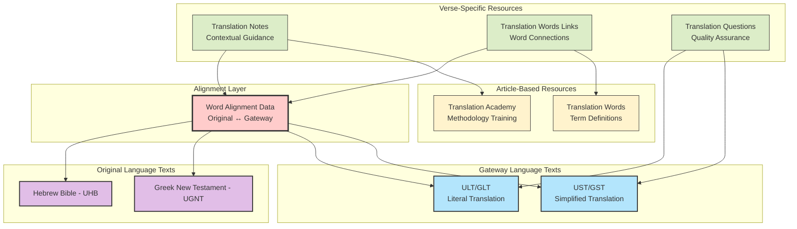
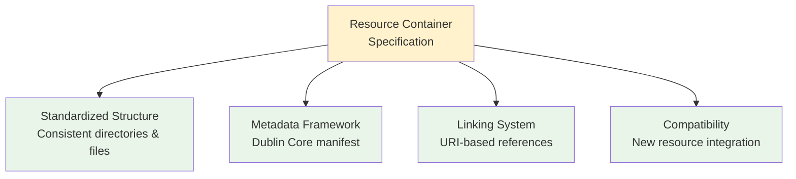
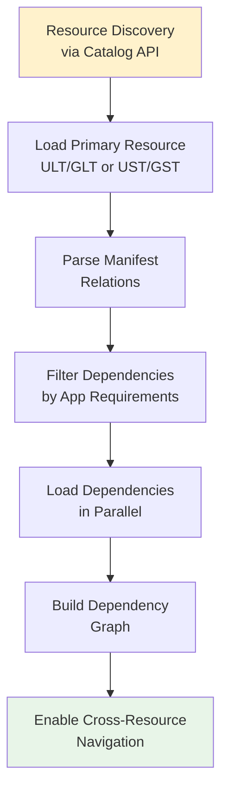
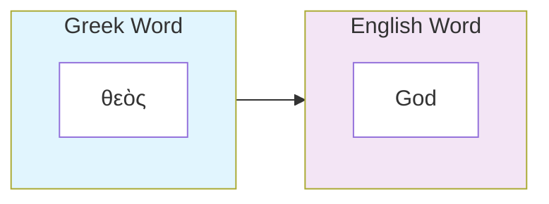
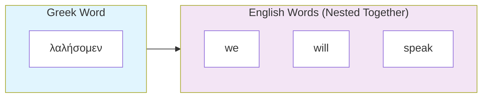
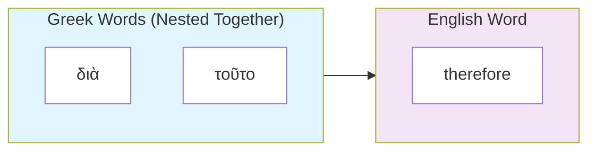
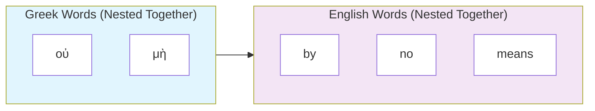
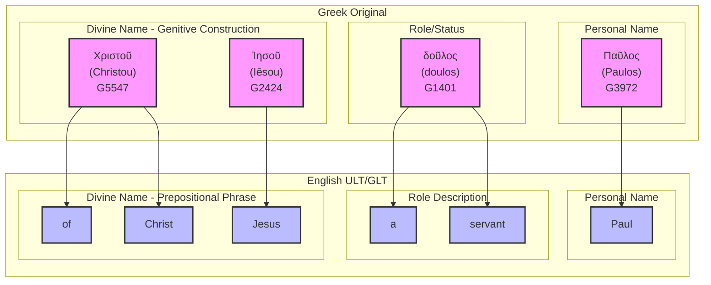

# unfoldingWord Bible Translation Resources Ecosystem: Developer Guide

## Introduction

This technical guide provides complete documentation for the unfoldingWord Bible translation resource ecosystem - an interconnected system of open-source resources that enables Mother Tongue Translators to create Scripture translations in their heart languages.

**Who This Helps:**

- **Developers**: Build Bible translation apps using APIs, word-level alignment, and cross-resource linking
- **Technical Decision Makers**: Plan system integration, optimize performance, and design for multiple languages  
- **Content Creators**: Understand how translation resources connect and support quality workflows
- **Open Source Contributors**: Follow technical standards, contribute new resources, and extend the ecosystem

**Key Benefits:** Saves development time with ready-to-use specifications, ensures new tools integrate seamlessly with existing apps, includes quality checks for reliable implementations, and simplifies working with interconnected Bible translation resources.

## Table of Contents

- [unfoldingWord Bible Translation Resources Ecosystem: Developer Guide](#unfoldingword-bible-translation-resources-ecosystem-developer-guide)
  - [Introduction](#introduction)
  - [Table of Contents](#table-of-contents)
  - [TLDR](#tldr)
  - [Overview](#overview)
    - [Mission \& Core Concepts](#mission--core-concepts)
  - [Resource Ecosystem Architecture](#resource-ecosystem-architecture)
    - [Key Design Principles](#key-design-principles)
    - [Resource Types \& Functions](#resource-types--functions)
    - [Core Architecture](#core-architecture)
  - [Technical Specifications](#technical-specifications)
    - [Resource Container (RC) Specification](#resource-container-rc-specification)
      - [Purpose \& Structure](#purpose--structure)
      - [Example: English ULT Resource Container](#example-english-ult-resource-container)
      - [Basic Requirements for Creating a Resource Container](#basic-requirements-for-creating-a-resource-container)
      - [Core RC Principles](#core-rc-principles)
      - [How RC Provides Structure and Interconnection](#how-rc-provides-structure-and-interconnection)
      - [RC Container Types \& File Patterns](#rc-container-types--file-patterns)
      - [Manifest Structure (Key Fields)](#manifest-structure-key-fields)
      - [RC Linking System](#rc-linking-system)
    - [Hosting Resource Containers](#hosting-resource-containers)
    - [API Reference](#api-reference)
      - [Platform Overview](#platform-overview)
      - [Catalog API Endpoints](#catalog-api-endpoints)
      - [Repository API Endpoints](#repository-api-endpoints)
      - [Authentication \& Access Control](#authentication--access-control)
      - [Rate Limiting \& Performance](#rate-limiting--performance)
    - [Repository Organization](#repository-organization)
      - [Organizational Models](#organizational-models)
      - [Repository Naming Conventions](#repository-naming-conventions)
      - [Repository Structure](#repository-structure)
      - [Discovery Patterns](#discovery-patterns)
      - [Access Patterns \& Performance](#access-patterns--performance)
      - [Repository Relationships](#repository-relationships)
      - [Quality Control \& Governance](#quality-control--governance)
      - [Migration \& Reorganization](#migration--reorganization)
      - [Best Practices](#best-practices)
    - [Integration Strategy](#integration-strategy)
    - [Loading Patterns](#loading-patterns)
    - [Dependency Resolution](#dependency-resolution)
  - [Resource formats](#resource-formats)
    - [USFM](#usfm)
    - [TSV](#tsv)
    - [Markdown](#markdown)
  - [unfoldingWord Resource Containers and their relationships](#unfoldingword-resource-containers-and-their-relationships)
    - [1. UHB (Hebrew Bible)](#1-uhb-hebrew-bible)
    - [2. UGNT (Greek New Testament)](#2-ugnt-greek-new-testament)
    - [3. ULT (Literal Translation for Translators)](#3-ult-literal-translation-for-translators)
    - [4. UST (Simplified Translation for Translators)](#4-ust-simplified-translation-for-translators)
    - [5. Translation Notes](#5-translation-notes)
    - [6. Translation Academy](#6-translation-academy)
    - [7. Translation Words](#7-translation-words)
    - [8. Translation Words Links](#8-translation-words-links)
    - [9. Translation Questions](#9-translation-questions)
  - [Alignment Layer](#alignment-layer)
    - [Alignment Syntax](#alignment-syntax)
      - [USFM Alignment Syntax Structure](#usfm-alignment-syntax-structure)
      - [Alignment Relationship Types](#alignment-relationship-types)
      - [Complex Alignment Example: Romans 1:1](#complex-alignment-example-romans-11)
  - [Versification Layer](#versification-layer)
  - [Quality Assurance of the Resource System](#quality-assurance-of-the-resource-system)
    - [Validation Requirements](#validation-requirements)
  - [Extensibility](#extensibility)
    - [Creating New Resources](#creating-new-resources)
    - [Memory Management](#memory-management)
  - [Development Workflow](#development-workflow)
    - [Local Development Setup](#local-development-setup)
      - [Environment Prerequisites](#environment-prerequisites)
      - [Resource Discovery \& Loading](#resource-discovery--loading)
    - [Testing Strategies](#testing-strategies)
      - [Unit Testing Approaches](#unit-testing-approaches)
      - [Test Data Management](#test-data-management)
    - [Debugging Approaches](#debugging-approaches)
      - [Common Issues \& Solutions](#common-issues--solutions)
      - [Debugging Tools \& Techniques](#debugging-tools--techniques)
    - [Performance Optimization](#performance-optimization)
      - [Resource Loading Optimization](#resource-loading-optimization)
      - [Memory Management](#memory-management-1)
  - [Key Success Factors](#key-success-factors)
  - [Automated Research \& AI Analysis](#automated-research--ai-analysis)
    - [Research Target Priorities](#research-target-priorities)
    - [Systematic Research Strategies](#systematic-research-strategies)
      - [USFM Specification Deep Analysis](#usfm-specification-deep-analysis)
      - [Resource Container Specification Research](#resource-container-specification-research)
      - [Gateway Language Manual Analysis](#gateway-language-manual-analysis)
      - [API Documentation Comprehensive Analysis](#api-documentation-comprehensive-analysis)
    - [Cross-Resource Analysis Frameworks](#cross-resource-analysis-frameworks)
      - [Ecosystem Coherence Verification](#ecosystem-coherence-verification)
      - [Implementation Gap Identification](#implementation-gap-identification)
    - [Automated Knowledge Extraction](#automated-knowledge-extraction)
      - [Natural Language Processing Applications](#natural-language-processing-applications)
      - [Machine Learning Pattern Recognition](#machine-learning-pattern-recognition)
    - [Research Output Integration](#research-output-integration)
      - [Knowledge Graph Construction](#knowledge-graph-construction)
      - [Continuous Monitoring](#continuous-monitoring)
    - [AI Research Best Practices](#ai-research-best-practices)
      - [Ethical Considerations](#ethical-considerations)
      - [Quality Assurance](#quality-assurance)
  - [Further Reading](#further-reading)
- [Glossary](#glossary)
      - [**Gateway Languages**](#gateway-languages)
      - [**Mother Tongue Translators (MTTs)**](#mother-tongue-translators-mtts)
      - [**Heart Languages**](#heart-languages)

## TLDR

unfoldingWord provides an interconnected ecosystem of open-source Bible translation resources designed to help Mother Tongue Translators create Scripture in their heart languages. The system centers around **word-level alignment** between original biblical texts and gateway language translations, with supporting resources that provide contextual guidance.

**Key Components:**

- **Source Texts**: Hebrew Bible (UHB) and Greek New Testament (UGNT)
- **Gateway Translations**: Literal (ULT/GLT) and Simplified (UST/GST) texts with word-level alignment to originals
- **Support Resources**: Translation Notes (TN), Translation Words (TW), Translation Academy (TA), and Translation Questions (TQ)

**For Developers:**

- All resources follow [**Resource Container (RC)** specification](https://resource-container.readthedocs.io/) with standardized manifest files.
- Resources are hosted on [Door43 Content Service](https://git.door43.org/) with REST API access
- Word alignment enables precise cross-resource navigation and features like word-level highlighting
- System supports multiple gateway languages with parallel resource structures
- Three main formats: USFM (Bible text), TSV (structured data), Markdown (articles)

**Getting Started:** Use the Catalog API to discover resources, load primary texts (ULT/UST), then add supporting resources based on manifest dependencies. The alignment layer connects everything together.

## Overview

### Mission & Core Concepts

unfoldingWord provides open-source <abbr title="A comprehensive suite of interconnected texts, guidance materials, and tools including literal translations, simplified translations, explanatory notes, term definitions, quality assurance questions, and training materials">**Bible translation resources**</abbr> under CC BY-SA 4.0 licensing to enable <abbr title="Native speakers of the target language working to translate Scripture into their heart language">**Mother Tongue Translators (MTTs)**</abbr> to translate Scripture from <abbr title="Strategic languages that serve as bridges between original biblical languages and target heart languages">**Gateway Languages**</abbr> into their <abbr title="The native languages that Mother Tongue Translators speak most naturally">**Heart Languages**</abbr>.

## Resource Ecosystem Architecture

The translation resource ecosystem consists of three foundational layers:

1. **Source Texts**: Original language texts (Hebrew, Greek, Aramaic) with modern gateway language translations
2. **Alignment Layer**: Precise word-level connections between original and gateway languages  
3. **Support Resources**: Contextual guidance, definitions, methodology, and quality assurance tools

### Key Design Principles

- **Interconnectedness**: All resources link together through standardized reference systems
- **Precision**: Word-level alignment enables exact targeting of translation guidance
- **Extensibility**: Resource Container specification allows new resource creation
- **Multilingual**: Gateway language organizations can create parallel resource sets
- **Open Access**: Creative Commons licensing ensures global accessibility

### Resource Types & Functions

The unfoldingWord ecosystem includes the following resources for Bible translators:

| Resource | Format | Purpose | Key Features |
|----------|--------|---------|--------------|
| **UHB** | USFM | Original language texts (Hebrew) | Tokenized |
| **UGNT** | USFM | Original language texts (Greek) | Tokenized |
| **ULT/GLT** | USFM | Literal translation preserving grammatical and syntactic structures, idiomatic expressions and figures of speech of the original text as much as possible | Word-aligned, form-centric, tokenized |
| **UST/GST** | USFM | Simplified translation that expresses the meaning of the original text as clearly as possible when the forms in the GLT/ULT are not clear or natural in the target language | Word-aligned, meaning-based, tokenized |
| **Translation Notes** | TSV | Verse-specific translation guidance, grammar explanations, contextual explanations, and cultural background information | Linked to aligned words and Translation Academy articles |
| **Translation Words** | Markdown | Biblical term definitions | Consistent terminology |
| **Translation Words Links** | TSV | Internal linking between aligned words and Translation Words definitions by occurrence in verse | Precise occurrence tracking |
| **Translation Questions** | TSV | Verse-specific quality assurance questions | Community checking |
| **Translation Academy** | Markdown | Translation methodology, cultural issues, and quality standards | Training materials |

For a more comprehensive description of the resources and their purpose, see the [unfoldingWord for Translators](https://unfoldingword.org/for-translators/) page. This document is a technical specification of the resources and their interconnections meant to help developers understand the resources and how they work together.

### Core Architecture



## Technical Specifications

### Resource Container (RC) Specification

#### Purpose & Structure

The **Resource Container specification** provides a standardized framework for organizing and connecting Bible resources. RC allows you to declare the file and directory structure of a resource and describe it comprehensively through a manifest file. This enables automatic discovery, validation, and interconnection of resources across the entire ecosystem.

#### Example: English ULT Resource Container

Here's what an actual Resource Container looks like in practice:

```
en_ult/
├── manifest.yaml             # Resource metadata and dependencies
├── LICENSE.md                # CC BY-SA 4.0 license
├── 01-GEN.usfm               # Genesis with word alignment data
├── 02-EXO.usfm               # Exodus with word alignment data
├── 03-LEV.usfm               # Leviticus with word alignment data
├── ...                       # All 66 books
├── 40-MAT.usfm               # Matthew with word alignment data
├── 41-MRK.usfm               # Mark with word alignment data
└── 66-REV.usfm               # Revelation with word alignment data
```

**Key Files:**

**`manifest.yaml`** - Declares resource identity, dependencies, and file structure:

```yaml
dublin_core:
  conformsto: 'rc0.2'                    # RC specification version
  identifier: 'ult'                      # Unique resource identifier
  language: 
    identifier: 'en'                     # BCP 47 language code
    direction: 'ltr'                     # Text direction (ltr/rtl)
  subject: 'Bible'                       # Resource category for filtering
  type: 'bundle'                         # RC container type (bundle/help/dict/man)
  relation:                              # Array of related resources
    - 'en/tn'                            # Translation Notes (same language)
    - 'en/twl'                           # Translation Words Links
    - 'hbo/uhb'                          # Hebrew Bible source
    - 'el-x-koine/ugnt'                  # Greek New Testament source
    - 'en/ta'                            # Translation Academy
    - 'en/tw'                            # Translation Words
  version: '85'                          # Resource version number

checking:
  checking_level: '3'                    # Quality assurance level (1-3)

projects:                                # File mappings for each book
  - identifier: 'gen'                    # Book identifier (3-letter code)
    path: './01-GEN.usfm'                # Relative file path
    sort: 1                              # Display/processing order
    versification: 'kjv'                 # Versification system
  - identifier: 'exo'
    path: './02-EXO.usfm'
    sort: 2
    versification: 'kjv'
  # ... continues for all 66 books
```

**`01-GEN.usfm`** - USFM text with embedded word alignment:

```usfm
\v 1 \zaln-s |x-strong="H07225" x-lemma="רֵאשִׁית" x-content="בְּרֵאשִׁית"\*\w In|x-occurrence="1"\w* \w the|x-occurrence="1"\w* \w beginning|x-occurrence="1"\w*\zaln-e\* \zaln-s |x-strong="H0430" x-lemma="אֱלֹהִים" x-content="אֱלֹהִים"\*\w God|x-occurrence="1"\w*\zaln-e\* \zaln-s |x-strong="H01254" x-lemma="בָּרָא" x-content="בָּרָא"\*\w created|x-occurrence="1"\w*\zaln-e\*...
```

#### Basic Requirements for Creating a Resource Container

To create a valid Resource Container, you need:

1. **Manifest File** (`manifest.yaml`) with required [Dublin Core metadata](https://dublincore.org/specifications/dublin-core/dcmi-terms/#terms-defined-by-dc)
2. **License File** (`LICENSE.md`) - typically CC BY-SA 4.0 for unfoldingWord resources
3. **Content Files** in the appropriate format (USFM for texts, TSV for data, Markdown for articles)
4. **Consistent Structure** following RC directory patterns for your container type
5. **Valid Identifiers** using established conventions (language codes, book codes, etc.)

This standardized structure ensures that all unfoldingWord resources work together seamlessly, regardless of language or resource type.

**Dublin Core**: The manifest file uses [Dublin Core metadata standards](https://dublincore.org/specifications/dublin-core/dcmi-terms/#terms-defined-by-dc) to describe the resource with standardized fields like `identifier`, `language`, `subject`, `type`, and `relation`. This ensures consistent metadata across all Resource Containers and enables automatic discovery and interconnection of resources.

**RC Core Functions:**



#### Core RC Principles

1. **Standardized Metadata**: Every resource has [Dublin Core metadata](https://dublincore.org/specifications/dublin-core/dcmi-terms/#terms-defined-by-dc) in `manifest.yaml`
2. **Predictable Structure**: Consistent directory layout and file naming
3. **Cross-Resource Linking**: URI-based references enable automatic navigation
4. **Version Management**: Built-in versioning and dependency tracking
5. **Extensibility**: Framework supports new resource types and subjects
6. **Platform Agnostic**: Works with any documents hosting platform that supports distributed version control and API access

#### How RC Provides Structure and Interconnection

**1. Resource Structure Standardization:**
RC defines consistent directory layouts and file naming patterns:

```yaml
# All resources follow same manifest structure
dublin_core:
  identifier: 'resource-name'
  type: 'bundle' | 'help' | 'dict' | 'man'
  relation: ['connected/resources']
```

**2. Interconnection Through Relations:**
Resources declare their dependencies and connections:

```yaml
# en_ult manifest declares connections to:
relation:
  - en/tn    # Translation Notes
  - en/twl   # Translation Words Links  
  - hbo/uhb  # Hebrew Bible source
```

**3. Cross-Resource Navigation:**
RC links provide standardized addressing:

```
rc://en/tn/help/gen/01/02    # Translation Note for Genesis 1:2
rc://en/tw/dict/bible/kt/god # Translation Words entry for "god"
```

**4. New Resource Compatibility:**
Following RC structure ensures new resources integrate automatically:

```yaml
# New commentary resource
dublin_core:
  identifier: 'commentary'
  type: 'help'
  relation: ['en/ult', 'en/ust']  # Links to existing resources
```

**5. Multi-Language Consistency:**
RC enables parallel resource structures across gateway languages:

```
en_ult   → es-419_glt  → fr_glt     # Same container type
en_tn    → es-419_tn   → fr_tn      # Same TSV structure
en_tw    → es-419_tw   → fr_tw      # Same markdown format
```

**Practical Benefits:**

- **Structure**: Predictable file organization across all resources
- **Compatibility**: New resources automatically work with existing tools
- **Interconnection**: Standardized linking enables seamless navigation
- **Quality Control**: Metadata provides versioning and quality tracking

#### RC Container Types & File Patterns

| Type | Structure | Content Pattern | Example |
|------|-----------|-----------------|---------|
| `bundle` | Flat USFM files | `{NN}-{BOOK}.usfm` | `01-GEN.usfm`, `40-MAT.usfm` |
| `help` | Flat TSV files | `{prefix}_{BOOK}.tsv` | `tn_GEN.tsv`, `tq_MAT.tsv` |
| `dict` | Nested Markdown | `bible/{type}/{term}.md` | `bible/kt/compassion.md`, `bible/names/aaron.md` |
| `man` | Nested chapters | `{category}/{topic}/{NN}.md` | `translate/figs-metaphor/01.md`, `intro/translation-guidelines/01.md` |

#### Manifest Structure (Key Fields)

```yaml
dublin_core:
  conformsto: 'rc0.2'                    # RC specification version
  identifier: 'ult'                      # Resource identifier
  language:
    identifier: 'en'                     # BCP 47 language code
    direction: 'ltr'                     # Text direction (ltr/rtl)
  relation:                              # Dependencies array
    - 'en/tn'                           # Same language resources
    - 'hbo/uhb?v=2.1.30'               # Source text with version
  subject: 'Bible'                       # Resource subject for filtering
  type: 'bundle'                         # RC container type
  version: '85'                          # Resource version number

checking:
  checking_level: '3'                    # Quality level (1-3)

projects:                                # Book definitions
  - identifier: 'gen'                    # Book identifier
    path: './01-GEN.usfm'               # File path
    sort: 1                             # Sort order
    versification: 'kjv'                # Versification system
```

For more information on the Resource Container specification, see the [Resource Container specification](https://resource-container.readthedocs.io/) page.

#### RC Linking System

**Link Format:** `rc://language/resource/type/project/chapter/chunk`

**Examples:**

- `rc://en/ult/book/gen/01/02` - ULT Genesis 1:2
- `rc://en/tn/help/gen/01/02` - Translation Note for Genesis 1:2
- `rc://en/tw/dict/bible/kt/god` - Translation Words entry for "god"
- `rc://*/ta/man/translate/figs-metaphor` - Translation Academy article (* wildcard for any language)

### Hosting Resource Containers

unfoldingWord resources are currently hosted on the [Door43 Content Service](https://git.door43.org/) platform. This platform is a fork of [Gitea](https://gitea.io/) (an open source Git server like GitHub) and provides a robust infrastructure for hosting and managing resources, including:

- Version control
- Collaboration (forking, pull requests, etc.)
- API access
- Resource discovery

Although any other platform that supports these features can host resource containers, this guide will focus on the Door43 Content Service and how unfoldingWord RCs are hosted and accessed in the Door43 ecosystem.

The DCS hosts unfoldingWord resources as git repositories using three organizational models:

**1. Single-Language Organizations**: Most gateway language communities create dedicated organizations (e.g., `es-419_gl` for Spanish, `fr_gl` for French) that contain all resource repositories for their specific language. This enables focused collaboration within language communities and clear ownership models.

**2. Multi-Language Organizations**: The core `unfoldingWord` organization hosts resources across multiple languages, including the original English resources and some community contributions in other languages, providing centralized access to foundational resources.

**3. Individual User Repositories**: Users can host resources under their personal accounts for private development, experimentation, or small group collaboration, though this limits broader community collaboration and discoverability.

This flexible organizational structure supports both large-scale community collaboration and individual development workflows, while maintaining clear resource discovery patterns for developers.

You can find the unfoldingWord organization containing all its resources at [https://git.door43.org/unfoldingWord](https://git.door43.org/unfoldingWord).

### API Reference

#### Platform Overview

The Door43 Content Service provides a comprehensive REST API for managing and accessing unfoldingWord resources. This Git-based platform (fork of Gitea) enables both resource discovery through enhanced catalog endpoints and direct repository access through standard Git API patterns.

**Primary Platform:** Door43 Content Service (`https://git.door43.org/`)

- **API Documentation:** [https://git.door43.org/api/swagger](https://git.door43.org/api/swagger)
- **Base URL:** `https://git.door43.org/api/v1`
- **API Version:** v1 (current)
- **Response Format:** JSON

#### Catalog API Endpoints

The Catalog API provides enhanced resource discovery with intelligent filtering and relationship resolution.

**Resource Discovery:**

```http
GET /api/v1/catalog/search
Query Parameters:
  - lang: Language code (en, es-419, fr, etc.)
  - subject: Resource subject (Bible, Translation Notes, etc.)
  - stage: Release stage (prod, preprod, draft)
  - owner: Organization name
  - repo: Repository name
  - tag: Specific version tag

Response: Array of catalog entries with metadata and relationships
```

**Organization & Language Listing:**

```http
GET /api/v1/catalog/list/owners
Response: Array of organization objects with resource counts

GET /api/v1/catalog/list/languages  
Response: Array of language objects with available resources

GET /api/v1/catalog/list/subjects
Response: Array of subject categories with resource counts
```

**Individual Resource Access:**

```http
GET /api/v1/catalog/entry/{owner}/{repo}/{ref}
Query Parameters:
  - lang: Filter by language (optional)
  
Response: Complete catalog entry with manifest data and file listings
```

#### Repository API Endpoints

Standard Gitea-compatible endpoints for direct repository manipulation and content access.

**Repository Metadata:**

```http
GET /api/v1/repos/{owner}/{repo}
Response: Repository object with metadata, clone URLs, and statistics

GET /api/v1/repos/{owner}/{repo}/branches
Response: Array of branch objects with commit information

GET /api/v1/repos/{owner}/{repo}/tags
Response: Array of tag objects with release information
```

**Content Access:**

```http
GET /api/v1/repos/{owner}/{repo}/contents/{filepath}
Query Parameters:
  - ref: Branch or tag name (default: master)
  
Response: File content object with base64 encoding or download URL

GET /api/v1/repos/{owner}/{repo}/archive/{ref}.{format}
Formats: zip, tar.gz
Response: Binary archive download
```

**Release Management:**

```http
GET /api/v1/repos/{owner}/{repo}/releases
Response: Array of release objects with assets and metadata

GET /api/v1/repos/{owner}/{repo}/releases/{id}
Response: Individual release object with detailed information
```

#### Authentication & Access Control

**Authentication Methods:**

Most unfoldingWord resources are publicly accessible, but authentication provides enhanced capabilities:

**API Token Authentication:**

```http
Authorization: token <API_TOKEN>
Content-Type: application/json
```

**Benefits of Authentication:**

- Increased rate limits (1000+ requests/hour vs 60/hour)
- Access to private repositories
- CRUD operations on resources
- Enhanced catalog filtering options
- Priority access during high traffic

**Token Generation:**

1. Create account on Door43 Content Service
2. Use the API to generate a token (/api/v1/users/{username}/tokens)
3. Use the token to authenticate your requests

#### Rate Limiting & Performance

**Rate Limit Headers:**

```http
X-RateLimit-Limit: 60        # Maximum requests per hour
X-RateLimit-Remaining: 45     # Remaining requests in current window
X-RateLimit-Reset: 1640995200 # Reset time (Unix timestamp)
```

**Performance Optimization Strategies:**

**Caching Strategy:**

- Cache manifest files for dependency resolution
- Store frequently accessed content locally
- Implement intelligent cache invalidation based on version tags
- Use ETags for conditional requests

**Batch Operations:**

- Download complete resource archives for offline usage
- Use catalog API for bulk discovery operations
- Implement parallel requests for independent resources
- Combine multiple file requests into archive downloads

**Error Resilience:**

- Implement exponential backoff for 429 (rate limit) responses
- Handle network timeouts with retry logic
- Gracefully degrade when optional resources are unavailable
- Provide fallback mechanisms for core functionality

### Repository Organization

#### Organizational Models

The Door43 Content Service supports multiple organizational patterns to accommodate different community structures and collaboration models:

**1. Single-Language Organizations:**

The most common pattern where gateway language communities create dedicated organizations containing all resources for their specific language:

```
Organization: es-419_gl (Spanish Gateway Language)
├── es-419_glt      # Spanish Literal Translation
├── es-419_gst      # Spanish Simplified Translation  
├── es-419_tn       # Spanish Translation Notes
├── es-419_tw       # Spanish Translation Words
├── es-419_twl      # Spanish Translation Words Links
├── es-419_tq       # Spanish Translation Questions
└── es-419_ta       # Spanish Translation Academy
```

**Benefits:**

- Centralized language-specific collaboration
- Clear ownership and governance model
- Simplified discovery for language communities
- Consistent quality control within language group

**2. Multi-Language Organizations:**

Organizations hosting resources across multiple languages, typically for foundational or cross-community resources:

```
Organization: unfoldingWord (Multi-Language)
├── en_ult          # English Literal Translation
├── en_ust          # English Simplified Translation
├── hbo_uhb         # Hebrew Bible (original language)
├── el-x-koine_ugnt # Greek New Testament (original language)
├── fr_ult          # French Literal Translation
└── hi_ult          # Hindi Literal Translation
```

**Use Cases:**

- Original language texts (Hebrew, Greek)
- Reference implementations for new languages
- Cross-community resource standards
- Experimental or prototype resources

**3. Individual User Repositories:**

Personal accounts hosting resources for development, testing, or specialized purposes:

```
User: translator_john
├── hi_ult_draft    # Hindi translation in development
├── hi_tn_personal  # Personal translation notes
└── test_resources  # Experimental resource formats
```

#### Repository Naming Conventions

**Standard Naming Pattern:** `{language-code}_{resource-identifier}`

**Language Code Standards:**

- **BCP 47 Compliance**: Use standard language tags (e.g., `en`, `es-419`, `fr`, `hi`)
- **Script Variants**: Include script codes when necessary (e.g., `ur-Arab`, `hi-Deva`)
- **Regional Variants**: Specify regions for localized versions (e.g., `es-419` for Latin American Spanish)
- **Original Languages**: Use scholarly conventions (`hbo` for Biblical Hebrew, `el-x-koine` for Koine Greek)

**Resource Identifier Conventions:**

| Resource Type | Identifier | Example Repository |
|---------------|------------|-------------------|
| Literal Translation | `ult` or `glt` | `en_ult`, `es-419_glt` |
| Simplified Translation | `ust` or `gst` | `en_ust`, `fr_gst` |
| Translation Notes | `tn` | `en_tn`, `hi_tn` |
| Translation Words | `tw` | `en_tw`, `ur_tw` |
| Translation Words Links | `twl` | `en_twl`, `es-419_twl` |
| Translation Questions | `tq` | `en_tq`, `fr_tq` |
| Translation Academy | `ta` | `en_ta`, `hi_ta` |
| Hebrew Bible | `uhb` | `hbo_uhb` |
| Greek New Testament | `ugnt` | `el-x-koine_ugnt` |

#### Repository Structure

**Release Management:**

```
Tagging Strategy:
├── v1.0.0          # Major release with breaking changes
├── v1.1.0          # Minor release with new content
├── v1.1.1          # Patch release with bug fixes
├── latest          # Points to current stable release
└── production      # Production deployment tag
```

#### Discovery Patterns

**Hierarchical Resource Discovery:**

```
Discovery Flow:
1. Organization Discovery
   GET /api/v1/catalog/list/owners
   
2. Repository Enumeration  
   GET /api/v1/repos?org={organization}
   
3. Resource Classification
   Parse repository names for language/resource patterns
   
4. Dependency Resolution
   GET /api/v1/repos/{owner}/{repo}/contents/manifest.yaml
```

**Language-Based Filtering:**

```
Filter Strategies:
1. Language Code Matching: Extract language from repository names
2. Manifest Language Field: Check dublin_core.language.identifier  
3. Resource Type Detection: Parse resource identifier patterns
4. Cross-Reference Validation: Verify language consistency across dependencies
```

**Subject-Based Filtering:**

Subject-based filtering uses the `dublin_core.subject` field in manifest files to categorize and filter resources by their content type and purpose.

**Standard Subject Categories:**

| Subject | Description | Example Resources |
|---------|-------------|-------------------|
| `Bible` | Original language biblical texts or other unaligned texts | `hbo_uhb`, `el-x-koine_ugnt` |
| `Aligned Bible` | Gateway language texts with word alignment | `en_ult`, `en_ust`, `fr_glt` |
| `Translation Notes` | Verse-specific translation guidance | `en_tn`, `es-419_tn` |
| `Translation Words` | Biblical term definitions and explanations | `en_tw`, `hi_tw` |
| `Translation Words Links` | Cross-reference links between texts and definitions | `en_twl`, `fr_twl` |
| `Translation Questions` | Quality assurance questions for checking | `en_tq`, `ur_tq` |
| `Translation Academy` | Training and methodology resources | `en_ta`, `es-419_ta` |

**Subject-Based Discovery Workflow:**

```
Resource Discovery by Subject:
1. Catalog Query by Subject
   GET /api/v1/catalog/search?subject=Bible&stage=prod
   
2. Subject-Specific Filtering
   Filter results by exact subject match or category grouping
   
3. Quality Level Filtering
   Further filter by checking_level (1-3) within subject category
   
4. Language Cross-Reference
   Find parallel resources in same subject across languages
```

**Subject Hierarchy & Relationships:**

```
Subject Dependency Patterns:
├── Bible (Source Texts)
│   └── Aligned Bible (Gateway Translations)
│       ├── Translation Notes (Contextual Guidance)
│       ├── Translation Words Links (Term References)
│       └── Translation Questions (Quality Checks)
├── Translation Words (Term Definitions)
│   └── Referenced by Translation Words Links
└── Translation Academy (Methodology)
    └── Referenced by Translation Notes
```

**Advanced Subject Filtering:**

```
Complex Subject Queries:
1. Multi-Subject Filtering
   Find resources spanning multiple subjects (e.g., Bible + Aligned Bible)
   
2. Subject Exclusion
   Filter out specific subject categories (e.g., exclude drafts)
   
3. Subject-Language Intersection
   Find all resources of specific subject in target language
   
4. Dependency-Aware Subject Loading
   Load complete subject chains (e.g., Bible → Aligned Bible → Translation Notes)
```

**Implementation Patterns:**

```
Subject Filter Implementation:
1. Manifest Parsing: Extract subject from dublin_core.subject field
2. Category Mapping: Map subjects to application feature sets
3. Progressive Loading: Load core subjects first, enhancement subjects later
4. User Preferences: Allow users to select preferred subject categories
5. Offline Prioritization: Cache high-priority subjects for offline access
```

#### Access Patterns & Performance

**Efficient Repository Access:**

| Access Pattern | Use Case | Performance Consideration |
|----------------|----------|-------------------------|
| Single Resource | Load specific translation | Direct repository access |
| Language Set | Load all resources for language | Parallel repository queries |
| Cross-Language | Compare translations | Batch manifest loading |
| Dependency Chain | Follow resource relations | Recursive dependency resolution |

**Caching Strategies:**

```
Repository Cache Layers:
1. Organization Metadata: Cache organization listings and descriptions
2. Repository Index: Cache repository names and basic metadata  
3. Manifest Cache: Cache parsed manifest files with TTL
4. Content Cache: Cache frequently accessed resource content
5. Dependency Graph: Cache resolved dependency relationships
```

#### Repository Relationships

**Direct Dependencies:**

```yaml
# Example: en_ult manifest.yaml
relation:
  - hbo/uhb           # Source text dependency
  - el-x-koine/ugnt   # Source text dependency  
  - en/ust            # Parallel translation
```

**Implicit Relationships:**

```
Resource Ecosystem Connections:
├── Source Texts (UHB/UGNT)
│   └── Gateway Translations (ULT/UST)
│       ├── Translation Notes (TN)
│       ├── Translation Words Links (TWL)
│       └── Translation Questions (TQ)
├── Reference Materials
│   ├── Translation Words (TW) ← Referenced by TWL
│   └── Translation Academy (TA) ← Referenced by TN
└── Cross-Language Parallels
    └── Same resource type across languages
```

#### Quality Control & Governance

**Repository-Level Quality Gates:**

| Quality Check | Implementation | Enforcement Level |
|---------------|----------------|------------------|
| Naming Compliance | Automated validation on creation | Mandatory |
| Manifest Schema | CI/CD pipeline validation | Mandatory |
| Content Format | Format-specific validators | Recommended |
| Cross-Reference | Dependency resolution testing | Recommended |
| Version Consistency | Compatibility matrix checking | Advisory |

**Governance Models:**

```
Permission Structures:
1. Organization Admins: Full access to all repositories in organization
2. Repository Maintainers: Write access to specific repositories
3. Contributors: Submit changes via pull requests
4. Readers: Public read access to published resources
```

#### Migration & Reorganization

**Repository Movement Patterns:**

```
Common Migration Scenarios:
1. User → Organization: Personal project becomes community resource
2. Organization → Organization: Language community reorganization  
3. Multi-Language → Single-Language: Resource localization
4. Repository Splitting: Large repository divided by book/resource type
5. Repository Merging: Multiple related repositories consolidated
```

**URL Preservation:**

```
Redirect Strategies:
1. GitHub-style redirects for moved repositories
2. Catalog API redirect responses for deprecated locations
3. Manifest relation updates for dependency redirection
4. API versioning to maintain backward compatibility
```

#### Best Practices

**Repository Creation Guidelines:**

1. **Consistent Naming**: Follow established language code and resource identifier patterns
2. **Complete Manifests**: Include all required Dublin Core metadata fields
3. **Clear Dependencies**: Explicitly declare all resource relationships
4. **Version Tagging**: Use semantic versioning for all releases
5. **Documentation**: Provide README files with resource-specific guidance

**Organizational Strategies:**

1. **Language Focus**: Prefer single-language organizations for community management
2. **Resource Grouping**: Keep related resources in same organization when possible
3. **Access Management**: Implement appropriate permission levels for collaboration
4. **Quality Standards**: Establish consistent quality gates across repositories
5. **Discovery Optimization**: Structure organizations for efficient resource discovery

### Integration Strategy



### Loading Patterns

**Phase 1:** Basic text display (ULT/GLT + UST/GST)
**Phase 2:** Enhanced navigation (versification, cross-references)
**Phase 3:** Supporting resources (TN, TW, TA integration)
**Phase 4:** Advanced features (word-level highlighting, quality assurance)

### Dependency Resolution

**Manifest-Driven Loading:**

```yaml
# en_ult/manifest.yaml
relation:
  - en/tn           # Translation Notes
  - en/twl          # Translation Words Links
  - hbo/uhb         # Hebrew Bible source
  - el-x-koine/ugnt # Greek New Testament source
```

**Filtering Strategies:**

- **Subject-based:** Filter by resource `subject` field in manifest
- **Identifier-based:** Filter by resource identifier patterns (tn, tw, ta, etc.)
- **Scope control:** Minimal/Extended/Full dependency loading
- **Quality-based:** Filter by `checking_level` (1-3)

## Resource formats

There are three main resource formats used in unfoldingWord resources, USFM, TSV, and Markdown.

### USFM

USFM is a markup language for Bible text. It is a subset of the [USFM 3.1 specification](https://docs.usfm.bible/usfm/3.1/index.html) and is used to represent the original language text of the Bible.

A usfm file should have the `.usfm` extension. e.g. `01-GEN.usfm`

Example:

A verse like this:

> ## 1
>
> ### The creation
>
> **1** In the beginning God created the heavens and the earth. **2** And the earth was without form, and void; and darkness was upon the face of the deep. And the Spirit of God moved upon the face of the waters.

Would be represented like this in a usfm file:

```usfm
\c 1
\s The creation
\p
\v 1 In the beginning God created the heavens and the earth. \v 2 And the earth was without form, and void; and darkness was upon the face of the deep. And the Spirit of God moved upon the face of the waters.
```

where:

- `\c` represents a chapter number
- `\s` represents a section title
- `\p` represents a paragraph
- `\v` represents a verse number

### TSV

TSV is a tab-separated values file format used to represent translation notes, translation words links, and translation questions.

A tsv file should have the `.tsv` extension. e.g. `tn_GEN.tsv`

Example of a translation notes TSV file:

a table like this:

| Reference | ID | Tags | SupportReference | Quote | Occurrence | Note |
|-----------|----|------|----------------|-------|------------|------|
| 1:1 | abc1 | grammar | rc://en/ta/man/translate/figs-metaphor | δοῦλος | 1 | Paul calls himself a **slave**, which indicates... |
| 1:2 | abc2 | culture | rc://en/ta/man/translate/translate-names | Ἰησοῦ | 1 | This is the name of the **Son of God**... |

would be represented like this in a TSV file:

```tsv
Reference ID Tags SupportReference Quote Occurrence Note
1:1 abc1 grammar rc://en/ta/man/translate/figs-metaphor δοῦλος 1 Paul calls himself a slave, which indicates...
1:2 abc2 culture rc://en/ta/man/translate/translate-names Ἰησοῦ 1 This is the name of the Son of God...
```

where:

- `Reference` is the reference to the original text
- `ID` is a unique identifier for the note
- `Tags` are the tags for the note
- `SupportReference` is the reference to the support text
- `Quote` is the quote from the original text
- `Occurrence` is the occurrence of the quote in the original text
- `Note` is the content of the translation note which is a markdown formatted string

### Markdown

Markdown is a lightweight markup language for creating formatted text. It is used to add formatting to the content of all unfoldingWord resources.

A markdown file should have the `.md` extension. e.g. `bc_GEN.md`

Example of a translation Academy article Markdown file:

```markdown
# Abstract Nouns
## What are abstract nouns and how do I deal with them in my translation?

### Description

Abstract nouns are nouns that refer to attitudes, qualities, events, or situations.
...

### Reason This Is a Translation Issue

The Bible that you translate from may use abstract nouns to express certain ideas. Your language might not use abstract nouns for some of those ideas.
...

### Examples From the Bible

> From **childhood** you have known the sacred writings … (2 Timothy 3:15a ULT)

The abstract noun “childhood” refers to when someone was a child.
...

### Translation Strategies

If an abstract noun would be natural and give the right meaning in your language, consider using it. If not, here is another option:

1. ...

### Examples of Translation Strategies Applied

1. ...

> … from **childhood** you have known the sacred writings … (2 Timothy 3:15a ULT)
>
> > Ever since **you were a child** you have known the sacred writings.
...
```

## unfoldingWord Resource Containers and their relationships

### 1. UHB (Hebrew Bible)

- format: `usfm`
- language: `he`
- subject: `Bible`
- type: `bundle` (RC)
- identifier: `uhb`
- relation: `en/ult`,
- link: `rc://en/uhb/book/gen/01/02`
- content:
  - 01-GEN.usfm
  - 02-EXO.usfm
  - 03-LEV.usfm
  - ...
  - 66-REV.usfm

See: [https://git.door43.org/unfoldingWord/hbo_uhb](https://git.door43.org/unfoldingWord/hbo_uhb)

### 2. UGNT (Greek New Testament)

- format: `usfm`
- language: `el`
- subject: `Bible`
- type: `bundle` (RC)
- identifier: `ugnt`
- relation: `en/ult`
- link: `rc://en/ugnt/book/gen/01/02`
- content:
  - 01-GEN.usfm
  - 02-EXO.usfm
  - 03-LEV.usfm
  - ...
  - 66-REV.usfm

See: [https://git.door43.org/unfoldingWord/el-x-koine_ugnt](https://git.door43.org/unfoldingWord/el-x-koine_ugnt)

### 3. ULT (Literal Translation for Translators)

- format: `usfm`
- language: `en`
- subject: `Aligned Bible`
- type: `bundle` (RC)
- identifier: `ult`
- relation: `hbo/uhb`, `el-x-koine/ugnt`, `en/ust`
- link: `rc://en/ult/book/gen/01/02`
- content:
  - 01-GEN.usfm
  - 02-EXO.usfm
  - 03-LEV.usfm
  - ...
  - 66-REV.usfm

See: [https://git.door43.org/unfoldingWord/en_ult](https://git.door43.org/unfoldingWord/en_ult)

### 4. UST (Simplified Translation for Translators)

- format: `usfm`
- language: `en`
- subject: `Aligned Bible`
- type: `bundle` (RC)
- identifier: `ust`
- relation: `en/ult`, `el-x-koine/ugnt`, `hbo/uhb`
- link: `rc://en/ust/book/gen/01/02`
- content:
  - 01-GEN.usfm
  - 02-EXO.usfm
  - 03-LEV.usfm
  - ...
  - 66-REV.usfm

See: [https://git.door43.org/unfoldingWord/en_ust](https://git.door43.org/unfoldingWord/en_ust)

### 5. Translation Notes

- format: `tsv`
- language: `en`
- subject: `Translation Notes`
- type: `help` (RC)
- identifier: `tn`
- relation: `en/ult`, `en/ust`, `el-x-koine/ugnt`, `hbo/uhb`, `en/ta`
- link: `rc://en/tn/help/gen/01/02`
- TSV columns:
  - Reference - the reference to the original text (e.g. 1:1-2)
  - ID - a unique identifier for the note (e.g. abc1)
  - Tags - the tags for the note (e.g. grammar, culture)
  - SupportReference - the reference to the support text (e.g. rc://en/ta/man/translate/figs-metaphor)
  - Quote - the quote from the original text (e.g. δοῦλος)
  - Occurrence - the occurrence of the quote in the original text (e.g. 1)
  - Note - the content of the translation note which is a markdown formatted string
- content:
  - tn_GEN.tsv
  - tn_EXO.tsv
  - tn_LEV.tsv
  - ...
  - tn_REV.tsv

The **Quote, Occurrence, and Reference** columns allows the note to be linked to the alignment layer, which in turn allows the note to reference the exact quote words in the original text and any other Bible resource that is aligned to it. This is the key to features like word-level highlighting where the user can clearly see the exact words that a note is referencing across multiple aligned texts.

The **SupportReference** column allows the note to reference the translationAcademy article that gives a more detailed explanation of the translation issue the note is referencing. For example, if the note is about the translation of the word "**slave**", the SupportReference would be `rc://en/ta/man/translate/figs-metaphor`, a tA article that explains how to translate metaphors.

An example of the content of a tn entry:

| Reference | ID | Tags | SupportReference | Quote | Occurrence | Note |
|-----------|----|------|----------------|-------|------------|------|
| 1:1 | abc1 | grammar | rc://en/ta/man/translate/figs-metaphor | δοῦλος | 1 | Here Paul calls himself a **slave**. This is a metaphor for a person who serves another person. Alternate translation: "A servant". |

See: [https://git.door43.org/unfoldingWord/en_tn](https://git.door43.org/unfoldingWord/en_tn)

### 6. Translation Academy

- format: `md`
- language: `en`
- subject: `Translation Academy`
- type: `man` (RC)
- identifier: `ta`
- relation: `en/tn`, `en/ult`, `en/ust`, `el-x-koine/ugnt`, `hbo/uhb`
- link: `rc://en/ta/man/translate/figs-metaphor`
- content:
  - checking/
    - ...
  - man/
    - ...
  - translate/
    - figs-metaphor/
      - title.md
      - subtitle.md
      - 01.md
    - translate-names/
      - ...
      - 01.md
    - ...

Academy articles are splitted into three files:

- title.md - the title of the article
- subtitle.md - the subtitle of the article
- 01.md - the content of the article

The content of the articles in the **translate** folder mostly adheres to the following structure:

```markdown
# Title
## Subtitle

### Description
...
### Reason This Is a Translation Issue
...
### Examples From the Bible
...
### Translation Strategies
...
### Examples of Translation Strategies Applied
...
```

See: [https://git.door43.org/unfoldingWord/en_ta](https://git.door43.org/unfoldingWord/en_ta)

### 7. Translation Words

- format: `md`
- language: `en`
- subject: `Translation Words`
- type: `dict` (RC)
- identifier: `tw`
- relation: `en/ult`, `en/ust`, `en/twl`, `el-x-koine/ugnt`, `hbo/uhb`
- link: `rc://en/tw/dict/bible/other/servant`
- content:
  - bible/
    - names/
      - aaron.md
      - ...
      - zechariah.md
    - kt/
      - apostle.md
      - ...
      - zion.md
    - other/
      - ...
      - bread.md

The content of a word article in the **bible** folder is a markdown file that contains the definition of the word. They mostly adhere to the following structure:

```markdown
# word

## Definition
...

## Translation Suggestions
...

## Examples from the Bible stories
...

## Bible References
...

## Word Data
...
```

See: [https://git.door43.org/unfoldingWord/en_tw](https://git.door43.org/unfoldingWord/en_tw)

### 8. Translation Words Links

- format: `tsv`
- language: `en`
- subject: `Translation Words Links`
- type: `help` (RC)
- identifier: `twl`
- relation: `en/ult`, `en/ust`, `en/tw`, `el-x-koine/ugnt`, `hbo/uhb`
- link: `rc://en/twl/help/gen/01/02`
- TSV columns:
  - Reference - the reference to the original text (e.g. 1:1-2)
  - ID - a unique identifier for the note (e.g. xyz1)
  - Tags - the tags for the note (kt, names, other)
  - OrigWords - the original words that the note is referencing (e.g. δοῦλος)
  - Occurrence - the occurrence of the quote in the original text (e.g. 1)
  - TWLink - the link to the translation word (e.g. rc://*/tw/dict/bible/other/servant)
- content:
  - twl_GEN.tsv
  - twl_EXO.tsv
  - twl_LEV.tsv
  - ...
  - twl_REV.tsv
  
The **TWLink** column allows the TWL entry to reference the translation word that is related to the original word.

The **OrigWords, Occurrence, and Reference** columns allows the TWL entry to be linked to the alignment layer, which in turn allows the TWL entry to reference the exact quote words in the original text and any other Bible resource that is aligned to it. This is the key to features like word-level highlighting where the user can clearly see the exact words that a note is referencing across multiple aligned texts.

See: [https://git.door43.org/unfoldingWord/en_twl](https://git.door43.org/unfoldingWord/en_twl)

### 9. Translation Questions

- format: `tsv`
- language: `en`
- subject: `Translation Questions`
- type: `help` (RC)
- identifier: `tq`
- relation: `en/ult`, `en/ust`
- link: `rc://en/tq/help/gen/01/02`
- TSV columns:
  - Reference - the reference to the original text (e.g. 1:1-2)
  - ID - a unique identifier for the tQ entry (e.g. xyz1)
  - Tags - the tags for the tQ entry
  - Quote - It can be used to link the question to the original text (mostly not used)
  - Occurrence - the occurrence of the quote in the original text
  - Question - the question that the tQ entry is referencing
  - Response - the response to the question
- content:
  - tq_GEN.tsv
  - tq_EXO.tsv
  - tq_LEV.tsv
  - ...
  - tq_REV.tsv

See: [https://git.door43.org/unfoldingWord/en_tq](https://git.door43.org/unfoldingWord/en_tq)

## Alignment Layer

The alignment layer is a key component of the unfoldingWord resource system. It is a layer that allows the resources to be linked to the original text and other Bible translations. Currently alignment data is embedded in the gateway language USFM files, which are tokenized into words.

### Alignment Syntax

unfoldingWord uses custom USFM markers for the alignment syntax. Which allows for precise word-level connections between gateway language translations and original Hebrew, Greek, and Aramaic texts.

#### USFM Alignment Syntax Structure

```usfm
\zaln-s |x-strong="G35880" x-lemma="ὁ" x-morph="Gr,EA,,,,NMS," x-occurrence="1" x-occurrences="1" x-content="ὁ"\*\w The|x-occurrence="1" x-occurrences="1"\w*\zaln-e\*
```

where:

- `\zaln-s` - start of alignment pair
  - `|x-strong="G35880"` - Strong's concordance number (G35880, H01234)
  - `|x-lemma="ὁ"` - Dictionary form of the original word (ὁ, אֱלֹהִים)
  - `|x-morph="Gr,EA,,,,NMS,"` - Morphological parsing (Gr,EA,,,,NMS,)
  - `|x-occurrence="1"` - Which occurrence in the verse (1, 2, 3...)
  - `|x-occurrences="1"` - Total occurrences in the verse
  - `|x-content="ὁ"` - Actual original language text being aligned
- `\*` - end of alignment start marker
- `\w` - word marker
  - `The` - the word being aligned
  - `|x-occurrence="1" x-occurrences="1"` - occurrence information
- `\w*` - end of word marker
- `\zaln-e\*` - end of alignment pair

#### Alignment Relationship Types

**1. One-to-One**: Single original word ↔ single gateway word

```usfm
\zaln-s |x-strong="G2316" x-lemma="θεός" x-morph="Gr,N,,,,,NMS," x-occurrence="1" x-occurrences="1" x-content="θεὸς"\*\w God|x-occurrence="1" x-occurrences="1"\w*\zaln-e\*
```



**2. One-to-Many**: Single original word ↔ multiple gateway words (nested structure)

```usfm
\zaln-s |x-strong="G2980" x-lemma="λαλέω" x-morph="Gr,V,IFA1,,P," x-occurrence="1" x-occurrences="1" x-content="λαλήσομεν"\*\w we|x-occurrence="1" x-occurrences="1"\w* \w will|x-occurrence="1" x-occurrences="1"\w* \w speak|x-occurrence="1" x-occurrences="1"\w*\zaln-e\*
```

*Here, the single Greek verb "λαλήσομεν" (we will speak) requires three English words to express the same meaning. All three gateway words are contained within one alignment pair because they all translate the single original word.*



**3. Many-to-One**: Multiple original words ↔ single gateway word (overlapping alignments)

```usfm
\zaln-s |x-strong="G1223" x-lemma="διά" x-morph="Gr,P,,,,,G,,," x-occurrence="1" x-occurrences="1" x-content="διὰ"\*\zaln-s |x-strong="G5124" x-lemma="οὗτος" x-morph="Gr,RD,,,,ANS," x-occurrence="1" x-occurrences="1" x-content="τοῦτο"\*\w therefore|x-occurrence="1" x-occurrences="1"\w*\zaln-e\*\zaln-e\*
```

*This example shows two Greek words "διὰ τοῦτο" (literally "through this") being translated as the single English word "therefore". The alignment markers are nested, with both original words wrapping around the single gateway word that captures their combined meaning.*



**4. Many-to-Many**: Multiple original words ↔ multiple gateway words (nested combinations)

```usfm
\zaln-s |x-strong="G3756" x-lemma="οὐ" x-morph="Gr,D,,,,,,,," x-occurrence="1" x-occurrences="1" x-content="οὐ"\*\zaln-s |x-strong="G3361" x-lemma="μή" x-morph="Gr,D,,,,,,,," x-occurrence="1" x-occurrences="1" x-content="μὴ"\*\w by|x-occurrence="1" x-occurrences="1"\w* \w no|x-occurrence="1" x-occurrences="1"\w* \w means|x-occurrence="1" x-occurrences="1"\w*\zaln-e\*\zaln-e\*
```

*This shows a many-to-many relationship: the Greek double negative "οὐ μὴ" (literally "not not") is an emphatic negation construction that cannot be aligned as individual word pairs. You cannot say οὐ = "by" and μὴ = "no means" because neither Greek word individually means those English concepts. Instead, both Greek words together form an emphatic negation that requires the English idiomatic phrase "by no means" as an inseparable unit. The nested alignment markers show that both original words contribute to all three gateway words simultaneously.*



#### Complex Alignment Example: Romans 1:1

**Original Greek Text**:
> Παῦλος δοῦλος Χριστοῦ Ἰησοῦ

**ULT/GLT Translation**:
> Paul, a servant of Christ Jesus

**Alignment Visualization**:



**USFM Alignment Code**:

```usfm
\v 1 \zaln-s |x-strong="G39720" x-lemma="Παῦλος" x-morph="Gr,N,,,,,NMS," x-occurrence="1" x-occurrences="1" x-content="Παῦλος"\*\w Paul|x-occurrence="1" x-occurrences="1"\w*\zaln-e\*, \zaln-s |x-strong="G14010" x-lemma="δοῦλος" x-morph="Gr,N,,,,,NMS," x-occurrence="1" x-occurrences="1" x-content="δοῦλος"\*\w a|x-occurrence="1" x-occurrences="1"\w* \w servant|x-occurrence="1" x-occurrences="1"\w*\zaln-e\* \zaln-s |x-strong="G55470" x-lemma="Χριστός" x-morph="Gr,N,,,,,GMS," x-occurrence="1" x-occurrences="1" x-content="Χριστοῦ"\*\w of|x-occurrence="1" x-occurrences="1"\w* \w Christ|x-occurrence="1" x-occurrences="1"\w*\zaln-e\* \zaln-s |x-strong="G24240" x-lemma="Ἰησοῦς" x-morph="Gr,N,,,,,GMS," x-occurrence="1" x-occurrences="1" x-content="Ἰησοῦ"\*\w Jesus|x-occurrence="1" x-occurrences="1"\w*\zaln-e\*
```

**3. Many-to-One**: Multiple original words ↔ single gateway word

```usfm
\zaln-s |x-strong="G1223" x-content="διὰ"\*\zaln-s |x-strong="G5124" x-content="τοῦτο"\*\w therefore\w*\zaln-e\*\zaln-e\*
```

**4. Many-to-Many**: Multiple original words ↔ multiple gateway words

```usfm
\zaln-s |x-strong="G2570" x-content="καλῶς"\*\zaln-s |x-strong="G4160" x-content="ποιεῖς"\*\w do\w* \w good\w*\zaln-e\*\zaln-e\*
```

## Versification Layer

The versification layer defines the standardized chapter and verse numbering system used by a resource, ensuring precise cross-resource references. Different Bible traditions use different versification schemes (e.g., KJV, RSV, Vulgate), which can vary in verse counts and numbering. The versification system is declared in the resource container's manifest file, allowing tools to properly align references when working with resources that may use different versification schemes.

Versification is commonly used by navigation components to know which references are available for the current resource. They are usually described in json files. See: [https://github.com/Copenhagen-Alliance/versification-specification](https://github.com/Copenhagen-Alliance/versification-specification)

## Quality Assurance of the Resource System

The resource system is a complex system that requires a lot of quality assurance to ensure that the resources are correct and consistent.

### Validation Requirements

**Content Integrity:**

- Format validation (USFM, TSV, Markdown parsing)
- Unicode/encoding compliance (UTF-8)
- Cross-resource reference resolution
- Version compatibility checks
- Manifest schema validation

**Translation Workflow Validation:**

- Alignment coverage (every original word aligned)
- Note accuracy (references valid aligned words)
- Link validity (TWL points to existing words)
- Question effectiveness (TQ verifies translation meaning)

## Extensibility

### Creating New Resources

**Requirements:**

1. Follow RC directory structure and manifest format
2. Use established file formats (USFM, TSV, Markdown)
3. Implement RC link compatibility
4. Define appropriate `subject` and `identifier`
5. Maintain cross-resource linking patterns

**Example New Resource:**

```yaml
# Custom commentary resource
dublin_core:
  identifier: 'biblical-commentary'
  subject: 'Commentary'
  type: 'help'
  format: 'text/tab-separated-values'
relation:
  - en/ult
  - en/ust
projects:
  - title: Genesis
    versification: ufw
    identifier: gen
    sort: 1
    path: ./bc_GEN.tsv
    categories:
      - bible-ot
```

### Memory Management

- **Selective Loading:** Only load required books/chapters
- **Resource Cleanup:** Unload unused resources after time threshold
- **Streaming Parsing:** Parse large USFM files in chunks
- **Index Generation:** Create searchable indexes for faster lookup

## Development Workflow

### Local Development Setup

#### Environment Prerequisites

**Basic Requirements:**

- Git client for repository access
- HTTP client library for API access
- JSON/YAML parser for manifest processing
- UTF-8 text processing capabilities
- Archive extraction utilities (ZIP/TAR)

**Development Tools:**

- USFM parser/validator library
- TSV processing capabilities
- Markdown renderer (for TA/TW content)
- Regular expression engine (for alignment parsing)
- Caching mechanism (file system or memory-based)

#### Resource Discovery & Loading

**Initial Setup Workflow:**

1. **Environment Configuration**: Set base API URL and authentication tokens
2. **Language Selection**: Choose target gateway language(s) for development
3. **Resource Discovery**: Use Catalog API to identify available resources
4. **Dependency Resolution**: Parse manifest files to understand resource relationships
5. **Selective Loading**: Download only required resources for development scope

**Development Data Sources:**

```
Recommended Development Resources:
- Primary: en_ult, en_ust (English gateway texts)
- Testing: Small book sets (e.g., Philippians, 1 John)
- Validation: Complete resource sets for integration testing
- Performance: Large books (e.g., Genesis, Matthew) for optimization
```

### Testing Strategies

#### Unit Testing Approaches

**Format Validation Testing:**

```
Test Categories:
1. USFM Parser Tests
   - Valid markup parsing
   - Alignment marker extraction
   - Error handling for malformed content
   - Character encoding validation

2. TSV Structure Tests
   - Column header validation
   - Data type verification
   - Reference format checking
   - Markdown content parsing

3. Manifest Processing Tests
   - Schema validation
   - Dependency resolution
   - Version compatibility checking
   - Link format validation
```

**Integration Testing Patterns:**

```
Cross-Resource Testing:
1. Reference Resolution
   - RC link validation
   - Cross-resource navigation
   - Version compatibility
   - Missing resource handling

2. Alignment System Testing
   - Word-level mapping accuracy
   - Occurrence counting validation
   - Nested alignment parsing
   - Performance under load

3. Content Consistency Testing
   - Translation note accuracy
   - Word link validation
   - Question relevance checking
   - Academy article references
```

#### Test Data Management

**Sample Data Sets:**

- **Minimal Set**: Single chapter for basic functionality testing
- **Standard Set**: Complete book for integration testing
- **Comprehensive Set**: Multi-book collection for system testing
- **Stress Test Set**: Complete Bible for performance validation

**Mock Data Strategies:**

- **API Response Mocking**: Simulate catalog and repository API responses
- **Content Stubbing**: Generate minimal valid content for testing
- **Error Simulation**: Create invalid content for error handling tests
- **Performance Testing**: Use large datasets for optimization validation

### Debugging Approaches

#### Common Issues & Solutions

**Resource Loading Problems:**

```
Debugging Checklist:
1. API Connectivity
   - Verify network access to git.door43.org
   - Check authentication token validity
   - Validate rate limiting status
   - Test fallback mechanisms

2. Content Parsing Issues
   - Validate UTF-8 encoding
   - Check format specification compliance
   - Verify alignment marker syntax
   - Test cross-reference resolution

3. Performance Problems
   - Profile memory usage during loading
   - Analyze network request patterns
   - Measure parsing performance
   - Optimize caching strategies
```

**Alignment Processing Debugging:**

```
Common Alignment Issues:
1. Nested Marker Problems
   - Validate opening/closing pairs
   - Check nesting depth limits
   - Verify occurrence counting
   - Test edge case handling

2. Reference Resolution Failures
   - Validate Strong's number format
   - Check original language text availability
   - Verify word occurrence accuracy
   - Test missing reference handling

3. Performance Bottlenecks
   - Profile alignment parsing speed
   - Optimize regular expression usage
   - Implement incremental processing
   - Cache parsed alignment data
```

#### Debugging Tools & Techniques

**Logging Strategies:**

- **Request Logging**: Track all API calls with timing information
- **Parse Logging**: Record content parsing steps and errors
- **Reference Logging**: Log cross-resource reference resolution
- **Performance Logging**: Track memory usage and processing times

**Validation Tools:**

- **Content Validators**: Real-time format and content validation
- **Link Checkers**: Automated cross-reference validation
- **Performance Profilers**: Memory and CPU usage analysis
- **Error Aggregators**: Centralized error collection and analysis

### Performance Optimization

#### Resource Loading Optimization

**Caching Strategies:**

```
Multi-Layer Caching:
1. Network Layer: Cache API responses with appropriate TTL
2. Content Layer: Cache parsed resources in memory/disk
3. Index Layer: Cache search indexes and cross-references
4. Result Layer: Cache computed results and aggregations
```

**Parallel Processing:**

```
Concurrency Patterns:
1. Parallel Resource Loading: Download multiple resources simultaneously
2. Background Processing: Parse content while loading additional resources
3. Lazy Loading: Load resources on-demand rather than upfront
4. Progressive Enhancement: Start with minimal features, add complexity
```

#### Memory Management

**Resource Lifecycle:**

```
Memory Optimization:
1. Load Planning: Determine minimum required resource set
2. Selective Loading: Load only needed books/chapters
3. Resource Cleanup: Unload unused resources after timeout
4. Garbage Collection: Monitor and optimize memory usage patterns
```

**Processing Optimization:**

```
Performance Patterns:
1. Streaming Parsing: Process large files in chunks
2. Index Generation: Pre-compute search indexes
3. Reference Caching: Cache frequently accessed cross-references
4. Batch Operations: Group similar operations for efficiency
```

## Key Success Factors

1. **Understand Dependencies:** Word alignment is the central hub connecting all resources
2. **Implement RC Standards:** Follow Resource Container specification precisely
3. **Leverage Catalog API:** Use enhanced discovery capabilities when available
4. **Design for Multi-Language:** Support any gateway language implementation
5. **Optimize Loading:** Use parallel loading, caching, and dependency filtering
6. **Handle Errors Gracefully:** Implement robust error handling and fallbacks
7. **Plan for Extensions:** Design systems to accommodate new resource types
8. **Cache Intelligently:** Implement efficient caching for network and parsing operations

## Automated Research & AI Analysis

This section provides guidance for AI systems, automated tools, and research platforms to systematically explore and analyze the unfoldingWord ecosystem for deeper insights and understanding.

### Research Target Priorities

**Primary Research Targets:**

| Resource | Research Focus | Key Insights to Extract |
|----------|----------------|------------------------|
| **USFM 3.1 Specification** | Format standards and syntax rules | Complete marker catalog, validation rules, alignment syntax extensions |
| **Resource Container Specification** | Structural standards and metadata | Dublin Core implementation, manifest schema, linking patterns |
| **Gateway Language Manual** | Translation methodology and principles | Quality standards, community workflows, theological frameworks |
| **Door43 API Documentation** | Technical implementation details | Complete endpoint catalog, response schemas, error handling patterns |

### Systematic Research Strategies

#### USFM Specification Deep Analysis

**Research Objectives:**
```
Technical Analysis:
1. Complete USFM marker inventory and classification
2. Alignment syntax variations and edge cases
3. Cross-reference syntax patterns and validation rules
4. Character encoding requirements and Unicode handling
5. Version compatibility matrices and migration patterns
```

**Extraction Methodologies:**
```
Automated Extraction:
1. Parse specification for all \marker definitions
2. Identify syntax patterns using regex analysis
3. Extract validation rules and constraints
4. Build comprehensive marker relationship graphs
5. Generate test case matrices for implementation validation
```

#### Resource Container Specification Research

**Research Objectives:**
```
Structural Analysis:
1. Complete Dublin Core metadata field catalog
2. Container type variations and file organization patterns
3. Cross-resource linking syntax and URI patterns
4. Version management and compatibility strategies
5. Quality assurance frameworks and validation approaches
```

**Implementation Discovery:**
```
Pattern Recognition:
1. Analyze manifest.yaml schemas across multiple examples
2. Extract resource relationship patterns and dependency graphs
3. Identify naming conventions and organizational structures
4. Map quality levels to implementation requirements
5. Document extension mechanisms for new resource types
```

#### Gateway Language Manual Analysis

**Research Objectives:**
```
Methodological Insights:
1. Translation quality frameworks and assessment criteria
2. Community collaboration patterns and governance models
3. Cultural adaptation strategies and localization principles
4. Theological review processes and accuracy standards
5. Technology integration approaches and tool recommendations
```

**Workflow Documentation:**
```
Process Mapping:
1. Extract step-by-step translation workflows
2. Identify quality checkpoints and review cycles
3. Document community roles and responsibility matrices
4. Analyze feedback incorporation and revision patterns
5. Map training requirements and skill development paths
```

#### API Documentation Comprehensive Analysis

**Research Objectives:**
```
Technical Implementation:
1. Complete endpoint catalog with request/response schemas
2. Authentication mechanisms and security implementations
3. Rate limiting strategies and performance optimization
4. Error handling patterns and recovery procedures
5. API versioning strategies and backward compatibility
```

**Integration Patterns:**
```
Usage Analysis:
1. Extract common API usage patterns and best practices
2. Identify performance bottlenecks and optimization strategies
3. Document error scenarios and resolution approaches
4. Analyze caching strategies and data management patterns
5. Map API evolution patterns and deprecation handling
```

### Cross-Resource Analysis Frameworks

#### Ecosystem Coherence Verification

**Consistency Analysis:**
```
Cross-Reference Validation:
1. Verify alignment between specification documents
2. Identify gaps or conflicts between different standards
3. Analyze implementation consistency across resources
4. Validate cross-resource linking and dependency patterns
5. Document evolution patterns and version synchronization
```

#### Implementation Gap Identification

**Gap Analysis Framework:**
```
Coverage Assessment:
1. Map specification coverage against real-world implementations
2. Identify undocumented patterns in actual resource usage
3. Analyze community-developed extensions and variations
4. Document implementation-specific optimizations and adaptations
5. Track specification evolution based on practical needs
```

### Automated Knowledge Extraction

#### Natural Language Processing Applications

**Content Analysis:**
```
NLP Research Applications:
1. Extract technical terminology and concept definitions
2. Build comprehensive glossaries and relationship maps
3. Identify procedural knowledge and workflow patterns
4. Analyze community feedback and improvement suggestions
5. Generate implementation guidelines from specification text
```

#### Machine Learning Pattern Recognition

**Pattern Discovery:**
```
ML Analysis Opportunities:
1. Resource usage pattern analysis across communities
2. Quality prediction models based on metadata patterns
3. Dependency optimization through usage analytics
4. Translation quality assessment through alignment analysis
5. Community collaboration effectiveness measurement
```

### Research Output Integration

#### Knowledge Graph Construction

**Semantic Relationships:**
```
Graph Building:
1. Map all entities (resources, specifications, communities)
2. Define relationship types (depends_on, implements, references)
3. Incorporate temporal dimensions for evolution tracking
4. Build inference capabilities for gap identification
5. Enable query interfaces for developer assistance
```

#### Continuous Monitoring

**Change Detection:**
```
Evolution Tracking:
1. Monitor specification updates and version changes
2. Track API evolution and endpoint modifications
3. Analyze community feedback and issue resolution patterns
4. Identify emerging usage patterns and requirements
5. Generate alerts for breaking changes or compatibility issues
```

### AI Research Best Practices

#### Ethical Considerations

**Research Guidelines:**
```
Responsible Research:
1. Respect API rate limits and server resources
2. Attribute insights to original specification sources
3. Maintain accuracy in extracted information representation
4. Consider community impact of automated analysis
5. Contribute findings back to community knowledge base
```

#### Quality Assurance

**Validation Strategies:**
```
Research Validation:
1. Cross-verify extracted information with multiple sources
2. Validate technical insights through implementation testing
3. Confirm community practices through direct observation
4. Peer review automated analysis results
5. Maintain provenance chains for all extracted knowledge
```

## Further Reading

- **[USFM 3.1 Specification](https://docs.usfm.bible/usfm/3.1/index.html)**
- **[Resource Container Specification](https://resource-container.readthedocs.io/en/latest/)**
- **[Gateway Language Manual](https://gl-manual.readthedocs.io/en/latest/gl_translation.html)**
- **[Door43 API Documentation](https://git.door43.org/api/swagger)**

# Glossary

#### **Gateway Languages**

Strategic languages (such as English, Spanish, French, Portuguese, Hindi) that serve as intermediary bridges between the original biblical languages (Hebrew, Greek, Aramaic) and target heart languages. Gateway languages are major languages that Mother Tongue Translators can understand and use as a foundation for translating Scripture into their native languages.

#### **Mother Tongue Translators (MTTs)**

Translators who are native speakers of the target language and are working to translate Scripture into their own heart language - the language they know best and speak most naturally.

#### **Heart Languages**

The native languages that Mother Tongue Translators speak most naturally and are translating Scripture into. These are the target languages for the final Bible translations that will serve local communities.
