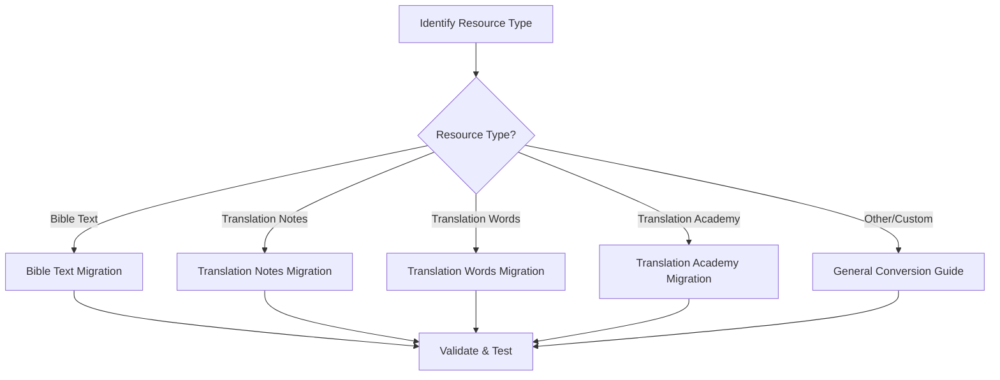

# Migration & Conversion Guides

This section provides comprehensive guides for converting between different repository formats in the unfoldingWord ecosystem. Each migration path is tailored to the specific characteristics and requirements of the source and target formats.

## 🎯 **Migration Overview**

### **Why Migrate Between Formats?**
- **Format Evolution**: Scripture Burrito is the modern evolution of Resource Container
- **Tool Consolidation**: Convert tool-specific formats to standardized Resource Container
- **Standardization**: Align with broader Bible translation community standards
- **Tool Compatibility**: Enable use with different application ecosystems
- **Future-Proofing**: Prepare for evolving ecosystem requirements

### **Migration Strategy**
All migration guides follow a consistent approach:
1. **Analyze** source format structure and content
2. **Map** content to target format specifications
3. **Transform** metadata and file organization
4. **Validate** converted repository
5. **Test** with target applications

## 📚 **Migration Paths**

### **📈 Format Evolution: RC → SB**

#### **[Resource Container to Scripture Burrito](rc-to-sb/)**
Convert standard Resource Container repositories to modern Scripture Burrito format.

- **📖 [Bible Text Migrations](rc-to-sb/bible-text/)** - UHB, UGNT, ULT, UST, OBS
- **📝 [Translation Support Migrations](rc-to-sb/translation-support/)** - TN, TW, TA, TQ
- **🔧 [Specialized Migrations](rc-to-sb/specialized/)** - Custom and legacy resources
- **📋 [General Conversion Guide](rc-to-sb/general-conversion-guide)** - Generic patterns

**Complexity**: ⭐-⭐⭐⭐ Variable | **Target**: Scripture Burrito flavors

### **🔧 Tool Consolidation: TC/tS → RC**

#### **[translationCore to Resource Container](tc-to-rc/)**
Integrate single-book translationCore projects into multi-book Resource Container repositories.

- **🔄 [Book Integration into Existing RC](tc-to-rc/book-integration)** - Add/replace books in existing RC
- **🆕 [New RC Creation from First TC Book](tc-to-rc/new-rc-creation)** - Create new RC starting with TC book
- **🔗 [Alignment Data Preservation](tc-to-rc/alignment-data-handling)** - Word alignment integrity

**Complexity**: ⭐⭐-⭐⭐⭐ Medium-High | **Target**: Resource Container (existing or new)

#### **[translationStudio to Resource Container](ts-to-rc/)**
Convert translationStudio repositories to standard Resource Container format.

- **📖 [Bible Book Migration](ts-to-rc/bible-book-migration)** - Chapter-based books
- **📚 [OBS Migration](ts-to-rc/obs-migration)** - Open Bible Stories
- **📊 [Completion Data Handling](ts-to-rc/completion-data-handling)** - Progress tracking

**Complexity**: ⭐⭐ Medium | **Target**: Resource Container

## 🗺️ **Migration Roadmap**

### **Start Here: [Migration Guide Index](migration-guide-index)**
Comprehensive overview of all migration guides with decision matrix.

### **Choose Your Path:**

## 📊 **Migration Complexity Matrix**

| Resource Type | Complexity | Time Estimate | Key Challenges |
|---------------|------------|---------------|----------------|
| **Bible Text (UHB, UGNT, ULT, UST)** | ⭐ Low | 2-4 hours | USFM validation, alignment data |
| **Translation Notes (TN)** | ⭐⭐ Medium | 4-8 hours | TSV parsing, reference mapping |
| **Translation Words (TW)** | ⭐⭐ Medium | 4-6 hours | Markdown organization, linking |
| **Translation Academy (TA)** | ⭐⭐⭐ High | 8-16 hours | Article hierarchies, dependencies |
| **Custom Resources** | ⭐⭐ Variable | Variable | Format-specific challenges |

## 🛠️ **Tools & Utilities**

### **Validation Tools**
- **Scripture Burrito Validator**: Verify converted repositories
- **Content Comparison**: Ensure no data loss during migration
- **Link Checker**: Validate cross-references and dependencies

### **Automation Support**
- **[MCP Migration Tools](../automation/)** - Automated migration assistance
- **Batch Processing**: Handle multiple repositories
- **Quality Assurance**: Automated testing and validation

## ⚠️ **Important Considerations**

### **Before You Start**
- ✅ **Backup** original repositories
- ✅ **Understand** both source and target formats
- ✅ **Test** with small repositories first
- ✅ **Plan** for validation and testing

### **Common Pitfalls**
- 🚫 **Metadata Loss**: Ensure all RC metadata is preserved
- 🚫 **Link Breakage**: Maintain cross-references and dependencies  
- 🚫 **Format Violations**: Follow Scripture Burrito specifications exactly
- 🚫 **Content Corruption**: Validate content integrity after conversion

## 🔄 **Reverse Migration**

While these guides focus on RC → SB migration, the principles can be adapted for reverse migration (SB → RC) when needed. Contact the development team for specific reverse migration requirements.

## 📈 **Success Metrics**

After completing a migration, verify:

- ✅ **Content Integrity**: All original content is preserved
- ✅ **Metadata Completeness**: All RC metadata mapped to SB
- ✅ **Link Preservation**: Cross-references work correctly
- ✅ **Tool Compatibility**: Converted repository works with SB tools
- ✅ **Validation Passes**: Scripture Burrito validator reports no errors

---

**Start Here**: [Migration Guide Index](migration-guide-index) - Choose the right migration guide for your resource type
