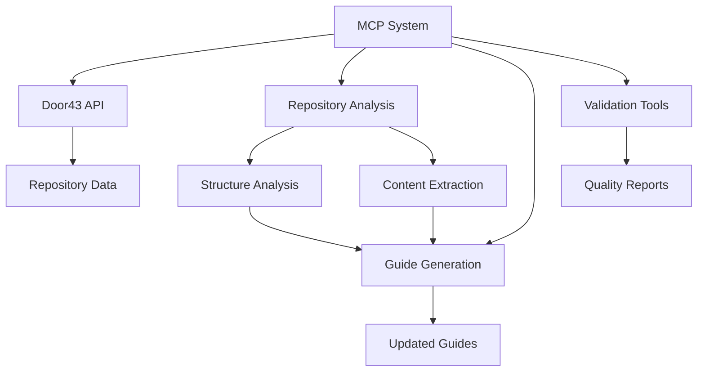

# Automation & MCP Tools

This section provides comprehensive instructions for Model Context Protocol (MCP) systems and automation tools to analyze, process, and maintain Door43 repositories. These tools enable automated analysis, guide generation, and quality assurance for the entire documentation ecosystem.

## 🤖 **What is MCP?**

**Model Context Protocol (MCP)** enables AI systems to interact with external data sources, APIs, and tools in a standardized way. For Door43, MCP tools can:

- **Analyze** repositories automatically
- **Generate** documentation guides
- **Validate** content and links
- **Monitor** ecosystem changes
- **Update** guides based on real data

## 🛠️ **Available Tools**

### **📊 Repository Analysis**

#### **[Door43 Repository Analyzer MCP](door43-repository-analyzer-mcp)**
**Comprehensive repository analysis and guide generation**

- **Purpose**: Analyze Door43 repositories and create/update format guides
- **Capabilities**: Structure analysis, content extraction, pattern detection
- **Output**: Detailed repository guides with real examples
- **Difficulty**: ⭐⭐⭐ Advanced

**Key Features:**
- Multi-specification support (RC, SB, Tool-generated)
- Automatic format detection
- Content pattern analysis
- Cross-repository comparison
- Guide template generation

### **🔧 Implementation Guides**

#### **[MCP Implementation Example](mcp-implementation-example)**
**Concrete example of MCP tool implementation**

- **Purpose**: Show practical MCP implementation patterns
- **Content**: Code examples, API integration, workflow automation
- **Audience**: Developers building MCP tools
- **Difficulty**: ⭐⭐⭐ Advanced

**What you'll learn:**
- MCP system architecture
- Door43 API integration patterns
- Automated analysis workflows
- Error handling and validation
- Guide generation automation

### **📋 Task Specifications**

#### **[MCP Task Specifications](mcp-task-specifications)**
**Detailed specifications for automated analysis tasks**

- **Purpose**: Define specific analysis and processing tasks
- **Content**: Task definitions, input/output specifications, success criteria
- **Use Case**: Guide MCP system development
- **Difficulty**: ⭐⭐ Intermediate

**Task Categories:**
- Repository structure analysis
- Content validation
- Link checking and repair
- Guide generation and updates
- Quality assurance automation

### **🔗 API Integration**

#### **[Door43 API Reference for MCP](door43-api-reference-for-mcp)**
**Optimized API reference for automated systems**

- **Purpose**: Provide MCP-optimized API documentation
- **Content**: Endpoint specifications, rate limiting, batch operations
- **Audience**: MCP developers and system architects
- **Difficulty**: ⭐⭐ Intermediate

**Special Features:**
- Rate limiting strategies
- Batch processing patterns
- Error handling for automation
- Authentication for long-running processes
- Performance optimization techniques

## 🎯 **Use Cases**

### **📚 Documentation Maintenance**
- **Automatic Guide Updates**: Keep guides current with repository changes
- **Link Validation**: Ensure all internal and external links work
- **Content Synchronization**: Update examples when repositories change
- **Quality Assurance**: Validate guide completeness and accuracy

### **🔍 Repository Monitoring**
- **New Repository Detection**: Identify new repositories requiring documentation
- **Format Changes**: Detect when repositories change specifications
- **Content Analysis**: Monitor for new patterns or edge cases
- **Ecosystem Health**: Track overall ecosystem status and trends

### **⚡ Workflow Automation**
- **Batch Processing**: Handle multiple repositories efficiently
- **Scheduled Analysis**: Regular automated repository analysis
- **Report Generation**: Automated status reports and summaries
- **Integration Testing**: Validate that guides work with real repositories

## 🏗️ **Architecture Overview**

### **System Components**

1. **MCP Core**: Protocol implementation and task orchestration
2. **API Client**: Optimized Door43 API integration
3. **Analysis Engine**: Repository structure and content analysis
4. **Guide Generator**: Automated documentation creation
5. **Validator**: Content and link validation
6. **Reporter**: Status reporting and monitoring

## ⚙️ **Setup & Configuration**

### **Prerequisites**
- **API Access**: Door43 API token for higher rate limits
- **MCP Framework**: Compatible MCP implementation
- **Processing Power**: Adequate resources for batch operations
- **Storage**: Space for repository caches and analysis results

### **Getting Started**
1. **[Read MCP Task Specifications](mcp-task-specifications)** - Understand requirements
2. **[Study Implementation Example](mcp-implementation-example)** - See practical patterns
3. **[Configure API Access](door43-api-reference-for-mcp)** - Set up authentication
4. **[Deploy Analyzer](door43-repository-analyzer-mcp)** - Start with repository analysis

## 📊 **Performance Considerations**

### **Rate Limiting**
- **Anonymous**: 60 requests/hour
- **Authenticated**: 1000+ requests/hour
- **Batch Operations**: Use bulk endpoints when available
- **Caching**: Implement intelligent caching strategies

### **Resource Management**
- **Memory**: Large repositories require significant RAM
- **Storage**: Cache frequently accessed repositories
- **Network**: Optimize for bandwidth efficiency
- **Processing**: Parallelize analysis tasks appropriately

## 🔒 **Security & Best Practices**

### **Authentication**
- **Secure Token Storage**: Never expose API tokens
- **Token Rotation**: Regular token updates
- **Scope Limitation**: Use minimal required permissions
- **Audit Logging**: Track all API interactions

### **Data Handling**
- **Privacy**: Respect repository privacy settings
- **Caching**: Implement appropriate cache expiration
- **Validation**: Verify data integrity throughout processing
- **Error Handling**: Graceful failure and recovery

## 📈 **Success Metrics**

### **Analysis Quality**
- **Coverage**: Percentage of repositories successfully analyzed
- **Accuracy**: Correctness of generated guides
- **Completeness**: Thoroughness of analysis results
- **Freshness**: How current the analysis data is

### **System Performance**
- **Processing Speed**: Repositories analyzed per hour
- **Error Rate**: Percentage of failed operations
- **Resource Efficiency**: CPU, memory, and bandwidth usage
- **Uptime**: System availability and reliability

---

**Start Here**: [MCP Task Specifications](mcp-task-specifications) - Understand what MCP systems should accomplish
