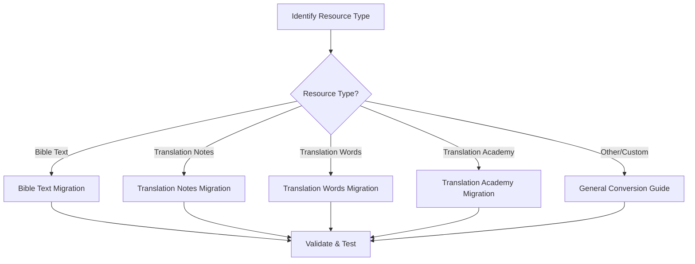

# Migration & Conversion Guides

This section provides comprehensive guides for converting Resource Container (RC) repositories to Scripture Burrito (SB) format. Each guide is tailored to the specific characteristics and requirements of different resource types.

## 🎯 **Migration Overview**

### **Why Migrate?**
- **Format Modernization**: Scripture Burrito offers more flexible organization
- **Standardization**: Align with broader Bible translation community standards
- **Tool Compatibility**: Enable use with Scripture Burrito-compatible tools
- **Future-Proofing**: Prepare for evolving ecosystem requirements

### **Migration Strategy**
All migration guides follow a consistent approach:
1. **Analyze** source RC structure
2. **Map** content to SB ingredients
3. **Transform** metadata and file organization
4. **Validate** converted repository
5. **Test** with target applications

## 📚 **Migration Guides**

### **📖 Core Content Migrations**

#### **[Bible Text RC to SB Migration](bible-text-rc-to-sb-migration)**
- **Covers**: UHB, UGNT, ULT, UST
- **Complexity**: ⭐ Low
- **Target Flavor**: textTranslation
- **Key Features**: USFM preservation, alignment data handling

#### **[Translation Notes RC to SB Migration](translation-notes-rc-to-sb-migration)**
- **Covers**: TN, OBS-TN
- **Complexity**: ⭐⭐ Medium
- **Target Flavor**: translationNotes
- **Key Features**: TSV data transformation, alignment preservation

### **📝 Support Resource Migrations**

#### **[Translation Words RC to SB Migration](translation-words-rc-to-sb-migration)**
- **Covers**: TW
- **Complexity**: ⭐⭐ Medium
- **Target Flavor**: translationWords
- **Key Features**: Markdown content organization, term linking

#### **[Translation Academy RC to SB Migration](translation-academy-rc-to-sb-migration)**
- **Covers**: TA
- **Complexity**: ⭐⭐⭐ High
- **Target Flavor**: translationAcademy
- **Key Features**: Complex article hierarchies, cross-references

### **🔧 Utility Guides**

#### **[General RC to SB Conversion](rc-to-scripture-burrito-conversion-guide)**
- **Covers**: Generic conversion patterns
- **Complexity**: ⭐⭐ Medium
- **Use Case**: Custom or uncommon resource types
- **Key Features**: Flexible mapping strategies

## 🗺️ **Migration Roadmap**

### **Start Here: [Migration Guide Index](migration-guide-index)**
Comprehensive overview of all migration guides with decision matrix.

### **Choose Your Path:**

## 📊 **Migration Complexity Matrix**

| Resource Type | Complexity | Time Estimate | Key Challenges |
|---------------|------------|---------------|----------------|
| **Bible Text (UHB, UGNT, ULT, UST)** | ⭐ Low | 2-4 hours | USFM validation, alignment data |
| **Translation Notes (TN)** | ⭐⭐ Medium | 4-8 hours | TSV parsing, reference mapping |
| **Translation Words (TW)** | ⭐⭐ Medium | 4-6 hours | Markdown organization, linking |
| **Translation Academy (TA)** | ⭐⭐⭐ High | 8-16 hours | Article hierarchies, dependencies |
| **Custom Resources** | ⭐⭐ Variable | Variable | Format-specific challenges |

## 🛠️ **Tools & Utilities**

### **Validation Tools**
- **Scripture Burrito Validator**: Verify converted repositories
- **Content Comparison**: Ensure no data loss during migration
- **Link Checker**: Validate cross-references and dependencies

### **Automation Support**
- **[MCP Migration Tools](../automation/)** - Automated migration assistance
- **Batch Processing**: Handle multiple repositories
- **Quality Assurance**: Automated testing and validation

## ⚠️ **Important Considerations**

### **Before You Start**
- ✅ **Backup** original repositories
- ✅ **Understand** both source and target formats
- ✅ **Test** with small repositories first
- ✅ **Plan** for validation and testing

### **Common Pitfalls**
- 🚫 **Metadata Loss**: Ensure all RC metadata is preserved
- 🚫 **Link Breakage**: Maintain cross-references and dependencies  
- 🚫 **Format Violations**: Follow Scripture Burrito specifications exactly
- 🚫 **Content Corruption**: Validate content integrity after conversion

## 🔄 **Reverse Migration**

While these guides focus on RC → SB migration, the principles can be adapted for reverse migration (SB → RC) when needed. Contact the development team for specific reverse migration requirements.

## 📈 **Success Metrics**

After completing a migration, verify:

- ✅ **Content Integrity**: All original content is preserved
- ✅ **Metadata Completeness**: All RC metadata mapped to SB
- ✅ **Link Preservation**: Cross-references work correctly
- ✅ **Tool Compatibility**: Converted repository works with SB tools
- ✅ **Validation Passes**: Scripture Burrito validator reports no errors

---

**Start Here**: [Migration Guide Index](migration-guide-index) - Choose the right migration guide for your resource type
