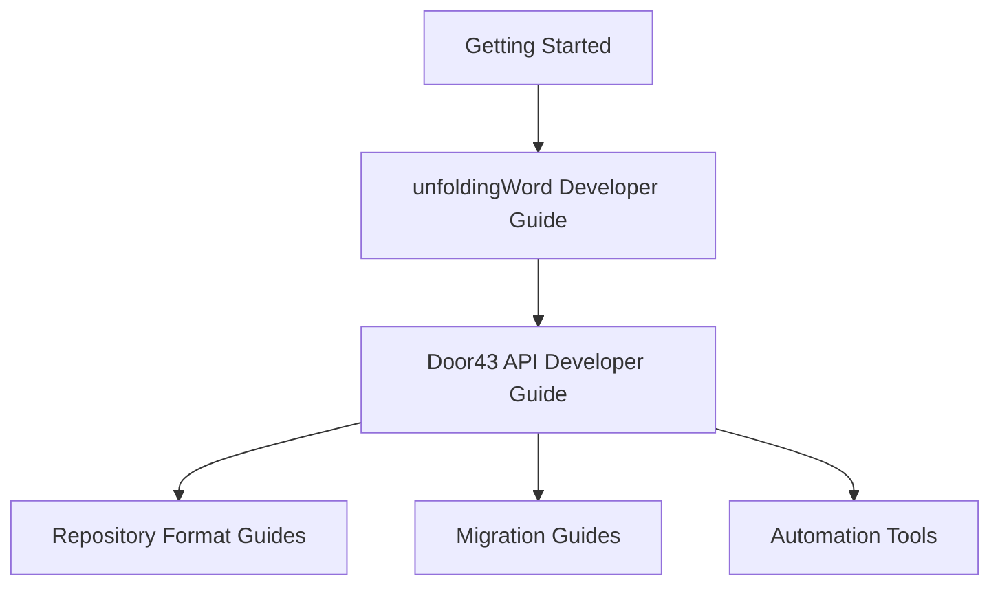

# Developer Guides

This section contains the core technical documentation for building applications that work with Door43 Bible translation resources. These guides provide comprehensive technical specifications and practical implementation patterns.

## 📚 **Core Guides**

### **[unfoldingWord Developer Guide](unfoldingword-developer-guide)**
**Complete technical specification of the resource ecosystem**

- **Audience**: Developers, technical decision makers, content creators
- **Content**: Resource architecture, alignment system, quality assurance, extensibility
- **Difficulty**: ⭐⭐ Intermediate
- **Prerequisites**: [Understanding the ecosystem](../getting-started/)

**What you'll learn:**
- Complete resource ecosystem architecture
- Word-level alignment system
- Quality assurance mechanisms  
- Resource interconnections
- Extensibility patterns

### **[Door43 API Developer Guide](door43-api-developer-guide)**
**Practical API implementation patterns and workflows**

- **Audience**: Developers building applications
- **Content**: API endpoints, authentication, CRUD operations, application examples
- **Difficulty**: ⭐⭐ Intermediate  
- **Prerequisites**: [unfoldingWord Developer Guide](unfoldingword-developer-guide)

**What you'll learn:**
- API authentication and endpoints
- Repository discovery and content access
- CRUD operations for content management
- Real-world application patterns
- Performance optimization strategies

## 🎯 **Learning Path**

### **Recommended Sequence:**

1. **[Getting Started](../getting-started/)** - Foundational concepts
2. **[unfoldingWord Developer Guide](unfoldingword-developer-guide)** - Technical architecture
3. **[Door43 API Developer Guide](door43-api-developer-guide)** - Practical implementation
4. **[Repository Formats](../repository-formats/)** - Specific format handling
5. **[Migration Guides](../migration/)** - Format conversion (if needed)

## 🛠️ **Implementation Support**

### **By Use Case**

| Use Case | Start Here | Then Read |
|----------|------------|-----------|
| **Preview App** | [Door43 API Guide](door43-api-developer-guide) | [Repository Formats](../repository-formats/) |
| **Translation Editor** | [unfoldingWord Guide](unfoldingword-developer-guide) | [Migration Guides](../migration/) |
| **Format Conversion** | [Migration Index](../migration/) | Specific migration guides |
| **Automated Processing** | [MCP Instructions](../automation/) | [API Reference](door43-api-developer-guide) |

### **By Experience Level**

- **🟢 New to Door43**: Start with [Getting Started](../getting-started/)
- **🟡 Familiar with APIs**: Jump to [Door43 API Guide](door43-api-developer-guide)
- **🔴 Need Deep Architecture**: Begin with [unfoldingWord Guide](unfoldingword-developer-guide)

## 🔗 **Related Documentation**

### **Format-Specific Guides**
- **[Resource Container Formats](../repository-formats/resource-container/)** - Standard unfoldingWord formats
- **[Scripture Burrito Formats](../repository-formats/scripture-burrito/)** - Alternative Bible formats  
- **[Tool-Generated Formats](../repository-formats/tool-generated/)** - Tool-specific formats

### **Specialized Topics**
- **[Migration & Conversion](../migration/)** - Format conversion guides
- **[Automation & MCP](../automation/)** - Automated processing tools
- **[Reference Materials](../reference/)** - Templates and reference docs

## 📈 **Success Metrics**

After completing these guides, you should be able to:

- ✅ Understand the complete Door43 resource ecosystem
- ✅ Authenticate with and use Door43 APIs effectively
- ✅ Detect and process different resource specifications
- ✅ Build applications that handle multiple resource types
- ✅ Implement word-level alignment features
- ✅ Handle resource dependencies and relationships

---

**Start Here**: [unfoldingWord Developer Guide](unfoldingword-developer-guide) - Learn the complete technical architecture
