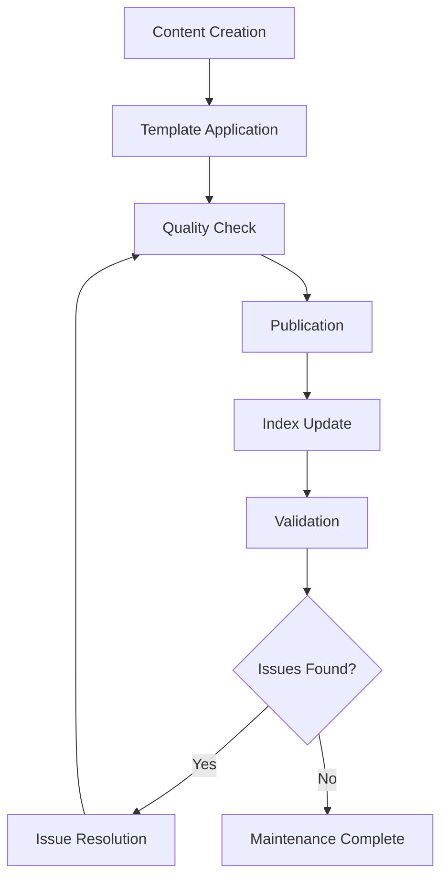

# Reference Materials

This section contains templates, analysis tools, and reference documentation that support the broader Door43 ecosystem. These materials are used by developers, content creators, and automated systems to maintain consistency and quality across all documentation.

## 📋 **Templates & Schemas**

### **Documentation Templates**
- **Guide Templates**: Standardized formats for creating new repository format guides
- **Frontmatter Schema**: Consistent metadata structure for all documentation
- **Analysis Templates**: Structured formats for repository analysis reports

### **Content Standards**
- **Writing Guidelines**: Style and tone standards for all documentation
- **Link Conventions**: Standardized linking patterns and URL structures
- **Metadata Requirements**: Required and optional frontmatter fields

## 🔧 **Analysis Tools**

### **[Repository Analysis Plan](repository-analysis-plan)**
**Comprehensive methodology for analyzing Door43 repositories**

- **Purpose**: Systematic approach to repository analysis
- **Content**: Analysis steps, data collection methods, reporting formats
- **Audience**: Developers, MCP systems, content analysts
- **Use Case**: Standardize repository analysis across tools and teams

**Key Components:**
- Repository structure analysis
- Content pattern detection
- Metadata extraction
- Cross-repository comparison
- Quality assessment criteria

### **[Guide Index](guide-index)**
**Master index of all documentation guides with metadata**

- **Purpose**: Central registry of all guides and their relationships
- **Content**: Guide catalog, cross-references, status tracking
- **Maintenance**: Updated automatically by MCP systems
- **Use Case**: Navigation aid and completeness tracking

**Features:**
- Complete guide inventory
- Cross-reference mapping
- Status and freshness tracking
- Gap identification
- Usage analytics

## 📊 **Quality Assurance**

### **Validation Standards**
- **Content Validation**: Accuracy and completeness checks
- **Link Validation**: Internal and external link verification
- **Format Compliance**: Adherence to documentation standards
- **Cross-Reference Integrity**: Relationship consistency across guides

### **Maintenance Procedures**
- **Regular Reviews**: Scheduled content audits and updates
- **Automated Checks**: MCP-driven validation and monitoring
- **Community Feedback**: User-driven improvement processes
- **Version Control**: Change tracking and rollback procedures

## 🎯 **Usage Guidelines**

### **For Content Creators**
- **Follow Templates**: Use provided templates for consistency
- **Check Standards**: Ensure compliance with style guidelines
- **Validate Links**: Verify all references before publishing
- **Update Metadata**: Maintain accurate frontmatter information

### **For Developers**
- **Reference Analysis Plan**: Use systematic analysis methodology
- **Implement Standards**: Follow established patterns and conventions
- **Contribute Improvements**: Suggest enhancements to templates and tools
- **Maintain Quality**: Ensure contributions meet quality standards

### **For MCP Systems**
- **Use Templates**: Generate content using standard templates
- **Follow Analysis Plan**: Implement systematic analysis procedures
- **Update Indexes**: Maintain current guide inventories
- **Report Issues**: Flag quality problems for human review

## 🔄 **Maintenance Workflow**

### **Continuous Improvement**
1. **Monitor Usage**: Track how templates and tools are used
2. **Collect Feedback**: Gather input from users and systems
3. **Identify Gaps**: Find missing templates or tools
4. **Update Standards**: Evolve guidelines based on experience
5. **Communicate Changes**: Ensure all stakeholders know about updates

## 📈 **Success Metrics**

### **Template Effectiveness**
- **Adoption Rate**: Percentage of guides using standard templates
- **Consistency Score**: Uniformity across documentation
- **Time Savings**: Reduction in guide creation time
- **Quality Improvement**: Fewer errors and omissions

### **Tool Utilization**
- **Analysis Coverage**: Percentage of repositories analyzed
- **Automation Success**: Automated process completion rates
- **Error Detection**: Issues identified and resolved
- **Maintenance Efficiency**: Time saved through automation

## 🔗 **Integration Points**

### **With Documentation System**
- **Template Integration**: Seamless template application
- **Metadata Harvesting**: Automatic frontmatter extraction
- **Link Generation**: Automated cross-reference creation
- **Index Maintenance**: Dynamic guide inventory updates

### **With MCP Systems**
- **Analysis Integration**: Systematic repository analysis
- **Quality Monitoring**: Automated quality assurance
- **Content Generation**: Template-based guide creation
- **Maintenance Automation**: Scheduled updates and checks

---

**Key Resources**: [Repository Analysis Plan](repository-analysis-plan) and [Guide Index](guide-index) provide the foundation for systematic documentation maintenance.
