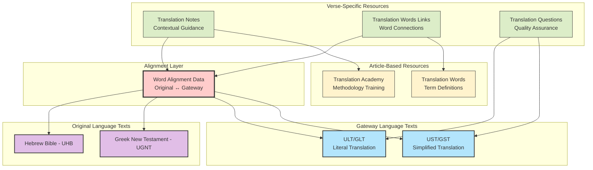
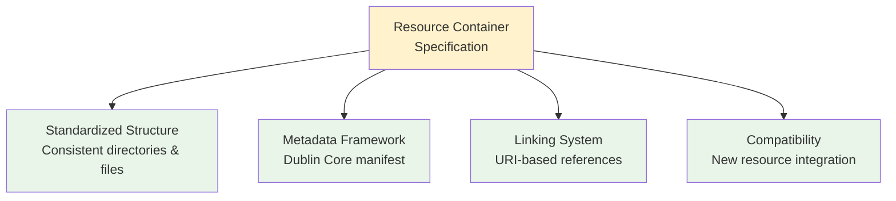
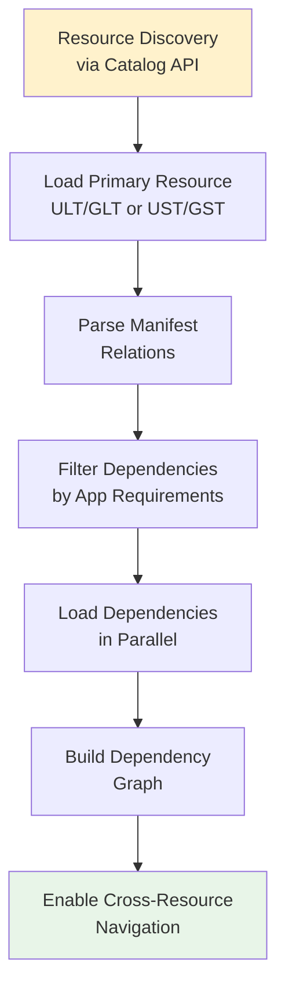
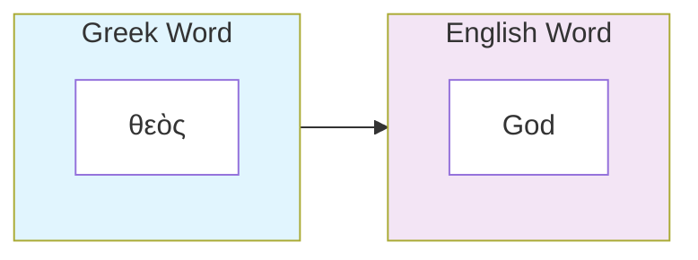
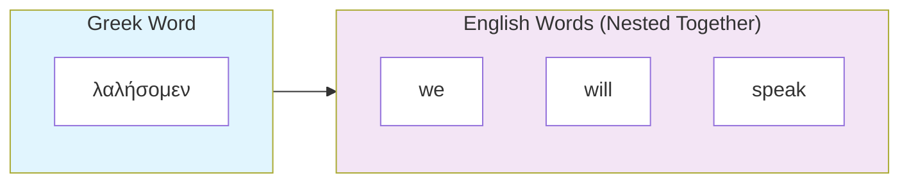
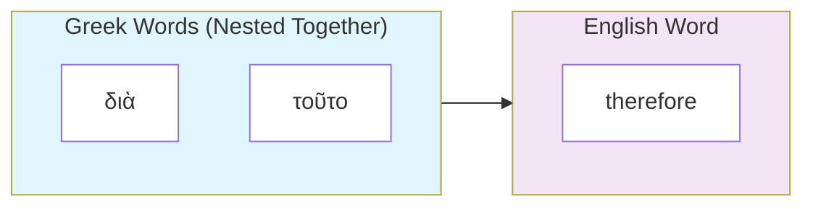
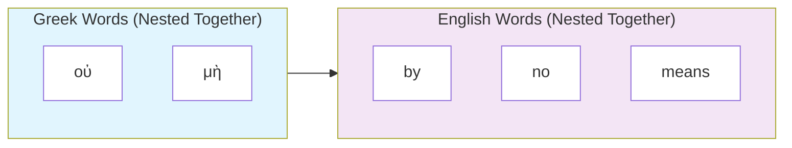
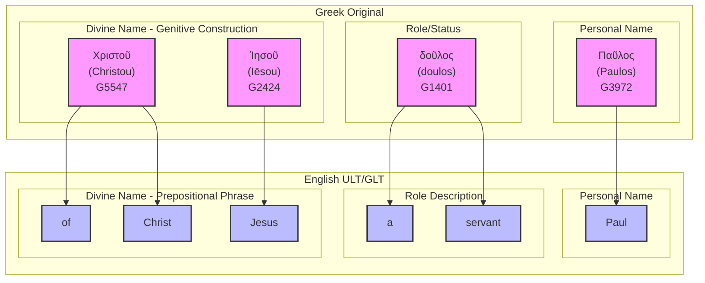

# unfoldingWord Bible Translation Resources Ecosystem: Developer Guide

## Introduction

This technical guide provides complete documentation for the unfoldingWord Bible translation resource ecosystem - an interconnected system of open-source resources that enables Mother Tongue Translators to create Scripture translations in their heart languages.

**Who This Helps:**
- **Developers**: Build Bible translation apps using APIs, word-level alignment, and cross-resource linking
- **Technical Decision Makers**: Plan system integration, optimize performance, and design for multiple languages  
- **Content Creators**: Understand how translation resources connect and support quality workflows
- **Open Source Contributors**: Follow technical standards, contribute new resources, and extend the ecosystem

**Key Benefits:** Saves development time with ready-to-use specifications, ensures new tools integrate seamlessly with existing apps, includes quality checks for reliable implementations, and simplifies working with interconnected Bible translation resources.

## Table of Contents

- [unfoldingWord Bible Translation Resources Ecosystem: Developer Guide](#unfoldingword-bible-translation-resources-ecosystem-developer-guide)
  - [Introduction](#introduction)
    - [Purpose \& Scope](#purpose--scope)
    - [Who This Guide Helps](#who-this-guide-helps)
    - [Key Benefits](#key-benefits)
  - [Table of Contents](#table-of-contents)
  - [TLDR](#tldr)
  - [Overview](#overview)
    - [Mission \& Core Concepts](#mission--core-concepts)
  - [Resource Ecosystem Architecture](#resource-ecosystem-architecture)
    - [Key Design Principles](#key-design-principles)
    - [Resource Types \& Functions](#resource-types--functions)
    - [Core Architecture](#core-architecture)
  - [Technical Specifications](#technical-specifications)
    - [Resource Container (RC) Specification](#resource-container-rc-specification)
      - [Purpose \& Structure](#purpose--structure)
      - [Example: English ULT Resource Container](#example-english-ult-resource-container)
      - [Basic Requirements for Creating a Resource Container](#basic-requirements-for-creating-a-resource-container)
      - [Core RC Principles](#core-rc-principles)
      - [How RC Provides Structure and Interconnection](#how-rc-provides-structure-and-interconnection)
      - [RC Container Types \& File Patterns](#rc-container-types--file-patterns)
      - [Manifest Structure (Key Fields)](#manifest-structure-key-fields)
      - [RC Linking System](#rc-linking-system)
    - [Hosting Resource Containers](#hosting-resource-containers)
    - [Platform Access](#platform-access)
    - [Key API Endpoints](#key-api-endpoints)
    - [Authentication \& Rate Limiting](#authentication--rate-limiting)
    - [Repository Organization](#repository-organization)
    - [Integration Strategy](#integration-strategy)
    - [Loading Patterns](#loading-patterns)
    - [Dependency Resolution](#dependency-resolution)
  - [Resource formats](#resource-formats)
    - [USFM](#usfm)
    - [TSV](#tsv)
    - [Markdown](#markdown)
  - [unfoldingWord Resource Containers and their relationships](#unfoldingword-resource-containers-and-their-relationships)
    - [1. UHB (Hebrew Bible)](#1-uhb-hebrew-bible)
    - [2. UGNT (Greek New Testament)](#2-ugnt-greek-new-testament)
    - [3. ULT (Literal Translation for Translators)](#3-ult-literal-translation-for-translators)
    - [4. UST (Simplified Translation for Translators)](#4-ust-simplified-translation-for-translators)
    - [5. Translation Notes](#5-translation-notes)
    - [6. Translation Academy](#6-translation-academy)
    - [7. Translation Words](#7-translation-words)
    - [8. Translation Words Links](#8-translation-words-links)
    - [9. Translation Questions](#9-translation-questions)
  - [Alignment Layer](#alignment-layer)
    - [Alignment Syntax](#alignment-syntax)
      - [USFM Alignment Syntax Structure](#usfm-alignment-syntax-structure)
      - [Alignment Relationship Types](#alignment-relationship-types)
      - [Complex Alignment Example: Romans 1:1](#complex-alignment-example-romans-11)
  - [Versification Layer](#versification-layer)
  - [Quality Assurance of the Resource System](#quality-assurance-of-the-resource-system)
    - [Validation Requirements](#validation-requirements)
  - [Extensibility](#extensibility)
    - [Creating New Resources](#creating-new-resources)
    - [Memory Management](#memory-management)
  - [Key Success Factors](#key-success-factors)
  - [Further Reading](#further-reading)
- [Glossary](#glossary)
      - [**Gateway Languages**](#gateway-languages)
      - [**Mother Tongue Translators (MTTs)**](#mother-tongue-translators-mtts)
      - [**Heart Languages**](#heart-languages)

## TLDR

unfoldingWord provides an interconnected ecosystem of open-source Bible translation resources designed to help Mother Tongue Translators create Scripture in their heart languages. The system centers around **word-level alignment** between original biblical texts and gateway language translations, with supporting resources that provide contextual guidance.

**Key Components:**
- **Source Texts**: Hebrew Bible (UHB) and Greek New Testament (UGNT)
- **Gateway Translations**: Literal (ULT/GLT) and Simplified (UST/GST) texts with word-level alignment to originals
- **Support Resources**: Translation Notes (TN), Translation Words (TW), Translation Academy (TA), and Translation Questions (TQ)

**For Developers:**
- All resources follow [**Resource Container (RC)** specification](https://resource-container.readthedocs.io/) with standardized manifest files.
- Resources are hosted on [Door43 Content Service](https://git.door43.org/) with REST API access
- Word alignment enables precise cross-resource navigation and features like word-level highlighting
- System supports multiple gateway languages with parallel resource structures
- Three main formats: USFM (Bible text), TSV (structured data), Markdown (articles)

**Getting Started:** Use the Catalog API to discover resources, load primary texts (ULT/UST), then add supporting resources based on manifest dependencies. The alignment layer connects everything together.

## Overview

### Mission & Core Concepts

unfoldingWord provides open-source <abbr title="A comprehensive suite of interconnected texts, guidance materials, and tools including literal translations, simplified translations, explanatory notes, term definitions, quality assurance questions, and training materials">**Bible translation resources**</abbr> under CC BY-SA 4.0 licensing to enable <abbr title="Native speakers of the target language working to translate Scripture into their heart language">**Mother Tongue Translators (MTTs)**</abbr> to translate Scripture from <abbr title="Strategic languages that serve as bridges between original biblical languages and target heart languages">**Gateway Languages**</abbr> into their <abbr title="The native languages that Mother Tongue Translators speak most naturally">**Heart Languages**</abbr>.

## Resource Ecosystem Architecture

The translation resource ecosystem consists of three foundational layers:

1. **Source Texts**: Original language texts (Hebrew, Greek, Aramaic) with modern gateway language translations
2. **Alignment Layer**: Precise word-level connections between original and gateway languages  
3. **Support Resources**: Contextual guidance, definitions, methodology, and quality assurance tools

### Key Design Principles

- **Interconnectedness**: All resources link together through standardized reference systems
- **Precision**: Word-level alignment enables exact targeting of translation guidance
- **Extensibility**: Resource Container specification allows new resource creation
- **Multilingual**: Gateway language organizations can create parallel resource sets
- **Open Access**: Creative Commons licensing ensures global accessibility

### Resource Types & Functions

The unfoldingWord ecosystem includes the following resources for Bible translators:

| Resource | Format | Purpose | Key Features |
|----------|--------|---------|--------------|
| **UHB** | USFM | Original language texts (Hebrew) | Tokenized |
| **UGNT** | USFM | Original language texts (Greek) | Tokenized |
| **ULT/GLT** | USFM | Literal translation preserving grammatical and syntactic structures, idiomatic expressions and figures of speech of the original text as much as possible | Word-aligned, form-centric, tokenized |
| **UST/GST** | USFM | Simplified translation that expresses the meaning of the original text as clearly as possible when the forms in the GLT/ULT are not clear or natural in the target language | Word-aligned, meaning-based, tokenized |
| **Translation Notes** | TSV | Verse-specific translation guidance, grammar explanations, contextual explanations, and cultural background information | Linked to aligned words and Translation Academy articles |
| **Translation Words** | Markdown | Biblical term definitions | Consistent terminology |
| **Translation Words Links** | TSV | Internal linking between aligned words and Translation Words definitions by occurrence in verse | Precise occurrence tracking |
| **Translation Questions** | TSV | Verse-specific quality assurance questions | Community checking |
| **Translation Academy** | Markdown | Translation methodology, cultural issues, and quality standards | Training materials |

For a more comprehensive description of the resources and their purpose, see the [unfoldingWord for Translators](https://unfoldingword.org/for-translators/) page. This document is a technical specification of the resources and their interconnections meant to help developers understand the resources and how they work together.

### Core Architecture



## Technical Specifications

### Resource Container (RC) Specification

#### Purpose & Structure

The **Resource Container specification** provides a standardized framework for organizing and connecting Bible resources. RC allows you to declare the file and directory structure of a resource and describe it comprehensively through a manifest file. This enables automatic discovery, validation, and interconnection of resources across the entire ecosystem.

#### Example: English ULT Resource Container

Here's what an actual Resource Container looks like in practice:

```
en_ult/
├── manifest.yaml             # Resource metadata and dependencies
├── LICENSE.md                # CC BY-SA 4.0 license
├── 01-GEN.usfm               # Genesis with word alignment data
├── 02-EXO.usfm               # Exodus with word alignment data
├── 03-LEV.usfm               # Leviticus with word alignment data
├── ...                       # All 66 books
├── 40-MAT.usfm               # Matthew with word alignment data
├── 41-MRK.usfm               # Mark with word alignment data
└── 66-REV.usfm               # Revelation with word alignment data
```

**Key Files:**

**`manifest.yaml`** - Declares resource identity, dependencies, and file structure:
```yaml
dublin_core:
  conformsto: 'rc0.2'                    # RC specification version
  identifier: 'ult'                      # Unique resource identifier
  language: 
    identifier: 'en'                     # BCP 47 language code
    direction: 'ltr'                     # Text direction (ltr/rtl)
  subject: 'Bible'                       # Resource category for filtering
  type: 'bundle'                         # RC container type (bundle/help/dict/man)
  relation:                              # Array of related resources
    - 'en/tn'                            # Translation Notes (same language)
    - 'en/twl'                           # Translation Words Links
    - 'hbo/uhb'                          # Hebrew Bible source
    - 'el-x-koine/ugnt'                  # Greek New Testament source
    - 'en/ta'                            # Translation Academy
    - 'en/tw'                            # Translation Words
  version: '85'                          # Resource version number

checking:
  checking_level: '3'                    # Quality assurance level (1-3)

projects:                                # File mappings for each book
  - identifier: 'gen'                    # Book identifier (3-letter code)
    path: './01-GEN.usfm'                # Relative file path
    sort: 1                              # Display/processing order
    versification: 'kjv'                 # Versification system
  - identifier: 'exo'
    path: './02-EXO.usfm'
    sort: 2
    versification: 'kjv'
  # ... continues for all 66 books
```

**`01-GEN.usfm`** - USFM text with embedded word alignment:
```usfm
\v 1 \zaln-s |x-strong="H07225" x-lemma="רֵאשִׁית" x-content="בְּרֵאשִׁית"\*\w In|x-occurrence="1"\w* \w the|x-occurrence="1"\w* \w beginning|x-occurrence="1"\w*\zaln-e\* \zaln-s |x-strong="H0430" x-lemma="אֱלֹהִים" x-content="אֱלֹהִים"\*\w God|x-occurrence="1"\w*\zaln-e\* \zaln-s |x-strong="H01254" x-lemma="בָּרָא" x-content="בָּרָא"\*\w created|x-occurrence="1"\w*\zaln-e\*...
```

#### Basic Requirements for Creating a Resource Container

To create a valid Resource Container, you need:

1. **Manifest File** (`manifest.yaml`) with required [Dublin Core metadata](https://dublincore.org/specifications/dublin-core/dcmi-terms/#terms-defined-by-dc)
2. **License File** (`LICENSE.md`) - typically CC BY-SA 4.0 for unfoldingWord resources
3. **Content Files** in the appropriate format (USFM for texts, TSV for data, Markdown for articles)
4. **Consistent Structure** following RC directory patterns for your container type
5. **Valid Identifiers** using established conventions (language codes, book codes, etc.)

This standardized structure ensures that all unfoldingWord resources work together seamlessly, regardless of language or resource type.

**Dublin Core**: The manifest file uses [Dublin Core metadata standards](https://dublincore.org/specifications/dublin-core/dcmi-terms/#terms-defined-by-dc) to describe the resource with standardized fields like `identifier`, `language`, `subject`, `type`, and `relation`. This ensures consistent metadata across all Resource Containers and enables automatic discovery and interconnection of resources.

**RC Core Functions:**



#### Core RC Principles

1. **Standardized Metadata**: Every resource has [Dublin Core metadata](https://dublincore.org/specifications/dublin-core/dcmi-terms/#terms-defined-by-dc) in `manifest.yaml`
2. **Predictable Structure**: Consistent directory layout and file naming
3. **Cross-Resource Linking**: URI-based references enable automatic navigation
4. **Version Management**: Built-in versioning and dependency tracking
5. **Extensibility**: Framework supports new resource types and subjects
6. **Platform Agnostic**: Works with any documents hosting platform that supports distributed version control and API access

#### How RC Provides Structure and Interconnection

**1. Resource Structure Standardization:**
RC defines consistent directory layouts and file naming patterns:

```yaml
# All resources follow same manifest structure
dublin_core:
  identifier: 'resource-name'
  type: 'bundle' | 'help' | 'dict' | 'man'
  relation: ['connected/resources']
```

**2. Interconnection Through Relations:**
Resources declare their dependencies and connections:

```yaml
# en_ult manifest declares connections to:
relation:
  - en/tn    # Translation Notes
  - en/twl   # Translation Words Links  
  - hbo/uhb  # Hebrew Bible source
```

**3. Cross-Resource Navigation:**
RC links provide standardized addressing:

```
rc://en/tn/help/gen/01/02    # Translation Note for Genesis 1:2
rc://en/tw/dict/bible/kt/god # Translation Words entry for "god"
```

**4. New Resource Compatibility:**
Following RC structure ensures new resources integrate automatically:

```yaml
# New commentary resource
dublin_core:
  identifier: 'commentary'
  type: 'help'
  relation: ['en/ult', 'en/ust']  # Links to existing resources
```

**5. Multi-Language Consistency:**
RC enables parallel resource structures across gateway languages:

```
en_ult   → es-419_glt  → fr_glt     # Same container type
en_tn    → es-419_tn   → fr_tn      # Same TSV structure
en_tw    → es-419_tw   → fr_tw      # Same markdown format
```

**Practical Benefits:**

- **Structure**: Predictable file organization across all resources
- **Compatibility**: New resources automatically work with existing tools
- **Interconnection**: Standardized linking enables seamless navigation
- **Quality Control**: Metadata provides versioning and quality tracking

#### RC Container Types & File Patterns

| Type | Structure | Content Pattern | Example |
|------|-----------|-----------------|---------|
| `bundle` | Flat USFM files | `{NN}-{BOOK}.usfm` | `01-GEN.usfm`, `40-MAT.usfm` |
| `help` | Flat TSV files | `{prefix}_{BOOK}.tsv` | `tn_GEN.tsv`, `tq_MAT.tsv` |
| `dict` | Nested Markdown | `bible/{type}/{term}.md` | `bible/kt/compassion.md`, `bible/names/aaron.md` |
| `man` | Nested chapters | `{category}/{topic}/{NN}.md` | `translate/figs-metaphor/01.md`, `intro/translation-guidelines/01.md` |

#### Manifest Structure (Key Fields)

```yaml
dublin_core:
  conformsto: 'rc0.2'                    # RC specification version
  identifier: 'ult'                      # Resource identifier
  language:
    identifier: 'en'                     # BCP 47 language code
    direction: 'ltr'                     # Text direction (ltr/rtl)
  relation:                              # Dependencies array
    - 'en/tn'                           # Same language resources
    - 'hbo/uhb?v=2.1.30'               # Source text with version
  subject: 'Bible'                       # Resource subject for filtering
  type: 'bundle'                         # RC container type
  version: '85'                          # Resource version number

checking:
  checking_level: '3'                    # Quality level (1-3)

projects:                                # Book definitions
  - identifier: 'gen'                    # Book identifier
    path: './01-GEN.usfm'               # File path
    sort: 1                             # Sort order
    versification: 'kjv'                # Versification system
```

For more information on the Resource Container specification, see the [Resource Container specification](https://resource-container.readthedocs.io/) page.

#### RC Linking System

**Link Format:** `rc://language/resource/type/project/chapter/chunk`

**Examples:**

- `rc://en/ult/book/gen/01/02` - ULT Genesis 1:2
- `rc://en/tn/help/gen/01/02` - Translation Note for Genesis 1:2
- `rc://en/tw/dict/bible/kt/god` - Translation Words entry for "god"
- `rc://*/ta/man/translate/figs-metaphor` - Translation Academy article (* wildcard for any language)

### Hosting Resource Containers

unfoldingWord resources are currently hosted on the [Door43 Content Service](https://git.door43.org/) platform. This platform is a fork of [Gitea](https://gitea.io/) (an open source Git server like GitHub) and provides a robust infrastructure for hosting and managing resources, including:

- Version control
- Collaboration (forking, pull requests, etc.)
- API access
- Resource discovery

Although any other platform that supports these features can host resource containers, this guide will focus on the Door43 Content Service and how unfoldingWord RCs are hosted and accessed in the Door43 ecosystem.

The DCS hosts unfoldingWord resources as git repositories using three organizational models:

**1. Single-Language Organizations**: Most gateway language communities create dedicated organizations (e.g., `es-419_gl` for Spanish, `fr_gl` for French) that contain all resource repositories for their specific language. This enables focused collaboration within language communities and clear ownership models.

**2. Multi-Language Organizations**: The core `unfoldingWord` organization hosts resources across multiple languages, including the original English resources and some community contributions in other languages, providing centralized access to foundational resources.

**3. Individual User Repositories**: Users can host resources under their personal accounts for private development, experimentation, or small group collaboration, though this limits broader community collaboration and discoverability.

This flexible organizational structure supports both large-scale community collaboration and individual development workflows, while maintaining clear resource discovery patterns for developers.

You can find the unfoldingWord organization containing all its resources at [https://git.door43.org/unfoldingWord](https://git.door43.org/unfoldingWord).

### Platform Access

The Door43 Content Service provides a REST API for managing resources. This API is documented in an [OpenAPI](https://swagger.io/) document and can be accessed at [https://git.door43.org/api/swagger](https://git.door43.org/api/swagger).

**Primary Platform:** Door43 Content Service (`https://git.door43.org/`)

- **API Documentation:** [https://git.door43.org/api/swagger](https://git.door43.org/api/swagger)
- **Base URL:** `https://git.door43.org/api/v1`
- **Catalog API:** Enhanced resource discovery with filtering
- **Repository API:** Standard Gitea endpoints for direct access

### Key API Endpoints

**Catalog Discovery:**

```javascript
// Find all resources for a specific language and subject
GET /api/v1/catalog/search?lang=en&subject=Bible&stage=prod

// List all organizations (resource types)
GET /api/v1/catalog/list/owners

// List all languages
GET /api/v1/catalog/list/languages

// Get a specific resource
GET /api/v1/catalog/entry/{owner}/{repo}/{ref}?lang=en
```

**Direct Repository Access:**

```javascript
// Get repository metadata
GET /api/v1/repos/{owner}/{repo}

// Download resource content
GET /api/v1/repos/{owner}/{repo}/archive/master.zip

// Get specific file content
GET /api/v1/repos/{owner}/{repo}/contents/{filepath}

// List repository releases/tags
GET /api/v1/repos/{owner}/{repo}/releases
```

### Authentication & Rate Limiting

**Authentication (Optional):**

```javascript
// Most resources are public, but authentication enables:
// - Higher rate limits
// - Access to private repositories
// - Enhanced API features 
// - CRUD operations on resources

headers: {
  'Authorization': 'token <API_TOKEN>',
  'Content-Type': 'application/json'
}
```

**Rate Limiting Best Practices:**

- Check `X-RateLimit-Remaining` header
- Implement exponential backoff on 429 responses
- Cache responses locally to minimize API calls
- Use ZIP downloads for bulk resource access

### Repository Organization

**Naming Pattern:** `{language-code}_{resource-identifier}`

**Examples:**

- `unfoldingWord/en_ult` - English Literal Translation
- `es-419_gl/es-419_tn` - Spanish Translation Notes
- `fr_gl/fr_tw` - French Translation Words

### Integration Strategy



### Loading Patterns

**Phase 1:** Basic text display (ULT/GLT + UST/GST)
**Phase 2:** Enhanced navigation (versification, cross-references)
**Phase 3:** Supporting resources (TN, TW, TA integration)
**Phase 4:** Advanced features (word-level highlighting, quality assurance)

### Dependency Resolution

**Manifest-Driven Loading:**

```yaml
# en_ult/manifest.yaml
relation:
  - en/tn           # Translation Notes
  - en/twl          # Translation Words Links
  - hbo/uhb         # Hebrew Bible source
  - el-x-koine/ugnt # Greek New Testament source
```

**Filtering Strategies:**

- **Subject-based:** Filter by resource `subject` field in manifest
- **Identifier-based:** Filter by resource identifier patterns (tn, tw, ta, etc.)
- **Scope control:** Minimal/Extended/Full dependency loading
- **Quality-based:** Filter by `checking_level` (1-3)

## Resource formats

There are three main resource formats used in unfoldingWord resources, USFM, TSV, and Markdown.

### USFM

USFM is a markup language for Bible text. It is a subset of the [USFM 3.1 specification](https://docs.usfm.bible/usfm/3.1/index.html) and is used to represent the original language text of the Bible.

A usfm file should have the `.usfm` extension. e.g. `01-GEN.usfm`

Example:

A verse like this:

> ## 1
> ### The creation
> **1** In the beginning God created the heavens and the earth. **2** And the earth was without form, and void; and darkness was upon the face of the deep. And the Spirit of God moved upon the face of the waters.

Would be represented like this in a usfm file:

```usfm
\c 1
\s The creation
\p
\v 1 In the beginning God created the heavens and the earth. \v 2 And the earth was without form, and void; and darkness was upon the face of the deep. And the Spirit of God moved upon the face of the waters.
```

where:

- `\c` represents a chapter number
- `\s` represents a section title
- `\p` represents a paragraph
- `\v` represents a verse number

### TSV

TSV is a tab-separated values file format used to represent translation notes, translation words links, and translation questions.

A tsv file should have the `.tsv` extension. e.g. `tn_GEN.tsv`

Example of a translation notes TSV file:

a table like this:

| Reference | ID | Tags | SupportReference | Quote | Occurrence | Note |
|-----------|----|------|----------------|-------|------------|------|
| 1:1 | abc1 | grammar | rc://en/ta/man/translate/figs-metaphor | δοῦλος | 1 | Paul calls himself a **slave**, which indicates... |
| 1:2 | abc2 | culture | rc://en/ta/man/translate/translate-names | Ἰησοῦ | 1 | This is the name of the **Son of God**... |


would be represented like this in a TSV file:

```tsv
Reference ID Tags SupportReference Quote Occurrence Note
1:1 abc1 grammar rc://en/ta/man/translate/figs-metaphor δοῦλος 1 Paul calls himself a slave, which indicates...
1:2 abc2 culture rc://en/ta/man/translate/translate-names Ἰησοῦ 1 This is the name of the Son of God...
```
where:

- `Reference` is the reference to the original text
- `ID` is a unique identifier for the note
- `Tags` are the tags for the note
- `SupportReference` is the reference to the support text
- `Quote` is the quote from the original text
- `Occurrence` is the occurrence of the quote in the original text
- `Note` is the content of the translation note which is a markdown formatted string

### Markdown

Markdown is a lightweight markup language for creating formatted text. It is used to add formatting to the content of all unfoldingWord resources.

A markdown file should have the `.md` extension. e.g. `bc_GEN.md`

Example of a translation Academy article Markdown file:

```markdown
# Abstract Nouns
## What are abstract nouns and how do I deal with them in my translation?

### Description

Abstract nouns are nouns that refer to attitudes, qualities, events, or situations.
...

### Reason This Is a Translation Issue

The Bible that you translate from may use abstract nouns to express certain ideas. Your language might not use abstract nouns for some of those ideas.
...

### Examples From the Bible

> From **childhood** you have known the sacred writings … (2 Timothy 3:15a ULT)

The abstract noun “childhood” refers to when someone was a child.
...

### Translation Strategies

If an abstract noun would be natural and give the right meaning in your language, consider using it. If not, here is another option:

1. ...

### Examples of Translation Strategies Applied

1. ...

> … from **childhood** you have known the sacred writings … (2 Timothy 3:15a ULT)
>
> > Ever since **you were a child** you have known the sacred writings.
...
```

## unfoldingWord Resource Containers and their relationships

### 1. UHB (Hebrew Bible)

- format: `usfm`
- language: `he`
- subject: `Bible`
- type: `bundle` (RC)
- identifier: `uhb`
- relation: `en/ult`,
- link: `rc://en/uhb/book/gen/01/02`
- content:
  - 01-GEN.usfm
  - 02-EXO.usfm
  - 03-LEV.usfm
  - ...
  - 66-REV.usfm


See: [https://git.door43.org/unfoldingWord/hbo_uhb](https://git.door43.org/unfoldingWord/hbo_uhb)

### 2. UGNT (Greek New Testament)

- format: `usfm`
- language: `el`
- subject: `Bible`
- type: `bundle` (RC)
- identifier: `ugnt`
- relation: `en/ult`
- link: `rc://en/ugnt/book/gen/01/02`
- content:
  - 01-GEN.usfm
  - 02-EXO.usfm
  - 03-LEV.usfm
  - ...
  - 66-REV.usfm

See: [https://git.door43.org/unfoldingWord/el-x-koine_ugnt](https://git.door43.org/unfoldingWord/el-x-koine_ugnt)

### 3. ULT (Literal Translation for Translators)

- format: `usfm`
- language: `en`
- subject: `Aligned Bible`
- type: `bundle` (RC)
- identifier: `ult`
- relation: `hbo/uhb`, `el-x-koine/ugnt`, `en/ust`
- link: `rc://en/ult/book/gen/01/02`
- content:
  - 01-GEN.usfm
  - 02-EXO.usfm
  - 03-LEV.usfm
  - ...
  - 66-REV.usfm

See: [https://git.door43.org/unfoldingWord/en_ult](https://git.door43.org/unfoldingWord/en_ult)

### 4. UST (Simplified Translation for Translators)

- format: `usfm`
- language: `en`
- subject: `Aligned Bible`
- type: `bundle` (RC)
- identifier: `ust`
- relation: `en/ult`, `el-x-koine/ugnt`, `hbo/uhb`
- link: `rc://en/ust/book/gen/01/02`
- content:
  - 01-GEN.usfm
  - 02-EXO.usfm
  - 03-LEV.usfm
  - ...
  - 66-REV.usfm

See: [https://git.door43.org/unfoldingWord/en_ust](https://git.door43.org/unfoldingWord/en_ust)

### 5. Translation Notes

- format: `tsv`
- language: `en`
- subject: `Translation Notes`
- type: `help` (RC)
- identifier: `tn`
- relation: `en/ult`, `en/ust`, `el-x-koine/ugnt`, `hbo/uhb`, `en/ta`
- link: `rc://en/tn/help/gen/01/02`
- TSV columns: 
  - Reference - the reference to the original text (e.g. 1:1-2)
  - ID - a unique identifier for the note (e.g. abc1)
  - Tags - the tags for the note (e.g. grammar, culture)
  - SupportReference - the reference to the support text (e.g. rc://en/ta/man/translate/figs-metaphor)
  - Quote - the quote from the original text (e.g. δοῦλος)
  - Occurrence - the occurrence of the quote in the original text (e.g. 1)
  - Note - the content of the translation note which is a markdown formatted string
- content:
  - tn_GEN.tsv
  - tn_EXO.tsv
  - tn_LEV.tsv
  - ...
  - tn_REV.tsv

The **Quote, Occurrence, and Reference** columns allows the note to be linked to the alignment layer, which in turn allows the note to reference the exact quote words in the original text and any other Bible resource that is aligned to it. This is the key to features like word-level highlighting where the user can clearly see the exact words that a note is referencing across multiple aligned texts.

The **SupportReference** column allows the note to reference the translationAcademy article that gives a more detailed explanation of the translation issue the note is referencing. For example, if the note is about the translation of the word "**slave**", the SupportReference would be `rc://en/ta/man/translate/figs-metaphor`, a tA article that explains how to translate metaphors.

An example of the content of a tn entry:

| Reference | ID | Tags | SupportReference | Quote | Occurrence | Note |
|-----------|----|------|----------------|-------|------------|------|
| 1:1 | abc1 | grammar | rc://en/ta/man/translate/figs-metaphor | δοῦλος | 1 | Here Paul calls himself a **slave**. This is a metaphor for a person who serves another person. Alternate translation: "A servant". |

See: [https://git.door43.org/unfoldingWord/en_tn](https://git.door43.org/unfoldingWord/en_tn)

### 6. Translation Academy

- format: `md`
- language: `en`
- subject: `Translation Academy`
- type: `man` (RC)
- identifier: `ta`
- relation: `en/tn`, `en/ult`, `en/ust`, `el-x-koine/ugnt`, `hbo/uhb`
- link: `rc://en/ta/man/translate/figs-metaphor`
- content:
  - checking/
    - ...
  - man/
    - ...
  - translate/
    - figs-metaphor/
      - title.md
      - subtitle.md
      - 01.md
    - translate-names/
      - ...
      - 01.md
    - ...

Academy articles are splitted into three files:

- title.md - the title of the article
- subtitle.md - the subtitle of the article
- 01.md - the content of the article

The content of the articles in the **translate** folder mostly adheres to the following structure:

```markdown
# Title
## Subtitle

### Description
...
### Reason This Is a Translation Issue
...
### Examples From the Bible
...
### Translation Strategies
...
### Examples of Translation Strategies Applied
...
```

See: [https://git.door43.org/unfoldingWord/en_ta](https://git.door43.org/unfoldingWord/en_ta)

### 7. Translation Words

- format: `md`
- language: `en`
- subject: `Translation Words`
- type: `dict` (RC)
- identifier: `tw`
- relation: `en/ult`, `en/ust`, `en/twl`, `el-x-koine/ugnt`, `hbo/uhb`
- link: `rc://en/tw/dict/bible/other/servant`
- content:
  - bible/
    - names/
      - aaron.md
      - ...
      - zechariah.md
    - kt/
      - apostle.md
      - ...
      - zion.md
    - other/
      - ...
      - bread.md

The content of a word article in the **bible** folder is a markdown file that contains the definition of the word. They mostly adhere to the following structure:

```markdown
# word

## Definition
...

## Translation Suggestions
...

## Examples from the Bible stories
...

## Bible References
...

## Word Data
...
```

See: [https://git.door43.org/unfoldingWord/en_tw](https://git.door43.org/unfoldingWord/en_tw)

### 8. Translation Words Links

- format: `tsv`
- language: `en`
- subject: `Translation Words Links`
- type: `help` (RC)
- identifier: `twl`
- relation: `en/ult`, `en/ust`, `en/tw`, `el-x-koine/ugnt`, `hbo/uhb`
- link: `rc://en/twl/help/gen/01/02`
- TSV columns:
  - Reference - the reference to the original text (e.g. 1:1-2)
  - ID - a unique identifier for the note (e.g. xyz1)
  - Tags - the tags for the note (kt, names, other)
  - OrigWords - the original words that the note is referencing (e.g. δοῦλος)
  - Occurrence - the occurrence of the quote in the original text (e.g. 1)
  - TWLink - the link to the translation word (e.g. rc://*/tw/dict/bible/other/servant)
- content:
  - twl_GEN.tsv
  - twl_EXO.tsv
  - twl_LEV.tsv
  - ...
  - twl_REV.tsv
  
The **TWLink** column allows the TWL entry to reference the translation word that is related to the original word.

The **OrigWords, Occurrence, and Reference** columns allows the TWL entry to be linked to the alignment layer, which in turn allows the TWL entry to reference the exact quote words in the original text and any other Bible resource that is aligned to it. This is the key to features like word-level highlighting where the user can clearly see the exact words that a note is referencing across multiple aligned texts.

See: [https://git.door43.org/unfoldingWord/en_twl](https://git.door43.org/unfoldingWord/en_twl)

### 9. Translation Questions

- format: `tsv`
- language: `en`
- subject: `Translation Questions`
- type: `help` (RC)
- identifier: `tq`
- relation: `en/ult`, `en/ust`
- link: `rc://en/tq/help/gen/01/02`
- TSV columns:
  - Reference - the reference to the original text (e.g. 1:1-2)
  - ID - a unique identifier for the tQ entry (e.g. xyz1)
  - Tags - the tags for the tQ entry
  - Quote - It can be used to link the question to the original text (mostly not used)
  - Occurrence - the occurrence of the quote in the original text
  - Question - the question that the tQ entry is referencing
  - Response - the response to the question
- content:
  - tq_GEN.tsv
  - tq_EXO.tsv
  - tq_LEV.tsv
  - ...
  - tq_REV.tsv

See: [https://git.door43.org/unfoldingWord/en_tq](https://git.door43.org/unfoldingWord/en_tq)

## Alignment Layer

The alignment layer is a key component of the unfoldingWord resource system. It is a layer that allows the resources to be linked to the original text and other Bible translations. Currently alignment data is embedded in the gateway language USFM files, which are tokenized into words.

### Alignment Syntax

unfoldingWord uses custom USFM markers for the alignment syntax. Which allows for precise word-level connections between gateway language translations and original Hebrew, Greek, and Aramaic texts.

#### USFM Alignment Syntax Structure

```usfm
\zaln-s |x-strong="G35880" x-lemma="ὁ" x-morph="Gr,EA,,,,NMS," x-occurrence="1" x-occurrences="1" x-content="ὁ"\*\w The|x-occurrence="1" x-occurrences="1"\w*\zaln-e\*
```

where:

- `\zaln-s` - start of alignment pair
  - `|x-strong="G35880"` - Strong's concordance number (G35880, H01234)
  - `|x-lemma="ὁ"` - Dictionary form of the original word (ὁ, אֱלֹהִים)
  - `|x-morph="Gr,EA,,,,NMS,"` - Morphological parsing (Gr,EA,,,,NMS,)
  - `|x-occurrence="1"` - Which occurrence in the verse (1, 2, 3...)
  - `|x-occurrences="1"` - Total occurrences in the verse
  - `|x-content="ὁ"` - Actual original language text being aligned
- `\*` - end of alignment start marker
- `\w` - word marker
  - `The` - the word being aligned
  -  `|x-occurrence="1" x-occurrences="1"` - occurrence information
- `\w*` - end of word marker
- `\zaln-e\*` - end of alignment pair


#### Alignment Relationship Types

**1. One-to-One**: Single original word ↔ single gateway word

```usfm
\zaln-s |x-strong="G2316" x-lemma="θεός" x-morph="Gr,N,,,,,NMS," x-occurrence="1" x-occurrences="1" x-content="θεὸς"\*\w God|x-occurrence="1" x-occurrences="1"\w*\zaln-e\*
```



**2. One-to-Many**: Single original word ↔ multiple gateway words (nested structure)

```usfm
\zaln-s |x-strong="G2980" x-lemma="λαλέω" x-morph="Gr,V,IFA1,,P," x-occurrence="1" x-occurrences="1" x-content="λαλήσομεν"\*\w we|x-occurrence="1" x-occurrences="1"\w* \w will|x-occurrence="1" x-occurrences="1"\w* \w speak|x-occurrence="1" x-occurrences="1"\w*\zaln-e\*
```

*Here, the single Greek verb "λαλήσομεν" (we will speak) requires three English words to express the same meaning. All three gateway words are contained within one alignment pair because they all translate the single original word.*



**3. Many-to-One**: Multiple original words ↔ single gateway word (overlapping alignments)

```usfm
\zaln-s |x-strong="G1223" x-lemma="διά" x-morph="Gr,P,,,,,G,,," x-occurrence="1" x-occurrences="1" x-content="διὰ"\*\zaln-s |x-strong="G5124" x-lemma="οὗτος" x-morph="Gr,RD,,,,ANS," x-occurrence="1" x-occurrences="1" x-content="τοῦτο"\*\w therefore|x-occurrence="1" x-occurrences="1"\w*\zaln-e\*\zaln-e\*
```

*This example shows two Greek words "διὰ τοῦτο" (literally "through this") being translated as the single English word "therefore". The alignment markers are nested, with both original words wrapping around the single gateway word that captures their combined meaning.*



**4. Many-to-Many**: Multiple original words ↔ multiple gateway words (nested combinations)

```usfm
\zaln-s |x-strong="G3756" x-lemma="οὐ" x-morph="Gr,D,,,,,,,," x-occurrence="1" x-occurrences="1" x-content="οὐ"\*\zaln-s |x-strong="G3361" x-lemma="μή" x-morph="Gr,D,,,,,,,," x-occurrence="1" x-occurrences="1" x-content="μὴ"\*\w by|x-occurrence="1" x-occurrences="1"\w* \w no|x-occurrence="1" x-occurrences="1"\w* \w means|x-occurrence="1" x-occurrences="1"\w*\zaln-e\*\zaln-e\*
```

*This shows a many-to-many relationship: the Greek double negative "οὐ μὴ" (literally "not not") is an emphatic negation construction that cannot be aligned as individual word pairs. You cannot say οὐ = "by" and μὴ = "no means" because neither Greek word individually means those English concepts. Instead, both Greek words together form an emphatic negation that requires the English idiomatic phrase "by no means" as an inseparable unit. The nested alignment markers show that both original words contribute to all three gateway words simultaneously.*



#### Complex Alignment Example: Romans 1:1

**Original Greek Text**:
> Παῦλος δοῦλος Χριστοῦ Ἰησοῦ

**ULT/GLT Translation**:
> Paul, a servant of Christ Jesus

**Alignment Visualization**:



**USFM Alignment Code**:

```usfm
\v 1 \zaln-s |x-strong="G39720" x-lemma="Παῦλος" x-morph="Gr,N,,,,,NMS," x-occurrence="1" x-occurrences="1" x-content="Παῦλος"\*\w Paul|x-occurrence="1" x-occurrences="1"\w*\zaln-e\*, \zaln-s |x-strong="G14010" x-lemma="δοῦλος" x-morph="Gr,N,,,,,NMS," x-occurrence="1" x-occurrences="1" x-content="δοῦλος"\*\w a|x-occurrence="1" x-occurrences="1"\w* \w servant|x-occurrence="1" x-occurrences="1"\w*\zaln-e\* \zaln-s |x-strong="G55470" x-lemma="Χριστός" x-morph="Gr,N,,,,,GMS," x-occurrence="1" x-occurrences="1" x-content="Χριστοῦ"\*\w of|x-occurrence="1" x-occurrences="1"\w* \w Christ|x-occurrence="1" x-occurrences="1"\w*\zaln-e\* \zaln-s |x-strong="G24240" x-lemma="Ἰησοῦς" x-morph="Gr,N,,,,,GMS," x-occurrence="1" x-occurrences="1" x-content="Ἰησοῦ"\*\w Jesus|x-occurrence="1" x-occurrences="1"\w*\zaln-e\*
```

**3. Many-to-One**: Multiple original words ↔ single gateway word

```usfm
\zaln-s |x-strong="G1223" x-content="διὰ"\*\zaln-s |x-strong="G5124" x-content="τοῦτο"\*\w therefore\w*\zaln-e\*\zaln-e\*
```

**4. Many-to-Many**: Multiple original words ↔ multiple gateway words

```usfm
\zaln-s |x-strong="G2570" x-content="καλῶς"\*\zaln-s |x-strong="G4160" x-content="ποιεῖς"\*\w do\w* \w good\w*\zaln-e\*\zaln-e\*
```

## Versification Layer

The versification layer defines the standardized chapter and verse numbering system used by a resource, ensuring precise cross-resource references. Different Bible traditions use different versification schemes (e.g., KJV, RSV, Vulgate), which can vary in verse counts and numbering. The versification system is declared in the resource container's manifest file, allowing tools to properly align references when working with resources that may use different versification schemes.

Versification is commonly used by navigation components to know which references are available for the current resource. They are usually described in json files. See: [https://github.com/Copenhagen-Alliance/versification-specification](https://github.com/Copenhagen-Alliance/versification-specification)

## Quality Assurance of the Resource System

The resource system is a complex system that requires a lot of quality assurance to ensure that the resources are correct and consistent.

### Validation Requirements

**Content Integrity:**

- Format validation (USFM, TSV, Markdown parsing)
- Unicode/encoding compliance (UTF-8)
- Cross-resource reference resolution
- Version compatibility checks
- Manifest schema validation

**Translation Workflow Validation:**

- Alignment coverage (every original word aligned)
- Note accuracy (references valid aligned words)
- Link validity (TWL points to existing words)
- Question effectiveness (TQ verifies translation meaning)

## Extensibility

### Creating New Resources

**Requirements:**

1. Follow RC directory structure and manifest format
2. Use established file formats (USFM, TSV, Markdown)
3. Implement RC link compatibility
4. Define appropriate `subject` and `identifier`
5. Maintain cross-resource linking patterns

**Example New Resource:**

```yaml
# Custom commentary resource
dublin_core:
  identifier: 'biblical-commentary'
  subject: 'Commentary'
  type: 'help'
  format: 'text/tab-separated-values'
relation:
  - en/ult
  - en/ust
projects:
  - title: Genesis
    versification: ufw
    identifier: gen
    sort: 1
    path: ./bc_GEN.tsv
    categories:
      - bible-ot
```

### Memory Management

- **Selective Loading:** Only load required books/chapters
- **Resource Cleanup:** Unload unused resources after time threshold
- **Streaming Parsing:** Parse large USFM files in chunks
- **Index Generation:** Create searchable indexes for faster lookup

## Key Success Factors

1. **Understand Dependencies:** Word alignment is the central hub connecting all resources
2. **Implement RC Standards:** Follow Resource Container specification precisely
3. **Leverage Catalog API:** Use enhanced discovery capabilities when available
4. **Design for Multi-Language:** Support any gateway language implementation
5. **Optimize Loading:** Use parallel loading, caching, and dependency filtering
6. **Handle Errors Gracefully:** Implement robust error handling and fallbacks
7. **Plan for Extensions:** Design systems to accommodate new resource types
8. **Cache Intelligently:** Implement efficient caching for network and parsing operations

## Further Reading

- **[USFM 3.1 Specification](https://docs.usfm.bible/usfm/3.1/index.html)**
- **[Resource Container Specification](https://resource-container.readthedocs.io/en/latest/)**
- **[Gateway Language Manual](https://gl-manual.readthedocs.io/en/latest/gl_translation.html)**
- **[Door43 API Documentation](https://git.door43.org/api/swagger)**

# Glossary

#### **Gateway Languages**

Strategic languages (such as English, Spanish, French, Portuguese, Hindi) that serve as intermediary bridges between the original biblical languages (Hebrew, Greek, Aramaic) and target heart languages. Gateway languages are major languages that Mother Tongue Translators can understand and use as a foundation for translating Scripture into their native languages.

#### **Mother Tongue Translators (MTTs)**

Translators who are native speakers of the target language and are working to translate Scripture into their own heart language - the language they know best and speak most naturally.

#### **Heart Languages**

The native languages that Mother Tongue Translators speak most naturally and are translating Scripture into. These are the target languages for the final Bible translations that will serve local communities.
